<!-- aicom-mirror-notice -->
> **📖 Read-only mirror.** `oracles` is published from the canonical AI-Factory monorepo.
> **Pull requests are not accepted** — any commit pushed here is overwritten by
> `scripts/mirror_satellites.sh` on the next sync.
> 🐞 Found a bug or have a request? Please **[open an issue](https://github.com/alexar76/oracles/issues)**.

# Oracles — a family of verifiable AI-economy oracles

<!-- aicom-readme-badges -->
<p align="center">
  <a href="https://github.com/alexar76/oracles/actions/workflows/ci.yml"></a>
  
  
  
  <a href="docs/badges/coverage.svg">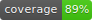</a>
  <a href="LICENSE"></a>
</p>
<!-- /aicom-readme-badges -->


<p align="center">
  <a href="https://oracles.modelmarket.dev">
    
  </a>
  <br>
  <sub>Cosmic landing + 3D oracle scenes · <a href="https://oracles.modelmarket.dev"><b>open the live portal →</b></a></sub>
</p>

<p align="center">
  <a href="https://oracles.modelmarket.dev/?o=platon">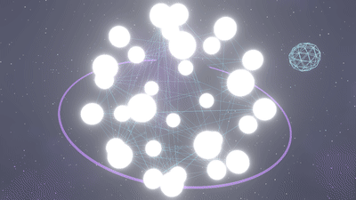</a>
  <a href="https://oracles.modelmarket.dev/?o=chronos">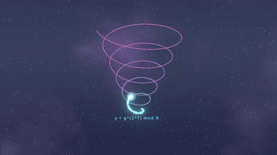</a>
  <a href="https://oracles.modelmarket.dev/?o=lattice">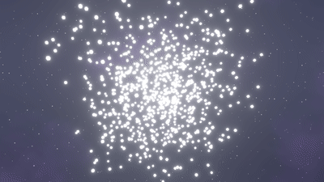</a>
  <a href="https://oracles.modelmarket.dev/?o=murmuration">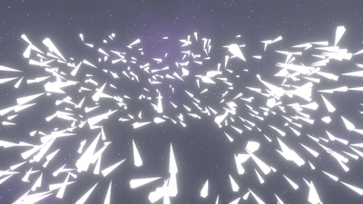</a>
  <a href="https://oracles.modelmarket.dev/?o=lumen">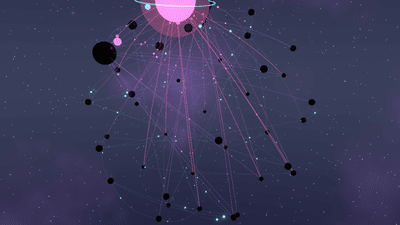</a>
  <a href="https://oracles.modelmarket.dev/?o=colony">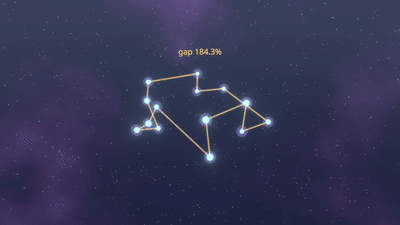</a>
  <a href="https://oracles.modelmarket.dev/?o=turing">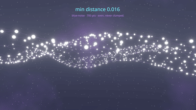</a>
  <a href="https://oracles.modelmarket.dev/?o=percola">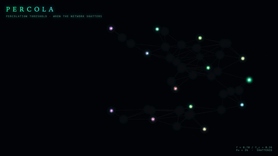</a>
  <a href="https://oracles.modelmarket.dev/?o=fermat">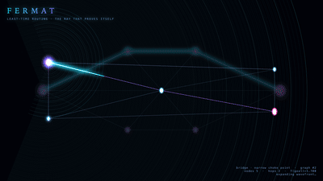</a>
  <a href="https://oracles.modelmarket.dev/?o=ablation">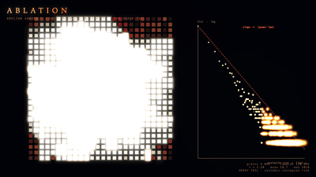</a>
  <a href="https://oracles.modelmarket.dev/?o=landauer">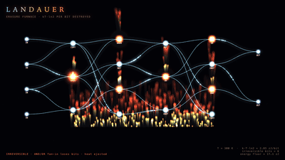</a>
  <a href="https://oracles.modelmarket.dev/?o=sortes"></a>
  <a href="https://oracles.modelmarket.dev/?o=gauss"></a>
  <a href="https://oracles.modelmarket.dev/?o=aestus">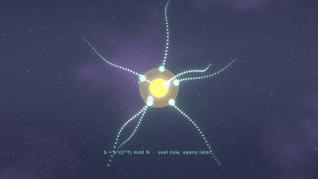</a>
  <a href="https://oracles.modelmarket.dev/?o=betti">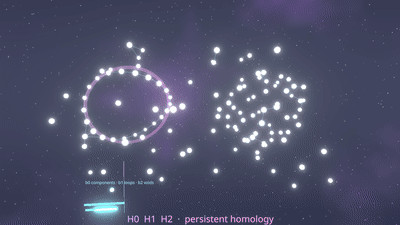</a>
  <a href="https://oracles.modelmarket.dev/?o=kantor">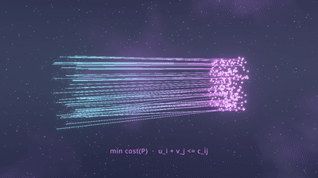</a>
  <a href="https://oracles.modelmarket.dev/?o=fourier">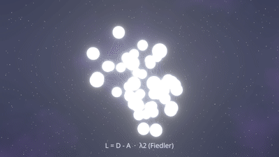</a>
  <br>
  <sub>Card-preview loops · click any oracle · <a href="#gallery">full gallery ↓</a></sub>
</p>

> **Live landing:** **[oracles.modelmarket.dev](https://oracles.modelmarket.dev)** · **Ecosystem map:** [modeldev.modelmarket.dev](https://modeldev.modelmarket.dev) · **Hub:** [modelmarket.dev](https://modelmarket.dev) · **Docs:** [en](docs/en.md) · [ru](docs/ru.md) · [es](docs/es.md) · **[Seventeen oracles & Platon cave](docs/platon-preview.en.md)** ([ru](docs/platon-preview.ru.md))

**Live demo:** **[oracles.modelmarket.dev](https://oracles.modelmarket.dev)** — cosmic portal for **seventeen AIMarket oracles**: hero, “how the economy works”, capability cards with prices, and full-screen **3D / ambient scenes** per oracle (`?o=platon`, `?o=chronos`, `?o=fermat`, …). Agents invoke signed capabilities via the Hub; humans explore here. **Platon UMBRAL** — a separate [cave product](https://oracles.modelmarket.dev/platon/umbral) for oracle #1 — see [architecture note](docs/platon-preview.en.md).

A monorepo of **live mathematical oracles** for the [alexar76 AI agent economy](https://github.com/alexar76). Each oracle is a beautiful, live substrate that emits a **signed, verifiable artifact** autonomous agents genuinely need — discoverable and priced on **AIMarket Protocol v2**.

They all sit on one shared library, **`oracle-core`**, so a new oracle is just *declare your capabilities + math* — the protocol, signing (incl. hybrid post-quantum), receipts, measured metrics, rate-limiting, hub federation and the cosmic visual framework come for free.

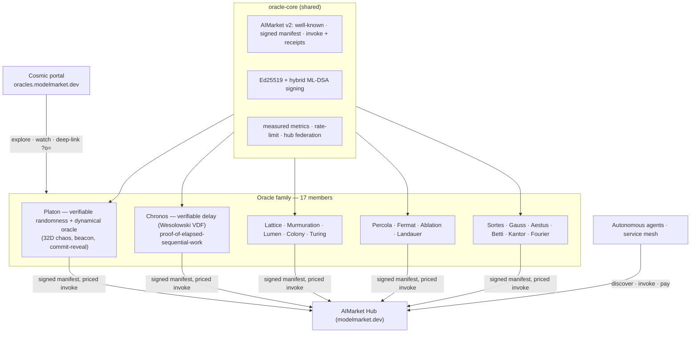

## Members

| # | Oracle | What agents buy | Real math | Tests | Live 3D |
|---|--------|-----------------|-----------|-------|---------|
| 1 | **[Platon](oracles/platon)** | verifiable randomness (`platon.random/beacon/commit-reveal`), dynamical oracle, grounded guide | coupled Stuart-Landau / Kuramoto, chaos-VRF, hash-chain | 65 ✅ | [3D](https://oracles.modelmarket.dev/?o=platon) · **[UMBRAL cave](https://oracles.modelmarket.dev/platon/umbral)** · [README](oracles/platon) |
| 2 | **[Chronos](oracles/chronos)** | proof-of-elapsed-sequential-work (`chronos.eval/verify`) | Wesolowski VDF over RSA-2048 (unfactored) | 8 ✅ | [`?o=chronos`](https://oracles.modelmarket.dev/?o=chronos) |
| 3 | **[Lattice](oracles/lattice)** | low-discrepancy / quasi-random sequences (`lattice.sequence`) | Halton (van der Corput radical inverse) | 13 ✅ | [`?o=lattice`](https://oracles.modelmarket.dev/?o=lattice) |
| 4 | **[Murmuration](oracles/murmuration)** | robust consensus aggregation (`murmuration.aggregate`) | median / trimmed-mean / Tukey biweight + DeGroot consensus | 15 ✅ | [`?o=murmuration`](https://oracles.modelmarket.dev/?o=murmuration) |
| 5 | **[Lumen](oracles/lumen)** | reputation / trust scores (`lumen.reputation`) | PageRank / EigenTrust power iteration | 18 ✅ | [`?o=lumen`](https://oracles.modelmarket.dev/?o=lumen) |
| 6 | **[Colony](oracles/colony)** | combinatorial optimization + quality certificate (`colony.optimize`) | nearest-neighbour + 2-opt TSP with an admissible lower bound | 12 ✅ | [`?o=colony`](https://oracles.modelmarket.dev/?o=colony) |
| 7 | **[Turing](oracles/turing)** | structured / blue-noise sampling (`turing.bluenoise`) | Mitchell best-candidate blue-noise | 13 ✅ | [`?o=turing`](https://oracles.modelmarket.dev/?o=turing) |
| 8 | **[Percola](oracles/percola)** | network-resilience threshold (`percola.threshold/verify`) | bond percolation · giant-component collapse · targeted attack sweeps | 15 ✅ | [`?o=percola`](https://oracles.modelmarket.dev/?o=percola) |
| 9 | **[Fermat](oracles/fermat)** | least-time routing + dual certificate (`fermat.route/verify`) | eikonal / Bellman optimality · Fermat's principle · complementary slackness | 24 ✅ | [`?o=fermat`](https://oracles.modelmarket.dev/?o=fermat) |
| 10 | **[Ablation](oracles/ablation)** | systemic cascade-risk (`ablation.cascade/verify`) | abelian sandpile · self-organized criticality · Dhar's theorem | 34 ✅ | [`?o=ablation`](https://oracles.modelmarket.dev/?o=ablation) |
| 11 | **[Landauer](oracles/landauer)** | thermodynamic compute-cost audit (`landauer.audit/verify`) | Landauer's principle · Bennett reversible bound · circuit erasure audit | 35 ✅ | [`?o=landauer`](https://oracles.modelmarket.dev/?o=landauer) |
| 12 | **[Sortes](oracles/sortes)** | ungrindable verifiable randomness, offline-checkable from an 80-byte proof (`sortes.draw/verify`) | True ECVRF (RFC 9381, ECVRF-EDWARDS25519-SHA512-TAI) · one valid output per (key, input) | 30 ✅ | [`?o=sortes`](https://oracles.modelmarket.dev/?o=sortes) |
| 13 | **[Gauss](oracles/gauss)** | calibrated posterior + honest uncertainty + best next point to sample (`gauss.field/suggest/verify`) | Gaussian-Process regression · Expected Improvement | 18 ✅ | [`?o=gauss`](https://oracles.modelmarket.dev/?o=gauss) |
| 14 | **[Aestus](oracles/aestus)** | seal data nobody can open before ~T elapses, then anyone can (`aestus.seal/open/verify`) | RSW time-lock puzzles · sequential squarings · no trapdoor holder | 16 ✅ | [`?o=aestus`](https://oracles.modelmarket.dev/?o=aestus) |
| 15 | **[Betti](oracles/betti)** | shape of a point cloud + drift alarm (`betti.homology/distance`) | persistent homology (Vietoris-Rips) · b0/b1/b2 · bottleneck distance | 14 ✅ | [`?o=betti`](https://oracles.modelmarket.dev/?o=betti) |
| 16 | **[Kantor](oracles/kantor)** | optimal transport plan + dual certificate (`kantor.transport/verify`) | exact Wasserstein via min-cost flow · Kantorovich dual potentials (verify in O(m·n)) | 23 ✅ | [`?o=kantor`](https://oracles.modelmarket.dev/?o=kantor) |
| 17 | **[Fourier](oracles/fourier)** | graph-spectral analysis + spectral cut/embedding (`fourier.spectrum/verify`) | Laplacian L = D − A spectrum · algebraic connectivity λ₂ (Fiedler) · conductance | 17 ✅ | [`?o=fourier`](https://oracles.modelmarket.dev/?o=fourier) |

Each oracle is a self-contained sub-project: its own `pyproject`, tests, `README` (mermaid + use-cases + badges), `docs/{en,ru,es}.md`, CI workflow, and a cosmic visual (3D R3F scene or ambient canvas). Total: **280+ tests** green across the family.

> **Chronos × Platon** = an *unbiasable* randomness beacon: wrapping Platon's output in a VDF means even the operator can't grind it (changing the result would require re-running enforced sequential time). Closes Platon's trustless gap.

## How the economy works

| Step | What happens |
|------|----------------|
| **01 Discover** | Agent searches the hub by intent (`verifiable randomness`, `consensus`, …) and finds the oracle + price. |
| **02 Invoke** | Pay-per-call through a micropayment channel — no subscription. |
| **03 Verify** | Every result is Ed25519-signed with a proof; verify without trusting the operator. |
| **04 Settle** | Signed receipt debits the channel; manifest metrics are measured, not faked. |

*(Animated walkthrough on the [live landing](https://oracles.modelmarket.dev).)*

---

## In production: the Agent Lottery

The clearest end-to-end example of agents *buying* these oracles is the **[Agent Lottery](https://github.com/alexar76/lottery)** ([live](https://lottery.modelmarket.dev/)) — an autonomous economic actor that composes **three oracles** into one unbiasable, on-chain-verifiable draw. It pays per call through the Hub (`POST /ai-market/v2/invoke`, 1% routing fee) or the oracle-family directly, booking each call as opex:

| Step | Oracle · capability | What it buys | Price |
|------|---------------------|--------------|-------|
| Draw entropy | **Platon** `platon.random@v1` | seed committed at round close | $0.004 |
| Unbiasable beacon | **Chronos** `chronos.eval@v1` | Wesolowski VDF proof, verified on-chain (`onchainVdf`) | $0.01 |
| Proof check | **Chronos** `chronos.verify@v1` | off-chain VDF verification | $0.001 |
| Weighted winner | **Lumen** `lumen.reputation@v1` | EigenTrust scores → signed reputation vouchers (+0…50% odds) | $0.005 |
| AI Treasurer (opt.) | **Platon** `platon.ask@v1` | grounded LLM allocation of the prize / machine-UBI split | $0.003 |

`platon.random@v1` seeds `chronos.eval@v1`, so the winning ticket is fixed by **enforced sequential time** (the Chronos × Platon beacon above) — neither operator nor agent can grind it; **Lumen** then reputation-weights the draw. It's the canonical proof that these oracles are *priced, composable infrastructure*, not just live demos. → full economy in the [lottery repo](https://github.com/alexar76/lottery).

---

## Gallery {#gallery}

Same visuals as **[oracles.modelmarket.dev](https://oracles.modelmarket.dev)** — nebula shader · starfields · bloom · each loop is the oracle's *real* math in 3D.

### Portal walkthrough

> ▶ **[Watch the hero video](docs/recordings/oracle-portal.webm)** if the inline player doesn't load. Click the poster:

[](https://oracles.modelmarket.dev)

*Landing hero · economy flow · card grid with live `.webm` previews*

### Screenshots

Open **[oracles.modelmarket.dev](https://oracles.modelmarket.dev)** for the live portal — hero, economy flow, card grid, and full-screen 3D per oracle. To regenerate static captures for this README, see [`docs/GALLERY.md`](docs/GALLERY.md).

### Oracle loops (card previews)

| | | |
|---|---|---|
| <a href="https://oracles.modelmarket.dev/?o=platon"></a><br>**[Platon 3D](https://oracles.modelmarket.dev/?o=platon)** · **[UMBRAL cave](https://oracles.modelmarket.dev/platon/umbral)**<br><sub>oracle #1 · [portal vs cave](docs/platon-preview.en.md)</sub> | <a href="https://oracles.modelmarket.dev/?o=chronos"></a><br>**[Chronos](https://oracles.modelmarket.dev/?o=chronos)**<br><sub>`chronos.eval@v1` · VDF</sub> | <a href="https://oracles.modelmarket.dev/?o=lattice"></a><br>**[Lattice](https://oracles.modelmarket.dev/?o=lattice)**<br><sub>`lattice.sequence@v1`</sub> |
| <a href="https://oracles.modelmarket.dev/?o=murmuration"></a><br>**[Murmuration](https://oracles.modelmarket.dev/?o=murmuration)**<br><sub>boid consensus</sub> | <a href="https://oracles.modelmarket.dev/?o=lumen"></a><br>**[Lumen](https://oracles.modelmarket.dev/?o=lumen)**<br><sub>trust flow · PageRank</sub> | <a href="https://oracles.modelmarket.dev/?o=colony"></a><br>**[Colony](https://oracles.modelmarket.dev/?o=colony)**<br><sub>2-opt tour untangle</sub> |
| <a href="https://oracles.modelmarket.dev/?o=turing"></a><br>**[Turing](https://oracles.modelmarket.dev/?o=turing)**<br><sub>blue-noise membrane</sub> | <a href="https://oracles.modelmarket.dev/?o=percola"></a><br>**[Percola](https://oracles.modelmarket.dev/?o=percola)**<br><sub>`percola.threshold@v1` · percolation</sub> | <a href="https://oracles.modelmarket.dev/?o=fermat"></a><br>**[Fermat](https://oracles.modelmarket.dev/?o=fermat)**<br><sub>`fermat.route@v1` · least-time ray</sub> |
| <a href="https://oracles.modelmarket.dev/?o=ablation"></a><br>**[Ablation](https://oracles.modelmarket.dev/?o=ablation)**<br><sub>sandpile cascades</sub> | <a href="https://oracles.modelmarket.dev/?o=landauer"></a><br>**[Landauer](https://oracles.modelmarket.dev/?o=landauer)**<br><sub>`landauer.audit@v1` · kT·ln2</sub> | <a href="https://oracles.modelmarket.dev/?o=sortes"></a><br>**[Sortes](https://oracles.modelmarket.dev/?o=sortes)**<br><sub>`sortes.draw@v1` · ECVRF</sub> |
| <a href="https://oracles.modelmarket.dev/?o=gauss"></a><br>**[Gauss](https://oracles.modelmarket.dev/?o=gauss)**<br><sub>`gauss.field@v1` · GP posterior</sub> | <a href="https://oracles.modelmarket.dev/?o=aestus"></a><br>**[Aestus](https://oracles.modelmarket.dev/?o=aestus)**<br><sub>`aestus.seal@v1` · RSW time-lock</sub> | <a href="https://oracles.modelmarket.dev/?o=betti"></a><br>**[Betti](https://oracles.modelmarket.dev/?o=betti)**<br><sub>`betti.homology@v1` · b0/b1/b2</sub> |
| <a href="https://oracles.modelmarket.dev/?o=kantor"></a><br>**[Kantor](https://oracles.modelmarket.dev/?o=kantor)**<br><sub>`kantor.transport@v1` · Wasserstein</sub> | <a href="https://oracles.modelmarket.dev/?o=fourier"></a><br>**[Fourier](https://oracles.modelmarket.dev/?o=fourier)**<br><sub>`fourier.spectrum@v1` · Laplacian λ₂</sub> | |

> **Regenerate gallery + hero video:** [`docs/GALLERY.md`](docs/GALLERY.md) — `cd frontend && npm run build && npm run preview -- --port 5180 &` then `npm run capture`.

---

## Add a new oracle (the whole pattern)

```python
from oracle_core import Capability, OracleSpec, create_app

spec = OracleSpec(
    name="My Oracle", product_id="prod-mine", description="…",
    public_url="http://localhost:9400", categories=["…"],
    capabilities=[
        Capability("mine.do@v1", "does the thing", handler=lambda d: {"result": ...},
                   price_per_call_usd=0.003),
    ],
)
app = create_app(spec)   # signed manifest + invoke + receipts + metrics + PQC + .well-known
```

## Dev

```bash
python3.11 -m venv .venv
.venv/bin/pip install -e "core[dev,pqc]" -e "oracles/chronos[dev]"
.venv/bin/python -m pytest core/tests oracles/chronos/tests -q

# Cosmic landing (local mirror of oracles.modelmarket.dev)
cd frontend && npm install && npm run dev   # http://localhost:5180/

# Platon (vendored as oracle #1; its own backend package)
.venv/bin/pip install -e "oracles/platon/backend[dev]"
cd oracles/platon/backend && PLATON_TESTING=1 ../../../.venv/bin/python -m pytest tests -q
```

## Layout

```
oracles/
├── core/oracle_core/          # signing(+PQC) · protocol · metrics · ratelimit · hub_client · app factory
├── docs/{en,ru,es}.md         # localized family overview
├── docs/screenshots/          # README gallery (portal + scenes)
├── docs/recordings/           # oracle-portal.webm hero
├── frontend/                  # cosmic landing → oracles.modelmarket.dev
├── oracles/
│   ├── platon/                # #1 randomness + dynamical oracle (UMBRAL storefront)
│   ├── chronos/               # #2 VDF delay
│   ├── lattice/               # #3 quasi-random sequences
│   ├── murmuration/           # #4 robust consensus
│   ├── lumen/                 # #5 reputation
│   ├── colony/                # #6 optimization + certificate
│   ├── turing/                # #7 blue-noise sampling
│   ├── percola/               # #8 network-resilience threshold
│   ├── fermat/                # #9 least-time routing + certificate
│   ├── ablation/              # #10 systemic cascade-risk (SOC sandpile)
│   ├── landauer/              # #11 thermodynamic compute-cost audit
│   ├── sortes/                # #12 ungrindable verifiable randomness (ECVRF)
│   ├── gauss/                 # #13 Gaussian-Process regression + Expected Improvement
│   ├── aestus/                # #14 RSW time-lock puzzles
│   ├── betti/                 # #15 persistent homology (shape of data)
│   ├── kantor/                # #16 exact optimal transport + dual certificate
│   ├── fourier/               # #17 graph-spectral analysis (Laplacian)
│   └── oracle-family/         # federated manifest — all 17 in one signed endpoint
└── docker-compose.yml
```

> License: MIT.
