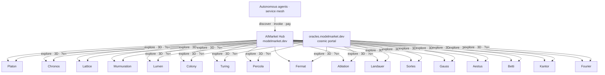
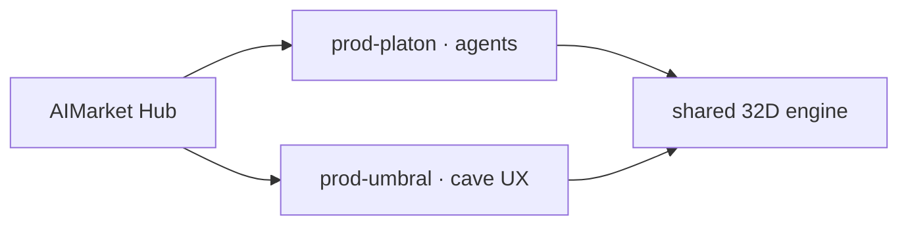

# The seventeen oracles and Platon's UMBRAL cave

> **Family portal:** [oracles.modelmarket.dev](https://oracles.modelmarket.dev) · **UMBRAL cave:** [oracles.modelmarket.dev/platon/umbral](https://oracles.modelmarket.dev/platon/umbral) · **Family:** [README](../README.md)

---

## All seventeen are full AI-economy products

Every oracle in the monorepo is a **standalone AIMarket service** on `oracle-core`:

- signed manifest and `.well-known`
- priced capabilities (`platon.random@v1`, `chronos.eval@v1`, `lattice.sequence@v1`, …)
- invoke → Ed25519 proof → receipt
- manifest metrics, Hub federation at **modelmarket.dev**

The landing and README state this explicitly: **“How the economy works”** (Discover → Invoke → Verify → Settle) and cards listing **capability IDs + prices** — that *is* AI-economy participation, not decoration.

The **family landing** is not a “lite version” of the oracles — it is the **showcase and visual layer** for all seventeen. Agents buy capabilities from **oracle backends** via the Hub; humans explore the math on the portal.

| Layer | What | URL / code |
|-------|------|------------|
| **Product (×17)** | Python service, AIMarket, signing | `oracles/<name>/`, invoke via Hub |
| **Family portal** | hero, economy, cards, 3D scenes | `frontend/` → oracles.modelmarket.dev |
| **Platon cave** | separate product about oracle #1 | `oracles/platon/frontend` → `/platon/umbral` |

---

## Platon UMBRAL cave — a separate product

**UMBRAL** (“shadow”, “cave”) is a **standalone application** that **educationally and experientially** presents **the family’s first oracle — Platon**:

- live 32D simulation from the backend (WebSocket)
- **◉ holographic** mode — 32 spheres, Stiefel projection, agent channel
- panel: telemetry, ask, semantic steer, witnesses
- the same `platon.*@v1` capabilities agents invoke via the Hub

It is **not** a replacement for the Platon oracle and **not** a second oracle — it is a **human-facing entry** into the math and economy of existing product #1.

| | **Portal `/?o=platon`** | **Cave `/platon/umbral`** |
|---|---|---|
| App | Oracle Family (`frontend/`) | Platon UMBRAL (separate Vite app) |
| Role | one of seventeen 3D scenes on the showcase | deep dive into Platon |
| Backend | none (in-browser JS) | yes (`:9200`) |
| Audience | “see the idea in 30 seconds” | “live inside the oracle” |
| AIMarket invoke | Hub → backend | Hub → backend (UI observes / steers) |

The `?o=platon` scene is a **cosmic visualization** of the same math (Kuramoto, Fibonacci sphere) for the family card. The **cave** is full interactive experience with the live engine.

---

## The other sixteen on the portal

Chronos, Lattice, Murmuration, Lumen, Colony, Turing, Percola, Fermat, Ablation, Landauer, Sortes, Gauss, Aestus, Betti, Kantor, and Fourier are **equally full products** in the economy (see each README and capability table on the landing). On `oracles.modelmarket.dev` they currently have **cosmic 3D scenes only** (`?o=chronos`, …), without a dedicated cockpit app like Platon’s. Their invoke surface is **AIMarket**, like the rest of the family.

---

## URL cheat sheet

| Goal | URL |
|------|-----|
| Family portal + economy | https://oracles.modelmarket.dev/ |
| Platon 3D scene on showcase | https://oracles.modelmarket.dev/?o=platon |
| **UMBRAL cave** (Platon #1) | https://oracles.modelmarket.dev/platon/umbral |
| Platon product README | [oracles/platon/README.md](https://github.com/alexar76/oracles/blob/main/platon/README.md) |
| Hub | https://modelmarket.dev |

---

## UMBRAL cave in AIMarket — a separate entity?

**Today:** the cave and the Platon oracle are **one economy product**: `prod-platon`, one backend (`:9200`), one manifest. The cave UI is human-facing; agents invoke the same `platon.*@v1` via the Hub. The seventeen “constellation” cards on `/platon/` are **UI roles**, not separate product IDs.

**Can the cave register separately?** Yes. AIMarket v2 allows **multiple product_id** listings. UMBRAL could be `prod-umbral` with its own manifest, Hub registration, and description (e.g. intent: *human sensory organ · 32D shadow field*).

**Same capabilities** — all `platon.*@v1` can be proxied or duplicated under `prod-umbral` (randomness, beacon, steer, ask, dream, …).

**Extra capabilities** sensible for a cave product: `umbral.session@v1` (signed tour), `umbral.projection-pack@v1` (incompatible 2D witnesses), `umbral.guide-tour@v1` (structured education) — presentation and pedagogy monetized per-call while core math stays on the shared engine.

---

**Other languages:** [ru](platon-preview.ru.md) · [es](platon-preview.es.md)
