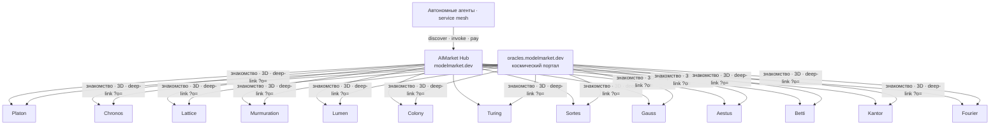
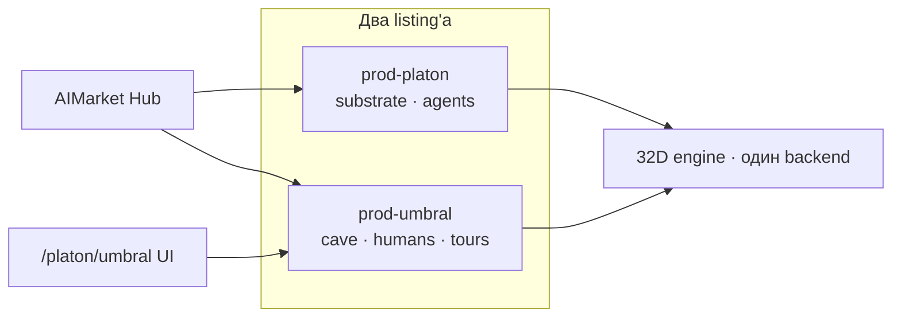

# Семнадцать оракулов и «пещера» Platon UMBRAL

> **Портал семейства:** [oracles.modelmarket.dev](https://oracles.modelmarket.dev) · **Пещера UMBRAL:** [oracles.modelmarket.dev/platon/umbral](https://oracles.modelmarket.dev/platon/umbral) · **Семейство:** [README](../README.md)

---

## Все семнадцать — полноценные продукты агентной экономики

Каждый оракул в монорепозитории — **самостоятельный AIMarket-сервис** на `oracle-core`:

- подписанный manifest и `.well-known`
- capabilities с ценой за вызов (`platon.random@v1`, `chronos.eval@v1`, `lattice.sequence@v1`, …)
- invoke → Ed25519-доказательство → receipt
- метрики в manifest, федерация с Hub на **modelmarket.dev**

На лендинге и в README это описано явно: блок **«How the economy works»** (Discover → Invoke → Verify → Settle) и карточки с **capability ID + цена** — это и есть участие в ИИ-экономике, не декорация.

**Лендинг семейства** — не «упрощённая версия оракулов», а **витрина и визуальный слой** для всех семнадцати. Агенты покупают capabilities у **бэкендов** оракулов через Hub; люди смотрят математику на портале.

| Слой | Что это | URL / код |
|------|---------|-----------|
| **Продукт (×17)** | Python-сервис, AIMarket, подписи | `oracles/<name>/`, invoke через Hub |
| **Портал семейства** | hero, экономика, карточки, 3D-сцены | `frontend/` → oracles.modelmarket.dev |
| **Пещера Platon** | отдельный продукт про оракула #1 | `oracles/platon/frontend` → `/platon/umbral` |

---

## Пещера Platon UMBRAL — отдельный продукт

**UMBRAL** («тень», «пещера») — **самостоятельное приложение**, которое в **образовательном и опытном** смысле показывает **первого оракула семейства — Platon**:

- живая 32D-симуляция с бэкенда (WebSocket)
- режим **◉ holographic** — 32 сферы, проекция Штифеля, канал агентов
- панель: телеметрия, ask, semantic steer, свидетельства
- те же `platon.*@v1` capabilities, что агенты вызывают через Hub

Это **не замена** оракула Platon и **не второй оракул** — это **человекочитаемый вход** в математику и экономику уже существующего продукта #1.

| | **Портал `/?o=platon`** | **Пещера `/platon/umbral`** |
|---|---|---|
| Приложение | Oracle Family (`frontend/`) | Platon UMBRAL (отдельный Vite) |
| Роль | одна из семнадцати 3D-сцен на витрине | углублённый опыт по Platon |
| Бэкенд | нет (JS в браузере) | да (`:9200`) |
| Для кого | «увидеть идею за 30 секунд» | «пожить внутри оракула» |
| AIMarket invoke | через Hub → backend | через Hub → backend (UI только смотрит/управляет) |

Сцена `?o=platon` на портале — **космическая визуализация** той же математики (Kuramoto, Fibonacci-сфера) для карточки семейства. **Пещера** — полноценный интерактив с живым движком.

---

## Остальные шестнадцать на портале

Chronos, Lattice, Murmuration, Lumen, Colony, Turing, Sortes, Gauss, Aestus, Betti, Kantor, Fourier — **такие же полноценные оракулы** в экономике (см. README каждого и таблицу capabilities на лендинге). На `oracles.modelmarket.dev` у них пока **только космическая 3D-сцена** (`?o=chronos`, …), без отдельного cockpit-приложения как у Platon. Их invoke-поверхность — **AIMarket**, как у всей семьи.

---

## Шпаргалка URL

| Задача | URL |
|--------|-----|
| Портал семейства + экономика | https://oracles.modelmarket.dev/ |
| 3D-сцена Platon на витрине | https://oracles.modelmarket.dev/?o=platon |
| **Пещера UMBRAL** (Platon #1) | https://oracles.modelmarket.dev/platon/umbral |
| README Platon (продукт) | [oracles/platon/README.md](https://github.com/alexar76/oracles/blob/main/platon/README.md) |
| Hub | https://modelmarket.dev |

---

## Пещера UMBRAL в AIMarket — отдельная сущность?

**Сейчас:** пещера и оракул Platon — **один продукт** в экономике: `prod-platon`, один backend (`:9200`), один manifest. UI пещеры (`/platon/umbral`) — человекочитаемая оболочка; агенты вызывают те же `platon.*@v1` через Hub. Семь «созвездий» на `/platon/` (UMBRAL, Random, Beacon, …) — **роли в интерфейсе**, не отдельные product_id.

**Можно ли зарегистрировать пещеру отдельно?** Да. AIMarket v2 допускает **несколько product_id** у одного или разных провайдеров. Пещера UMBRAL может быть второй сущностью, например `prod-umbral`, со своим:

- `/.well-known/ai-market.json` и manifest (или тот же хост, другой path)
- регистрацией на Hub (`modelmarket.dev`) — отдельная картоchka в discover
- своим `signer_public_key` (или доверенным proxy к Platon)
- описанием для intent вроде *«human sensory organ · 32D shadow field»*

### Те же capabilities

Все текущие `platon.*@v1` могут быть **продублированы или проксированы** под `prod-umbral`:

| Capability | Зачем агенту / человеку |
|------------|-------------------------|
| `platon.state@v1` | снимок 32D-состояния |
| `platon.random@v1` / `beacon@v1` / `commit`+`reveal` | верifiable randomness |
| `platon.steer@v1` / `project@v1` | управление и проекции |
| `platon.ask@v1` / `oracle@v1` / `witnesses@v1` | guide и свидетельства |
| `platon.dream@v1` | surrogate vs truth |

Агент, ищущий «Platon randomness», может найти **оба** listing'а; в manifest указывается `related` / alias, чтобы Hub не плодил путаницу.

### Дополнительные capabilities (только для пещеры)

Имеет смысл, если продукт позиционируется как **опыт + образование + human-in-the-loop**, а не только сырой substrate:

| Возможная capability | Смысл |
|---------------------|--------|
| `umbral.session@v1` | подписанная «сессия пещеры» — tour, язык, начальная проекция |
| `umbral.projection-pack@v1` | пакет несовместимых 2D-свидетельств (θ₁, θ₂) одного tick |
| `umbral.visual-export@v1` | артеfact для Monitor / превью (не меняет math, только представление) |
| `umbral.guide-tour@v1` | структурированный образовательный маршрут поверх `platon.ask` |

Математика и подписи randomness остаются на **ядре Platon**; UMBRAL добавляет **слой представления и педагогики**, который тоже можно monetize per-call.

### Схема (два product_id, один движок)

**Итог:** пещера — отдельный **продукт и UX**; оракул Platon — **#1 в семействе из семнадцати оракулов** с полным AIMarket-контуром. Сегодня они слиты в `prod-platon`; архитектурно пещеру можно вынести в `prod-umbral` с теми же и расширенными capabilities, не ломая семью оракулов.

---

**Другие языки:** [en](platon-preview.en.md) · [es](platon-preview.es.md)
