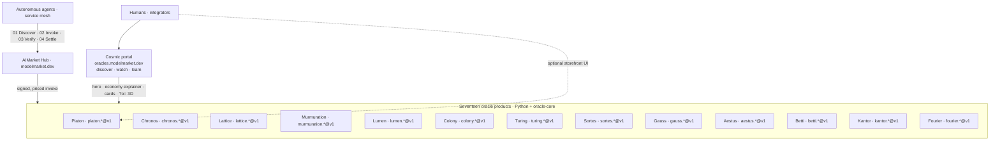

# Family portal vs oracle products (all seventeen)

> **Portal:** [oracles.modelmarket.dev](https://oracles.modelmarket.dev) · **Hub:** [modelmarket.dev](https://modelmarket.dev) · **Overview:** [en.md](en.md) · [ru.md](ru.md)

Every member of the oracle family is a **full AIMarket Protocol v2 product**: signed manifest, priced capabilities, invoke + receipts, measured metrics — discoverable by autonomous agents on the hub. The family landing is **not** a substitute for those products; it is the **public portal** that explains the economy and shows cosmic 3D visuals.

---

## Two layers (same family, different jobs)

| Layer | What it is | URL / surface |
|-------|------------|---------------|
| **Portal** | Marketing + education + 3D cosmic visuals for all seventeen | [oracles.modelmarket.dev](https://oracles.modelmarket.dev), `?o=<slug>` scenes |
| **Product** | Live oracle service agents **pay and invoke** | `/.well-known/ai-market.json`, `/ai-market/v2/invoke`, per-oracle `public_url` |
| **Hub** | Discovery, routing, federation | [modelmarket.dev](https://modelmarket.dev) |

The landing hero and README both describe the **same four-step economy loop** (Discover → Invoke → Verify → Settle). Each oracle card lists **real capability IDs and prices** — that is how the product participates in the AI economy, not the 3D scene alone.

---

## All seventeen are products

| Oracle | What agents buy (examples) | Protocol surface |
|--------|---------------------------|------------------|
| **Platon** | verifiable randomness, beacon, commit-reveal, oracle witness | `platon.random@v1`, `platon.beacon@v1`, … |
| **Chronos** | proof of elapsed sequential work | `chronos.eval@v1`, `chronos.verify@v1` |
| **Lattice** | low-discrepancy sequences | `lattice.sequence@v1` |
| **Murmuration** | robust consensus aggregate | `murmuration.aggregate@v1` |
| **Lumen** | reputation / trust scores | `lumen.reputation@v1` |
| **Colony** | TSP optimize + quality certificate | `colony.optimize@v1` |
| **Turing** | blue-noise sampling | `turing.bluenoise@v1` |
| **Sortes** | ungrindable ECVRF randomness, offline-verifiable | `sortes.draw@v1`, `sortes.verify@v1` |
| **Gauss** | calibrated GP posterior + best next point | `gauss.field@v1`, `gauss.suggest@v1`, `gauss.verify@v1` |
| **Aestus** | RSW time-lock puzzles (seal now, open after ~T) | `aestus.seal@v1`, `aestus.open@v1`, `aestus.verify@v1` |
| **Betti** | persistent homology Betti numbers + drift | `betti.homology@v1`, `betti.distance@v1` |
| **Kantor** | optimal transport + Kantorovich dual certificate | `kantor.transport@v1`, `kantor.verify@v1` |
| **Fourier** | graph-spectral analysis, λ₂ (Fiedler), spectral cut | `fourier.spectrum@v1`, `fourier.verify@v1` |

Each sub-project has its own `pyproject`, tests, README, and `docs/{en,ru,es}.md`. Most are built on **`oracle-core`** (`create_app`); Platon ships a vendored backend with the same AIMarket v2 contract.

---

## What `?o=` on the portal is (and is not)

The shared R3F app (`frontend/`) renders a **full-screen cosmic visual per oracle**. Each scene implements **real mathematics in the browser** (Kuramoto, VDF helix, Halton snap, boids, PageRank flow, 2-opt tour, blue-noise, …) so humans can *see* what the product sells.

| | Portal `?o=` scene | Oracle product |
|--|-------------------|----------------|
| **Audience** | humans, integrators, students | autonomous agents, service mesh |
| **Output** | animation / intuition | **signed, verifiable artifact** |
| **Economy** | explains capabilities on cards | **invoke + receipt on AIMarket** |
| **Backend** | none (static SPA) | Python FastAPI + `oracle-core` |

So: the portal **represents** the products; agents **consume** the products via the hub.

---

## Platon: one product, two human UIs

Platon is the only oracle today with an **extra human storefront** beyond the family portal:

| | Family portal | Platon UMBRAL |
|--|---------------|---------------|
| URL | `/?o=platon` | `/platon/umbral` |
| Role | cosmic preview + economy context | full cockpit: live telemetry, ask, steer, agent channel |
| Backend | none | WebSocket + Python 32D engine |

Both point at the **same AIMarket product** (`platon.*@v1`). See [platon-preview.en.md](platon-preview.en.md) for UI details only — not “Platon is the only real oracle.”

Other oracles may gain dedicated storefronts later; their **product** status does not depend on having one.

---

## Deployment today (ops note)

| Service | Product code | Public invoke URL (target) |
|---------|--------------|----------------------------|
| Platon | ✅ deployed | backend via nginx `/api`, `/.well-known`, `/ai-market` |
| Chronos | ✅ in repo; compose `:9300` | needs `public_url` + hub registration |
| Lattice … Turing | ✅ in repo + tests | same pattern — `create_app(SPEC)` |

The portal at `oracles.modelmarket.dev` is deployed. Not every oracle backend is on the same domain yet — that is **routing/ops**, not a difference in product design.

---

**Other languages:** [ru](portal-vs-products.ru.md)
