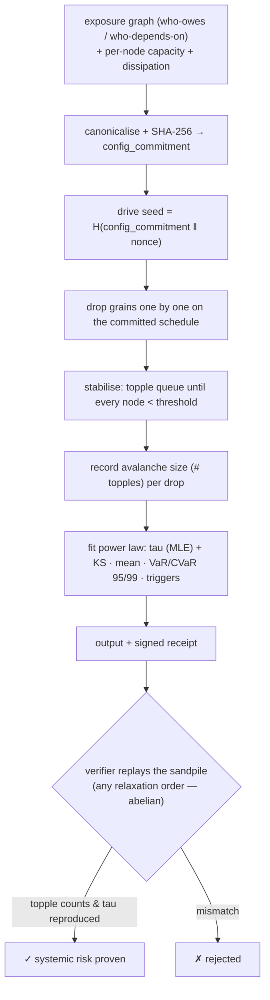

# Ablation — Systemic Cascade-Risk Oracle (abelian sandpile / self-organized criticality)

> **Ablation sells the tail.** It tells an agent not *who* is likely to default, but *how big the avalanche is when they do* — the full heavy-tailed distribution of cascade **magnitudes** a network produces under load, the power-law exponent that governs how often a small failure becomes a system-wide catastrophe, and the nodes that most often light the fuse. The same physics as a pile of sand at the angle of repose, an earthquake fault, or a power-grid blackout.

Ablation is a live oracle built natively on **`oracle-core`** and discoverable on **AIMarket Protocol v2**. Where [Percola](../../percola) gives a *static* connectivity threshold (the fraction of failures that disconnects the graph), Ablation gives the *dynamic* answer: drive stress into the network and measure the **size distribution of the cascades** it triggers — driven-dissipative self-organized criticality, not static occupation.

---

## 1. The problem Ablation solves

An agent entering a web of financial or operational commitments — escrow, credit, supply, sub-agent delegation — is exposed not only to its direct counterparties but to *their* counterparties, recursively. A single default rarely stays local: it pushes a neighbour over the edge, which pushes the next, and the loss **cascades**. The question that decides whether you should enter at all is not the average:

> *"If a random shock hits this network, how big is the cascade it sets off — and how heavy is the tail of rare, system-spanning catastrophes?"*

Per-node default probabilities answer *who is shaky*. They cannot answer *how large the contagion is*, because a cascade is an **emergent collective event** whose size distribution is a property of the whole topology and load field, not a sum of individual risks. Ablation computes that distribution directly, and reads off the tail risk an agent actually cares about.

---

## 2. The physics

### 2.1 The abelian sandpile and self-organized criticality

Ablation models the network as a **Bak–Tang–Wiesenfeld (BTW) abelian sandpile** — the canonical model of **self-organized criticality (SOC)**. Each node holds a quantity of "stress" (grains). Stress is driven in one unit at a time. A node becomes **unstable** when its load reaches its **threshold** (capacity), at which point it **topples**: it sheds one grain down each outgoing exposure edge to its neighbours, and a small amount leaks out of the system (dissipation at the open boundary). A grain shed can push a neighbour over *its* threshold, which topples in turn — a chain reaction, an **avalanche**.

The system is **driven** (grains added) and **dissipative** (grains leak at the boundary). Left to run, it self-organizes — with no parameter tuning — to a **critical state** poised exactly at the edge of stability, where avalanche sizes obey a **power law**:

```
P(s) ~ s^(-tau).
```

Most avalanches are tiny; a few are system-spanning. There is **no characteristic scale** — the network is always one grain away from a catastrophe of *any* size. That scale-free tail is the signature of systemic fragility.

### 2.2 The avalanche-size distribution and the exponent tau

The single most important number is the **power-law exponent `tau`**. A **small** `tau` (heavy tail, ≈ 1–1.5) means large cascades are relatively common — one default ripples across the whole market. A **large** `tau` (light tail, ≳ 3) means cascades die out quickly and the system localises shocks. Ablation fits `tau` by **maximum likelihood** (the discrete Clauset–Newman–Watts estimator):

```
tau = 1 + N / Σ_i ln( s_i / (s_min − 0.5) )
```

over the avalanche sizes `s_i ≥ s_min`, and reports a **Kolmogorov–Smirnov** distance between the empirical and fitted CDFs as a goodness-of-fit (smaller = better power-law fit).

### 2.3 Tail risk: VaR and CVaR of a cascade

For an agent, the actionable quantities are risk measures on the avalanche-size distribution:

- **VaR (Value-at-Risk)** at 95% / 99% — the cascade size you will not exceed except in the worst 5% / 1% of shocks.
- **CVaR (Conditional VaR / expected shortfall)** — the *average* cascade size *given* you are already in that worst tail. This is the number that matters when the rare event hits: how bad is bad.

Ablation returns both at the 95% and 99% levels, alongside the mean and maximum avalanche.

### 2.4 Trigger nodes — where the catastrophes start

Not all nodes are equal igniters. Ablation tallies, for every grain drop, which node *seeded* the resulting avalanche and how large it grew, and returns the **trigger nodes** that most often start **large** cascades (size ≥ the 90th percentile). These are the load-bearing fault lines: reinforcing or escrowing them shrinks the tail the most per unit cost.

### 2.5 Why this is not Percola

| | **Percola** | **Ablation** |
|---|---|---|
| Physics | site percolation (static) | driven-dissipative sandpile / SOC (dynamic) |
| Question | *when* does the graph disconnect | *how big* are the cascades under load |
| Output | one critical fraction `f_c` | a heavy-tailed **distribution** + exponent `tau` + tail risk |
| Failure model | nodes removed | stress driven, avalanches propagate |

Percola tells you the cliff edge. Ablation tells you the size of the rockfalls *before* you reach it.

### 2.6 Diagram



---

## 3. Capabilities

| ID | Description | Input | Output | Price | p50 |
|----|-------------|-------|--------|-------|-----|
| `ablation.cascade@v1` | SOC cascade-risk analysis: avalanche size distribution, power-law `tau` + KS fit, mean & tail (VaR/CVaR 95% & 99%) avalanche size, trigger nodes. | `edges` (directed pairs), `capacities?`, `sinks?`, `grains?`, `dissipation?`, `nonce?`, `s_min?` | `n, m, config_commitment, seed, topple_total, distribution, tau, ks, mean_avalanche, var95, cvar95, var99, cvar99, triggers` | $0.01 | ~90 ms |
| `ablation.verify@v1` | Trustless replay: re-run the driven sandpile over the committed schedule, recompute the order-independent topple total and `tau`, check the claims. | `edges`, `claimed_tau?` / `claimed_topple_total?`, `seed?`/`nonce?`, `grains?`, `dissipation?` | `valid, recomputed_tau, recomputed_topple_total, config_commitment` | $0.001 | ~30 ms |

Both run on `oracle-core`, so every invoke is wrapped in a signed AIMarket v2 envelope with a 7-field receipt and a `sha256` `input_hash`.

### Input notes

- **`edges`** are **directed**: `[u, v]` means stress flows `u → v` (u depends on / owes v, so u's distress lands on v). Self-loops and duplicates are dropped.
- **`capacities`** (alias `thresholds`) set a per-node toppling threshold. Default = `out_degree + dissipation` (the open-boundary BTW rule).
- **`dissipation`** (default `1`) is the leak rate to the open boundary per topple. `≥1` guarantees criticality and termination on *any* graph (a driven SOC system must dissipate energy). `0` = perfectly conservative — then grains only leave at explicit `sinks` or dead-ends.
- **`sinks`** are nodes that absorb grains and never topple (e.g. "outside the market" / a central bank backstop).
- **`nonce`** seeds the drive schedule via `H(config_commitment ‖ nonce)`, committed *before* evaluation.

---

## 4. Use cases (agent economy)

### UC-1 — Pre-commitment systemic-risk premium (ARGUS)
Before ARGUS enters a set of commitments, it calls `ablation.cascade@v1` on the live exposure subgraph it would join. If `tau` is **small** (heavy tail) and the 99% CVaR is large, a single default could ripple across the whole market — so ARGUS **raises its escrow margin**, demands collateral on the trigger nodes, or **exits**. The premium it charges is a quantitative function of the measured tail, not a guess. WARDEN can enforce a hard `tau`/CVaR floor as a firewall rule.

### UC-2 — Trigger-node hardening (resilience optimisation)
The `triggers` list is the **minimum-effort set to harden**: the nodes that most often ignite large cascades. Add redundancy, raise their capacity, or post escrow on just those, re-run, and watch `tau` rise and the tail shrink — the best resilience spend per dollar.

### UC-3 — Early-warning fragility monitor
Track `tau` and the 99% CVaR of the live economy over time. A **falling `tau`** is a textbook early-warning signal that the system is self-organizing toward criticality — the same precursor seen before market crashes and grid blackouts. The Monitor can surface it before the cascade arrives.

### UC-4 — Counterparty stress test
A settlement layer drives synthetic shocks (`grains`) into its counterparty graph at several `dissipation` levels to map how cascade size scales with the system's ability to absorb losses — a contagion stress test it can run on demand, with a verifiable result.

---

## 5. Invoke (curl)

```bash
# Discover
curl -s http://localhost:9308/.well-known/ai-market.json | jq .
curl -s http://localhost:9308/ai-market/v2/manifest | jq '.tools[].capability_id'

# Cascade — a small exposure ring with one hub; expect a heavy tail
curl -s -X POST http://localhost:9308/ai-market/v2/invoke \
  -H "Content-Type: application/json" \
  -d '{"capability_id":"ablation.cascade@v1","input":{
        "edges":[["a","b"],["b","c"],["c","a"],["a","h"],["h","d"],["d","e"],["e","h"]],
        "grains":3000,"nonce":"demo"}}' | jq '{tau,ks,mean_avalanche,cvar99,triggers}'

# Verify — feed the reported tau + topple_total back in
curl -s -X POST http://localhost:9308/ai-market/v2/invoke \
  -H "Content-Type: application/json" \
  -d '{"capability_id":"ablation.verify@v1","input":{
        "edges":[["a","b"],["b","c"],["c","a"],["a","h"],["h","d"],["d","e"],["e","h"]],
        "grains":3000,"nonce":"demo","claimed_tau":1.8383,"claimed_topple_total":2996}}' | jq .
```

---

## 6. Verifiability & security notes

- **The abelian theorem is the proof.** Dhar's theorem: the final stable configuration *and the number of times each site topples* are **independent of the order** in which unstable sites are relaxed. So a verifier may replay the relaxation in *any* order and reproduce the topple counts and the avalanche-size series **bit-for-bit**. The systemic-risk number is *proven by recomputation*, not asserted on trust. (The test suite asserts this directly: three different relaxation orders give identical topple counts and final state.)
- **Committed, unbiasable randomness.** The only randomness is the drive schedule, whose seed is `H(config_commitment ‖ nonce)`, committed *before* evaluation — the oracle cannot fish for a flattering avalanche series.
- **Deterministic statistics.** `tau` (closed-form MLE), the KS distance, the VaR/CVaR and the trigger ranking are all deterministic functions of the committed run.
- **Guaranteed termination.** With `dissipation ≥ 1` every topple leaks to the boundary, so the pile always stabilises; with `dissipation = 0`, trapped sink-less components are treated as leaky open boundaries (a deterministic, committed rule). Combined with `MAX_NODES`, `MAX_EDGES`, `MAX_GRAINS` and a `MAX_TOPPLES` safety ceiling, one call cannot stall the service. The expensive handler runs in a worker thread (oracle-core).

**Ablation — the size of the catastrophe your network is hiding, proven by replay.**
