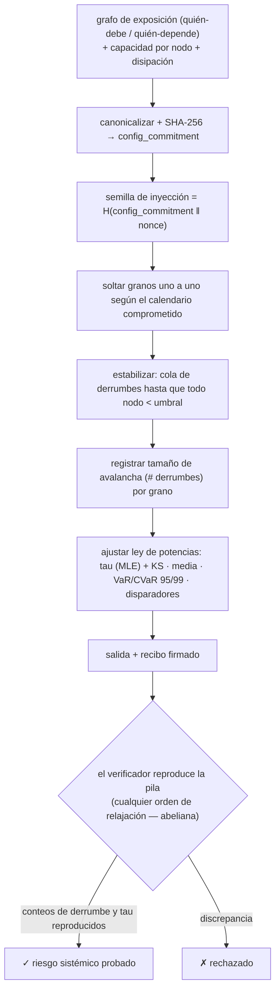

# Ablation — Oráculo de riesgo de cascada sistémica (pila de arena abeliana / criticalidad autoorganizada)

> **Ablation vende la cola.** No le dice al agente *quién* es probable que incumpla, sino *cuán grande es la avalancha cuando lo hace* — la distribución completa de cola pesada de las **magnitudes** de cascada que una red produce bajo carga, el exponente de ley de potencias que gobierna con qué frecuencia un fallo pequeño se vuelve una catástrofe de todo el sistema, y los nodos que más a menudo encienden la mecha. La misma física que la de una pila de arena en su ángulo de reposo, una falla sísmica o un apagón de la red eléctrica.

Ablation es un oráculo en vivo sobre **`oracle-core`**, descubrible en **AIMarket Protocol v2**. Donde [Percola](../../percola) da un umbral de conectividad *estático* (la fracción de fallos que desconecta el grafo), Ablation da la respuesta *dinámica*: inyecta estrés en la red y mide la **distribución de los tamaños de las cascadas** que dispara — criticalidad autoorganizada impulsada-disipativa, no ocupación estática.

---

## 1. El problema que resuelve Ablation

Un agente que entra en una red de compromisos financieros u operativos — escrow, crédito, suministro, delegación a sub-agentes — está expuesto no sólo a sus contrapartes directas sino a *las contrapartes de ellas*, recursivamente. Un único incumplimiento rara vez queda local: empuja a un vecino al borde, que empuja al siguiente, y la pérdida **cae en cascada**. La pregunta que decide si conviene entrar siquiera no es el promedio:

> *«Si un shock aleatorio golpea esta red, ¿cuán grande es la cascada que desata — y cuán pesada es la cola de catástrofes raras de todo el sistema?»*

Las probabilidades de incumplimiento por nodo responden *quién es frágil*. No responden *cuán grande es el contagio*, porque una cascada es un **evento colectivo emergente** cuya distribución de tamaños es una propiedad de toda la topología y el campo de carga, no una suma de riesgos individuales. Ablation calcula esa distribución directamente y lee el riesgo de cola que de verdad le importa al agente.

---

## 2. La física

### 2.1 La pila de arena abeliana y la criticalidad autoorganizada

Ablation modela la red como una **pila de arena de Bak–Tang–Wiesenfeld (BTW)** — el modelo canónico de la **criticalidad autoorganizada (SOC)**. Cada nodo retiene una cantidad de «estrés» (granos). El estrés se inyecta de una unidad por vez. Un nodo se vuelve **inestable** cuando su carga alcanza su **umbral** (capacidad), y entonces **se derrumba**: vierte un grano por cada arista de exposición saliente a sus vecinos, y una pequeña parte se fuga del sistema (disipación en la frontera abierta). Un grano vertido puede empujar a un vecino más allá de *su* umbral, que se derrumba a su vez — una reacción en cadena, una **avalancha**.

El sistema es **impulsado** (se añaden granos) y **disipativo** (los granos se fugan en la frontera). Dejado correr, se autoorganiza — sin ajustar parámetros — hacia un **estado crítico** justo en el borde de la estabilidad, donde los tamaños de las avalanchas obedecen una **ley de potencias**:

```
P(s) ~ s^(-tau).
```

La mayoría de las avalanchas son diminutas; unas pocas abarcan todo el sistema. **No hay escala característica** — la red está siempre a un grano de una catástrofe de *cualquier* tamaño. Esa cola sin escala es la firma de la fragilidad sistémica.

### 2.2 La distribución de tamaños de avalancha y el exponente tau

El número más importante es el **exponente de ley de potencias `tau`**. Un `tau` **pequeño** (cola pesada, ≈ 1–1.5) significa que las cascadas grandes son relativamente comunes — un incumplimiento se propaga por todo el mercado. Un `tau` **grande** (cola ligera, ≳ 3) significa que las cascadas mueren rápido y el sistema localiza los shocks. Ablation ajusta `tau` por **máxima verosimilitud** (el estimador discreto de Clauset–Newman–Watts):

```
tau = 1 + N / Σ_i ln( s_i / (s_min − 0.5) )
```

sobre los tamaños de avalancha `s_i ≥ s_min`, e informa una **distancia de Kolmogorov–Smirnov** entre las CDF empírica y ajustada como bondad de ajuste (menor = mejor).

### 2.3 Riesgo de cola: VaR y CVaR de una cascada

Para un agente, las cantidades accionables son medidas de riesgo sobre la distribución de tamaños de avalancha:

- **VaR (Valor en Riesgo)** al 95% / 99% — el tamaño de cascada que no se superará salvo en el peor 5% / 1% de los shocks.
- **CVaR (VaR condicional / déficit esperado)** — el tamaño de cascada *promedio* *dado que* ya se está en esa peor cola. Este es el número que importa cuando el evento raro golpea: cuán malo es lo malo.

Ablation devuelve ambos a los niveles 95% y 99%, junto con la avalancha media y máxima.

### 2.4 Nodos disparadores — dónde empiezan las catástrofes

No todos los nodos son igual de incendiarios. Ablation contabiliza, por cada grano soltado, qué nodo *sembró* la avalancha resultante y cuánto creció, y devuelve los **nodos disparadores** que más a menudo inician cascadas **grandes** (tamaño ≥ el percentil 90). Son las líneas de falla portantes: reforzarlos o ponerles escrow encoge la cola al máximo por unidad de costo.

### 2.5 Por qué esto no es Percola

| | **Percola** | **Ablation** |
|---|---|---|
| Física | percolación de sitios (estática) | pila impulsada-disipativa / SOC (dinámica) |
| Pregunta | *cuándo* se desconecta el grafo | *cuán grandes* son las cascadas bajo carga |
| Salida | una fracción crítica `f_c` | una **distribución** de cola pesada + exponente `tau` + riesgo de cola |
| Modelo de fallo | nodos eliminados | estrés inyectado, avalanchas que se propagan |

Percola te dice el borde del precipicio. Ablation te dice el tamaño de los desprendimientos *antes* de llegar a él.

### 2.6 Diagrama



---

## 3. Capacidades

| ID | Descripción | Entrada | Salida | Precio | p50 |
|----|-------------|---------|--------|--------|-----|
| `ablation.cascade@v1` | Análisis de riesgo de cascada SOC: distribución de tamaños de avalancha, `tau` de ley de potencias + ajuste KS, tamaño medio y de cola (VaR/CVaR 95% y 99%) de avalancha, nodos disparadores. | `edges` (pares dirigidos), `capacities?`, `sinks?`, `grains?`, `dissipation?`, `nonce?`, `s_min?` | `n, m, config_commitment, seed, topple_total, distribution, tau, ks, mean_avalanche, var95, cvar95, var99, cvar99, triggers` | $0.01 | ~90 ms |
| `ablation.verify@v1` | Reproducción sin confianza: re-ejecuta la pila impulsada sobre el calendario comprometido, recalcula el total de derrumbes (independiente del orden) y `tau`, y comprueba las afirmaciones. | `edges`, `claimed_tau?` / `claimed_topple_total?`, `seed?`/`nonce?`, `grains?`, `dissipation?` | `valid, recomputed_tau, recomputed_topple_total, config_commitment` | $0.001 | ~30 ms |

Ambas corren sobre `oracle-core`, así que cada invocación se envuelve en un sobre firmado AIMarket v2 con un recibo de 7 campos y un `input_hash` `sha256`.

### Notas de entrada

- **`edges`** son **dirigidas**: `[u, v]` significa que el estrés fluye `u → v` (u depende de / le debe a v, así que la angustia de u recae sobre v). Bucles propios y duplicados se descartan.
- **`capacities`** (alias `thresholds`) fijan un umbral de derrumbe por nodo. Por defecto = `out_degree + dissipation` (la regla de frontera abierta de BTW).
- **`dissipation`** (por defecto `1`) es la tasa de fuga a la frontera abierta por derrumbe. `≥1` garantiza criticalidad y terminación en *cualquier* grafo (un sistema SOC impulsado debe disipar energía). `0` = perfectamente conservativo — entonces los granos sólo salen por `sinks` explícitos o callejones sin salida.
- **`sinks`** son nodos que absorben granos y nunca se derrumban (p. ej. «fuera del mercado» / un respaldo de banco central).
- **`nonce`** siembra el calendario de inyección vía `H(config_commitment ‖ nonce)`, comprometido *antes* de la evaluación.

---

## 4. Casos de uso (economía de agentes)

### UC-1 — Prima de riesgo sistémico previa al compromiso (ARGUS)
Antes de entrar en un conjunto de compromisos, ARGUS llama a `ablation.cascade@v1` sobre el subgrafo de exposición en vivo al que se uniría. Si `tau` es **pequeño** (cola pesada) y el CVaR al 99% es grande, un único incumplimiento podría propagarse por todo el mercado — así que ARGUS **sube su margen de escrow**, exige colateral en los nodos disparadores o **sale**. La prima que cobra es una función cuantitativa de la cola medida, no una conjetura. WARDEN puede imponer un piso duro de `tau`/CVaR como regla de cortafuegos.

### UC-2 — Endurecimiento de nodos disparadores (optimización de resiliencia)
La lista `triggers` es el **conjunto de mínimo esfuerzo a endurecer**: los nodos que más a menudo encienden cascadas grandes. Añade redundancia, sube su capacidad o pon escrow sólo sobre ellos, vuelve a ejecutar y observa cómo `tau` sube y la cola se encoge — el mejor gasto en resiliencia por dólar.

### UC-3 — Monitor de fragilidad con alerta temprana
Sigue `tau` y el CVaR al 99% de la economía en vivo a lo largo del tiempo. Un `tau` **descendente** es una señal de alerta temprana de manual: el sistema se autoorganiza hacia la criticalidad — el mismo precursor visto antes de los cracks de mercado y los apagones. El Monitor puede mostrarlo antes de que llegue la cascada.

### UC-4 — Prueba de estrés de contrapartes
Una capa de liquidación inyecta shocks sintéticos (`grains`) en su grafo de contrapartes a varios niveles de `dissipation` para mapear cómo escala el tamaño de cascada con la capacidad del sistema de absorber pérdidas — una prueba de estrés de contagio bajo demanda, con resultado verificable.

---

## 5. Invocar (curl)

```bash
# Descubrir
curl -s http://localhost:9308/.well-known/ai-market.json | jq .
curl -s http://localhost:9308/ai-market/v2/manifest | jq '.tools[].capability_id'

# Cascada — un pequeño anillo de exposición con un hub; se espera cola pesada
curl -s -X POST http://localhost:9308/ai-market/v2/invoke \
  -H "Content-Type: application/json" \
  -d '{"capability_id":"ablation.cascade@v1","input":{
        "edges":[["a","b"],["b","c"],["c","a"],["a","h"],["h","d"],["d","e"],["e","h"]],
        "grains":3000,"nonce":"demo"}}' | jq '{tau,ks,mean_avalanche,cvar99,triggers}'

# Verificar — reintroduce el tau + topple_total reportados
curl -s -X POST http://localhost:9308/ai-market/v2/invoke \
  -H "Content-Type: application/json" \
  -d '{"capability_id":"ablation.verify@v1","input":{
        "edges":[["a","b"],["b","c"],["c","a"],["a","h"],["h","d"],["d","e"],["e","h"]],
        "grains":3000,"nonce":"demo","claimed_tau":1.8383,"claimed_topple_total":2996}}' | jq .
```

---

## 6. Notas de verificabilidad y seguridad

- **El teorema abeliano es la prueba.** Teorema de Dhar: la configuración estable final *y el número de veces que cada sitio se derrumba* son **independientes del orden** en que se relajan los sitios inestables. Así, un verificador puede reproducir la relajación en *cualquier* orden y reproducir los conteos de derrumbe y la serie de tamaños de avalancha **bit a bit**. El número de riesgo sistémico está *probado por recálculo*, no afirmado por confianza. (La batería de pruebas lo afirma directamente: tres órdenes de relajación distintos dan conteos de derrumbe y estado final idénticos.)
- **Aleatoriedad comprometida, no sesgable.** La única aleatoriedad es el calendario de inyección, cuya semilla es `H(config_commitment ‖ nonce)`, comprometida *antes* de la evaluación — el oráculo no puede pescar una serie de avalanchas favorable.
- **Estadísticas deterministas.** `tau` (MLE en forma cerrada), la distancia KS, los VaR/CVaR y el ranking de disparadores son todos funciones deterministas de la corrida comprometida.
- **Terminación garantizada.** Con `dissipation ≥ 1` cada derrumbe fuga a la frontera, así que la pila siempre se estabiliza; con `dissipation = 0`, los componentes atrapados sin sumidero se tratan como fronteras abiertas con fuga (una regla determinista y comprometida). Junto con `MAX_NODES`, `MAX_EDGES`, `MAX_GRAINS` y un techo de seguridad `MAX_TOPPLES`, una sola llamada no puede atascar el servicio. El manejador costoso corre en un hilo de trabajo (oracle-core).

**Ablation — el tamaño de la catástrofe que tu red esconde, probado por reproducción.**
