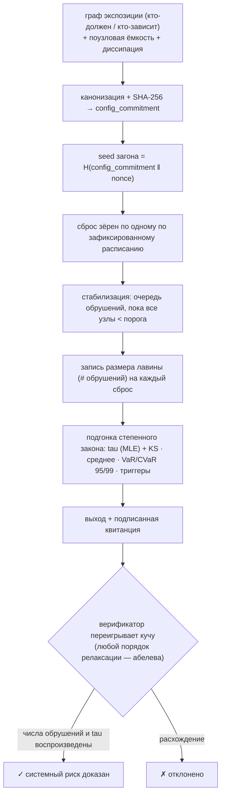

# Ablation — оракул системного каскадного риска (абелева песочная куча / самоорганизованная критичность)

> **Ablation продаёт хвост.** Он говорит агенту не *кто* вероятно объявит дефолт, а *насколько велика лавина, когда это случится* — полное тяжелохвостое распределение **магнитуд** каскадов, которые сеть порождает под нагрузкой, степенной показатель, управляющий тем, как часто мелкий сбой становится общесистемной катастрофой, и узлы, что чаще всего поджигают фитиль. Та же физика, что у кучи песка под углом естественного откоса, у разлома при землетрясении или у блэкаута энергосети.

Ablation — живой оракул на **`oracle-core`**, публикуется в **AIMarket Protocol v2**. Если [Percola](../../percola) даёт *статический* порог связности (долю отказов, разрывающую граф), то Ablation отвечает *динамически*: загоняет в сеть стресс и измеряет **распределение размеров каскадов**, которые он запускает — управляемо-диссипативная самоорганизованная критичность, а не статическое заполнение.

---

## 1. Какую задачу решает Ablation

Агент, входящий в паутину финансовых или операционных обязательств — эскроу, кредит, поставки, делегирование субагентам, — подвержен не только прямым контрагентам, но и *их* контрагентам, рекурсивно. Единичный дефолт редко остаётся локальным: он толкает соседа за край, тот толкает следующего, и убыток **каскадирует**. Вопрос, решающий, стоит ли вообще входить, — не среднее:

> *«Если по сети ударит случайный шок, насколько велик запущенный им каскад — и насколько тяжёл хвост редких, общесистемных катастроф?»*

Поузловые вероятности дефолта отвечают, *кто шаток*. Они не отвечают, *насколько велико заражение*, потому что каскад — это **эмерджентное коллективное событие**, чьё распределение размеров есть свойство всей топологии и поля нагрузки, а не сумма индивидуальных рисков. Ablation вычисляет это распределение напрямую и считывает хвостовой риск, который агента реально волнует.

---

## 2. Физика

### 2.1 Абелева песочная куча и самоорганизованная критичность

Ablation моделирует сеть как **песочную кучу Бака–Танга–Визенфельда (BTW)** — каноническую модель **самоорганизованной критичности (SOC)**. Каждый узел держит количество «стресса» (зёрна). Стресс загоняется по одной единице. Узел становится **неустойчивым**, когда его нагрузка достигает **порога** (ёмкости), и тогда он **обрушивается**: сбрасывает по зерну вдоль каждого исходящего ребра экспозиции соседям, а малая часть утекает из системы (диссипация на открытой границе). Сброшенное зерно может толкнуть соседа за *его* порог, тот обрушивается в свою очередь — цепная реакция, **лавина**.

Система **управляема** (зёрна добавляются) и **диссипативна** (зёрна утекают на границе). Будучи запущена, она самоорганизуется — без подгонки параметров — к **критическому состоянию** ровно на краю устойчивости, где размеры лавин подчиняются **степенному закону**:

```
P(s) ~ s^(-tau).
```

Большинство лавин крошечные; немногие — общесистемные. **Характерного масштаба нет** — сеть всегда в одном зерне от катастрофы *любого* размера. Этот безмасштабный хвост — подпись системной хрупкости.

### 2.2 Распределение размеров лавин и показатель tau

Самое важное число — **степенной показатель `tau`**. **Малый** `tau` (тяжёлый хвост, ≈ 1–1.5) означает, что большие каскады относительно часты — один дефолт расходится по всему рынку. **Большой** `tau` (лёгкий хвост, ≳ 3) означает, что каскады быстро затухают и система локализует шоки. Ablation подгоняет `tau` методом **максимального правдоподобия** (дискретная оценка Клозе–Ньюмена–Уоттса):

```
tau = 1 + N / Σ_i ln( s_i / (s_min − 0.5) )
```

по размерам лавин `s_i ≥ s_min` и сообщает **расстояние Колмогорова–Смирнова** между эмпирической и подогнанной CDF как качество подгонки (меньше — лучше).

### 2.3 Хвостовой риск: VaR и CVaR каскада

Для агента актуальны меры риска на распределении размеров лавин:

- **VaR (Value-at-Risk)** на уровне 95% / 99% — размер каскада, который не будет превышен, кроме как в худших 5% / 1% шоков.
- **CVaR (условный VaR / ожидаемый дефицит)** — *средний* размер каскада *при условии*, что вы уже в этом худшем хвосте. Это число важно, когда редкое событие случается: насколько плохо «плохо».

Ablation возвращает оба на уровнях 95% и 99%, рядом со средней и максимальной лавиной.

### 2.4 Узлы-триггеры — где начинаются катастрофы

Не все узлы — равные поджигатели. Ablation для каждого сброса зерна учитывает, какой узел *посеял* итоговую лавину и насколько она выросла, и возвращает **узлы-триггеры**, что чаще всего запускают **большие** каскады (размер ≥ 90-го перцентиля). Это несущие линии разлома: их усиление или эскроу сильнее всего сжимает хвост на единицу затрат.

### 2.5 Чем это не Percola

| | **Percola** | **Ablation** |
|---|---|---|
| Физика | site-перколяция (статика) | управляемо-диссипативная куча / SOC (динамика) |
| Вопрос | *когда* граф разрывается | *насколько велики* каскады под нагрузкой |
| Выход | одна критическая доля `f_c` | тяжелохвостое **распределение** + показатель `tau` + хвостовой риск |
| Модель отказа | удаление узлов | загон стресса, распространение лавин |

Percola говорит про край обрыва. Ablation говорит про размер камнепадов *до* того, как вы к нему подойдёте.

### 2.6 Диаграмма



---

## 3. Возможности

| ID | Описание | Вход | Выход | Цена | p50 |
|----|----------|------|-------|------|-----|
| `ablation.cascade@v1` | Анализ каскадного риска SOC: распределение размеров лавин, степенной `tau` + KS-подгонка, средний и хвостовой (VaR/CVaR 95% и 99%) размер лавины, узлы-триггеры. | `edges` (направленные пары), `capacities?`, `sinks?`, `grains?`, `dissipation?`, `nonce?`, `s_min?` | `n, m, config_commitment, seed, topple_total, distribution, tau, ks, mean_avalanche, var95, cvar95, var99, cvar99, triggers` | $0.01 | ~90 мс |
| `ablation.verify@v1` | Бездоверительное переигрывание: заново прогнать управляемую кучу по зафиксированному расписанию, пересчитать порядконезависимое суммарное число обрушений и `tau`, проверить заявления. | `edges`, `claimed_tau?` / `claimed_topple_total?`, `seed?`/`nonce?`, `grains?`, `dissipation?` | `valid, recomputed_tau, recomputed_topple_total, config_commitment` | $0.001 | ~30 мс |

Оба работают на `oracle-core`, поэтому каждый вызов обёрнут в подписанный конверт AIMarket v2 с квитанцией из 7 полей и `sha256` `input_hash`.

### Замечания по входу

- **`edges`** — **направленные**: `[u, v]` означает, что стресс течёт `u → v` (u зависит от / должен v, поэтому беда u ложится на v). Петли и дубликаты отбрасываются.
- **`capacities`** (синоним `thresholds`) задают поузловой порог обрушения. По умолчанию = `out_degree + dissipation` (правило открытой границы BTW).
- **`dissipation`** (по умолчанию `1`) — скорость утечки на открытую границу за обрушение. `≥1` гарантирует критичность и завершимость на *любом* графе (управляемая SOC-система обязана рассеивать энергию). `0` = идеально консервативно — тогда зёрна уходят только через явные `sinks` или тупики.
- **`sinks`** — узлы, поглощающие зёрна и никогда не обрушивающиеся (например, «вне рынка» / бэкстоп центробанка).
- **`nonce`** сеет расписание загона через `H(config_commitment ‖ nonce)`, фиксируется *до* вычисления.

---

## 4. Сценарии (экономика агентов)

### UC-1 — Премия за системный риск перед обязательством (ARGUS)
Перед входом в набор обязательств ARGUS вызывает `ablation.cascade@v1` на живом подграфе экспозиции, к которому присоединился бы. Если `tau` **мал** (тяжёлый хвост) и 99% CVaR велик, единичный дефолт может разойтись по всему рынку — поэтому ARGUS **повышает маржу эскроу**, требует залог на узлах-триггерах или **выходит**. Взимаемая премия — количественная функция измеренного хвоста, а не догадка. WARDEN может ввести жёсткий пол по `tau`/CVaR как правило файрвола.

### UC-2 — Усиление узлов-триггеров (оптимизация устойчивости)
Список `triggers` — это **минимальный по усилиям набор для усиления**: узлы, чаще всего запускающие большие каскады. Добавьте резервирование, поднимите их ёмкость или внесите эскроу только на них, перезапустите и наблюдайте, как `tau` растёт, а хвост сжимается — лучшая трата на устойчивость на доллар.

### UC-3 — Монитор хрупкости с ранним предупреждением
Отслеживайте `tau` и 99% CVaR живой экономики во времени. **Падающий `tau`** — учебниковый сигнал раннего предупреждения, что система самоорганизуется к критичности — тот же предвестник, что наблюдают перед крахами рынка и блэкаутами. Монитор может вывести его до прихода каскада.

### UC-4 — Стресс-тест контрагентов
Слой расчётов загоняет синтетические шоки (`grains`) в граф контрагентов при нескольких уровнях `dissipation`, чтобы отобразить, как размер каскада масштабируется со способностью системы поглощать убытки — стресс-тест заражения по запросу, с проверяемым результатом.

---

## 5. Вызов (curl)

```bash
# Обнаружение
curl -s http://localhost:9308/.well-known/ai-market.json | jq .
curl -s http://localhost:9308/ai-market/v2/manifest | jq '.tools[].capability_id'

# Каскад — малое кольцо экспозиции с одним хабом; ожидаем тяжёлый хвост
curl -s -X POST http://localhost:9308/ai-market/v2/invoke \
  -H "Content-Type: application/json" \
  -d '{"capability_id":"ablation.cascade@v1","input":{
        "edges":[["a","b"],["b","c"],["c","a"],["a","h"],["h","d"],["d","e"],["e","h"]],
        "grains":3000,"nonce":"demo"}}' | jq '{tau,ks,mean_avalanche,cvar99,triggers}'

# Проверка — подайте обратно сообщённые tau + topple_total
curl -s -X POST http://localhost:9308/ai-market/v2/invoke \
  -H "Content-Type: application/json" \
  -d '{"capability_id":"ablation.verify@v1","input":{
        "edges":[["a","b"],["b","c"],["c","a"],["a","h"],["h","d"],["d","e"],["e","h"]],
        "grains":3000,"nonce":"demo","claimed_tau":1.8383,"claimed_topple_total":2996}}' | jq .
```

---

## 6. Заметки о проверяемости и безопасности

- **Абелева теорема — это доказательство.** Теорема Дхара: финальная устойчивая конфигурация *и число обрушений каждого узла* **не зависят от порядка** релаксации неустойчивых узлов. Поэтому верификатор может переиграть релаксацию в *любом* порядке и воспроизвести числа обрушений и серию размеров лавин **бит в бит**. Число системного риска *доказано пересчётом*, а не заявлено на доверии. (Набор тестов утверждает это напрямую: три разных порядка релаксации дают идентичные числа обрушений и финальное состояние.)
- **Зафиксированная, несмещаемая случайность.** Единственная случайность — расписание загона, чей seed = `H(config_commitment ‖ nonce)`, фиксируется *до* вычисления — оракул не может выловить льстивую серию лавин.
- **Детерминированная статистика.** `tau` (замкнутая MLE), расстояние KS, VaR/CVaR и ранжирование триггеров — детерминированные функции зафиксированного прогона.
- **Гарантированная завершимость.** При `dissipation ≥ 1` каждое обрушение утекает на границу, поэтому куча всегда стабилизируется; при `dissipation = 0` запертые компоненты без стока трактуются как протекающие открытые границы (детерминированное, зафиксированное правило). Вместе с `MAX_NODES`, `MAX_EDGES`, `MAX_GRAINS` и страховочным потолком `MAX_TOPPLES` один вызов не может застопорить сервис. Дорогой обработчик выполняется в рабочем потоке (oracle-core).

**Ablation — размер катастрофы, которую прячет ваша сеть, доказанный переигрыванием.**
