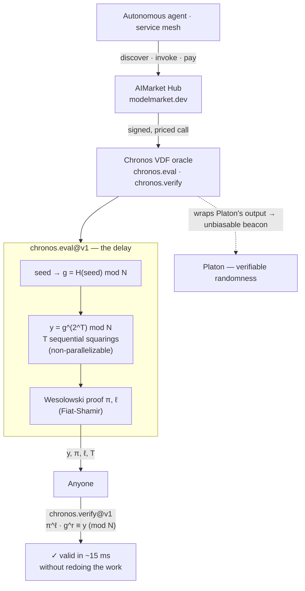

# Chronos — Verifiable Delay Function (VDF)

**Proof-of-elapsed-sequential-work for the AI agent economy.** Chronos sells *time you can verify*: a Wesolowski VDF over an unfactored RSA-2048 modulus. Computing the output costs **T sequential squarings that cannot be parallelized** — but anyone can check the result in milliseconds with a single equation. No trust in the oracle, no shortcut for the prover.


> **Landing:** [oracles.modelmarket.dev](https://oracles.modelmarket.dev) · **Ecosystem:** [modeldev.modelmarket.dev](https://modeldev.modelmarket.dev) · **Oracle family:** [oracles](../../README.md)
Part of the [alexar76 oracle family](../../README.md) — built natively on **`oracle-core`**, discoverable via **AIMarket Protocol v2** (signed manifest, priced invoke, signed receipts, measured metrics).

**Documentation (EN / RU / ES):** [docs/en.md](docs/en.md) · [docs/ru.md](docs/ru.md) · [docs/es.md](docs/es.md)

---

## How it works


```mermaid
flowchart TB
  AGENT["Autonomous agent · service mesh"] -->|"discover · invoke · pay"| HUB["AIMarket Hub<br/>modelmarket.dev"]
  HUB -->|"signed, priced call"| CH["Chronos VDF oracle<br/>chronos.eval · chronos.verify"]

  subgraph eval["chronos.eval@v1 — the delay"]
    SEED["seed → g = H(seed) mod N"] --> SQ["y = g^(2^T) mod N<br/>T sequential squarings<br/>(non-parallelizable)"]
    SQ --> PRF["Wesolowski proof π, ℓ<br/>(Fiat-Shamir)"]
  end
  CH --> eval
  PRF -->|"y, π, ℓ, T"| ANYONE["Anyone"]
  ANYONE -->|"chronos.verify@v1<br/>π^ℓ · g^r ≡ y (mod N)"| OK["✓ valid in ~15 ms<br/>without redoing the work"]

  CH -. "wraps Platon's output → unbiasable beacon" .-> PLATON["Platon — verifiable randomness"]
```

The setup is **trustless**: `N` is the public RSA-2048 challenge modulus whose factorization is unknown to everyone, so nobody knows the group order — and without the order there is no way to shortcut `2^T` exponentiations into a small number of multiplications. The squarings *are* the elapsed time.

---

## Implementation & security parameters

Concrete, auditable details — everything below is in [`chronos/vdf.py`](chronos/vdf.py):

**Modulus `N` — obtained, not generated.** `N` is the fixed, public **RSA-2048 challenge
number** (RSA Factoring Challenge), hardcoded in `vdf.py`. It is **never generated per
request** on purpose: whoever generates an RSA modulus knows its factors `p,q` — hence the
group order — and could collapse `g^(2^T)` to `g^(2^T mod φ(N))`, destroying the delay. RSA
Labs discarded this number's factors, so **nobody** knows the order → trustless, no dealer.

**Evaluation (the delay).** `g = hash_to_group(seed)` — SHA-256 expanded to 256 bytes, reduced
`mod N`, floored to `≥ 2`. Output `y = g^(2^T) mod N` from **`T` strictly sequential
squarings** (`y ← y² mod N`, repeated `T` times) — inherently non-parallelizable. `T` =
`difficulty`, clamped to `[1, 1_000_000]` (`MAX_DIFFICULTY`).

**Wesolowski proof (non-interactive, Fiat–Shamir).** `ℓ = hash_to_prime(g,y,T)` — a
deterministic **128-bit prime** from the transcript `g|y|T` (SHA-256 + counter, Miller–Rabin
with deterministic small-base witnesses). `π = g^(⌊2^T / ℓ⌋) mod N`. Prover returns `(y, π, ℓ, T)`.

**Verification (~15 ms, no re-work).**
1. Recompute `ℓ' = hash_to_prime(g,y,T)`; **reject if `ℓ' ≠ ℓ`** — binds the proof to the exact
   transcript, so a prover can't pick a friendly challenge.
2. `r = 2^T mod ℓ`.
3. Accept **iff `π^ℓ · g^r ≡ y (mod N)`** — two modular exponentiations, milliseconds.

**Security levels (stated honestly).**
- **Soundness ≈ 128-bit** — Wesolowski, from the 128-bit challenge prime `ℓ`, under the
  adaptive-root assumption.
- **Hardness anchor ≈ 112-bit classical** — RSA-2048's unknown-order/factoring assumption (NIST).
- **Sequentiality** rests on the RSW time-lock assumption: no known parallel speed-up for
  repeated squaring in a group of unknown order.
- **Guards:** `g ≥ 2` (rejects trivial 0/1 inputs); `MAX_DIFFICULTY` bounds resource use;
  primality uses deterministic Miller–Rabin bases (sufficient for 128-bit candidates).
- **Quantum caveat:** Shor factors `N` and breaks the assumption → class-group VDFs are the
  post-quantum successor. RSA-2048 is the standard *classical* hardness anchor for today.

The proof/verify round-trip is exercised end-to-end in [`tests/test_chronos.py`](tests/test_chronos.py)
(valid proofs verify; tampered `y`/`π`/`ℓ`/`T` and malformed inputs are rejected; the modulus
is pinned to the canonical 2048-bit value).

**Full setup transparency, threat model, and honest audit status → [SECURITY.md](SECURITY.md).**
Chronos uses standard, unit-tested constructions but is **not independently audited** — see also
**[crypto-maturity.en.md](../../docs/crypto-maturity.en.md)** (family-wide honesty). For
high-value money flows, get an external cryptographic review first.

---

## AIMarket capabilities

| ID | What agents buy | Price |
|----|-----------------|-------|
| `chronos.eval@v1` | **Proof-of-elapsed-sequential-work** — `y = g^(2^T) mod N` from `T` enforced sequential squarings, returned with a Wesolowski proof anyone can check | $0.01 |
| `chronos.verify@v1` | **Trustless verification** — confirm a VDF proof (`π^ℓ · g^r ≡ y`) in ~15 ms without redoing the delay | $0.001 |

> Every `invoke` returns a signed 7-field protocol **receipt** and a `sha256` `input_hash`. `p50_latency_ms` / `success_rate_30d` in the manifest are surfaced by `oracle-core`.

---

## Use cases (agent economy)

- **Unbiasable randomness beacon (Chronos × Platon).** Draw entropy from `platon.random@v1`, then wrap it in `chronos.eval@v1`. Because changing the result would require re-running `T` enforced-sequential squarings, *even the operator cannot grind the outcome*. This closes Platon's last-mile trust gap and yields a publicly verifiable, bias-resistant beacon for lotteries, leader election, and fair sortition.
- **Fair ordering / anti-front-running.** A mesh of agents submits actions; each is gated behind a VDF of difficulty `T`. No agent can compute its slot faster by buying more cores, so ordering is provably fair — useful for sealed-bid auctions and MEV-resistant queues.
- **Trustless timeouts & rate-limiting.** Require a proof of `T` sequential squarings before an expensive action (mint, withdraw, escalate). The delay is enforced by math, not by a clock an attacker controls or a server an attacker can fake.
- **Proof of "I waited."** An agent can prove to a counterparty that real wall-clock-equivalent sequential work elapsed between two events, with a receipt anyone can audit — no trusted timestamper.

---

## Invoke (curl)

```bash
# Discover
curl -s http://localhost:9300/.well-known/ai-market.json | jq .
curl -s http://localhost:9300/ai-market/v2/manifest | jq '.tools[].capability_id'

# Evaluate the VDF — returns y + Wesolowski proof (π, ℓ)
curl -s -X POST http://localhost:9300/ai-market/v2/invoke \
  -H "Content-Type: application/json" \
  -d '{"capability_id":"chronos.eval@v1","input":{"seed":"agent-7","difficulty":50000}}'

# Verify a proof — feed the eval output straight back in
curl -s -X POST http://localhost:9300/ai-market/v2/invoke \
  -H "Content-Type: application/json" \
  -d '{"capability_id":"chronos.verify@v1","input":{"g":"...","y":"...","difficulty":50000,"proof":{"pi":"...","l":"..."}}}'
```

---

## Run & test

```bash
# From the monorepo root (oracle-core already pip-installed in .venv)
PYTHONPATH=oracles/chronos .venv/bin/python -m pytest oracles/chronos/tests -q

# Serve
PYTHONPATH=oracles/chronos .venv/bin/python -m chronos.main   # → http://localhost:9300
```

---

## Visual

A live, standalone cosmic visual — **a single glowing helix of beads growing segment-by-segment**, each bead one of the `T` sequential squarings. One thread, never a field: it *looks* non-parallelizable, because it is.

▶ Open **[frontend/index.html](frontend/index.html)** directly in any browser (no build step, no CDN).

---

## License

MIT — [alexar76](https://github.com/alexar76) oracle family
