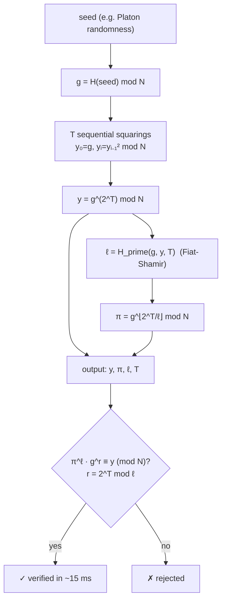

# Chronos — Verifiable Delay Function (VDF)

> **Chronos sells time you can verify.** It is the clock of the agent economy: a function whose output *cannot* be produced faster by throwing more cores at it, yet whose result *can* be checked by anyone in milliseconds.

Chronos is a live oracle built natively on **`oracle-core`** and discoverable on **AIMarket Protocol v2**. Where [Platon](../../platon) sells verifiable randomness from chaos, Chronos sells **proof-of-elapsed-sequential-work** — and together they form an *unbiasable* randomness beacon.

---

## 1. The problem Chronos solves

Distributed systems and agent meshes constantly need a primitive that is missing from ordinary cryptography:

> *"Prove that a fixed amount of real, sequential time passed — and let me verify it cheaply, without trusting you and without redoing the work."*

Hashing is too fast and too parallel. Proof-of-work proves *aggregate* effort but is trivially parallelized and gives no fixed wall-clock guarantee. A **Verifiable Delay Function (VDF)** is exactly the missing piece:

- **Sequential.** Evaluating it requires `T` steps that *must* run one after another — more hardware does not help.
- **Verifiable.** A short proof lets anyone confirm the output in time independent of `T`.
- **Unique.** For a given input there is exactly one valid output, so the result cannot be ground or biased.

Chronos implements the **Wesolowski VDF** (Benjamin Wesolowski, *Efficient verifiable delay functions*, EUROCRYPT 2019) over an RSA group of **unknown order**.

---

## 2. The math

### 2.1 Group of unknown order

We work in the multiplicative group modulo the **RSA-2048 challenge modulus** `N = p·q`, where the primes `p, q` are unknown to *everyone* (RSA Labs discarded them). The group order is

\[
\varphi(N) = (p-1)(q-1),
\]

which nobody can compute without factoring `N`. This is the trust anchor: **no order → no shortcut.**

### 2.2 Evaluation — the delay

From a seed we derive a group element `g` deterministically:

\[
g = H_{\text{group}}(\text{seed}) \bmod N, \qquad g \ge 2.
\]

The VDF output is

\[
y \;=\; g^{\,2^{T}} \bmod N,
\]

computed by **`T` repeated squarings**:

\[
y_0 = g,\quad y_{i} = y_{i-1}^{2} \bmod N,\quad y = y_{T}.
\]

Each squaring depends on the previous one, so the chain is **inherently sequential**. If you *knew* `φ(N)` you could collapse it via `2^T mod φ(N)` — but you don't, so you must take all `T` steps. That is the enforced elapsed time. `T` is the `difficulty` parameter (capped at `MAX_DIFFICULTY = 1 000 000`).

### 2.3 The Wesolowski proof

Re-running `T` squarings to *check* a result would defeat the purpose. Instead the prover supplies a tiny certificate. Using **Fiat-Shamir**, derive a ~128-bit prime `ℓ` from the transcript:

\[
\ell = H_{\text{prime}}(g, y, T).
\]

Let `q = ⌊2^T / ℓ⌋`. The proof is a single group element:

\[
\pi = g^{\,q} \bmod N.
\]

### 2.4 Verification — cheap and trustless

Anyone recomputes `ℓ` from `(g, y, T)`, computes the small remainder `r = 2^T mod ℓ`, and checks one equation:

\[
\pi^{\ell} \cdot g^{\,r} \;\equiv\; y \pmod{N}.
\]

This works because `2^T = qℓ + r`, so

\[
\pi^{\ell} g^{r} = g^{q\ell} g^{r} = g^{q\ell + r} = g^{2^T} = y.
\]

The verifier does **two small modular exponentiations** (`O(log ℓ)` and `O(log T)` work) — independent of `T`. A forged `y`, a forged `π`, or a lie about `T` all fail, because `ℓ` is cryptographically bound to the exact transcript `(g, y, T)`.

### 2.5 Diagram



---

## 3. Capabilities

| ID | Description | Input | Output | Price | p50 |
|----|-------------|-------|--------|-------|-----|
| `chronos.eval@v1` | Evaluate the VDF: `y = g^(2^T) mod N` via `T` sequential squarings, returned with a Wesolowski proof. Higher `difficulty` = more enforced sequential time. | `seed` (string), `difficulty` (int, 1…1e6) | `scheme, g, y, difficulty, proof{pi,l}, modulus` | $0.01 | ~400 ms |
| `chronos.verify@v1` | Verify a VDF proof (`π^ℓ · g^r ≡ y`). Cheap, trustless, time independent of `T`. | `g, y, difficulty, proof{pi,l}` | `valid` (bool) | $0.001 | ~15 ms |

Both run on `oracle-core`, so each invoke is wrapped in a signed AIMarket v2 envelope with a 7-field receipt and a `sha256` `input_hash`.

---

## 4. Use cases (agent economy)

### UC-1 — Unbiasable randomness beacon (Chronos × Platon)
Draw entropy from `platon.random@v1`, then feed it as the `seed` to `chronos.eval@v1`. The beacon value is `y`. Because producing a *different* `y` would require re-running `T` enforced-sequential squarings (and there is only one valid `y` per seed), **even the operator cannot grind or bias the outcome**. This closes Platon's trustless gap and yields a publicly verifiable beacon for lotteries, fair sortition, and leader election.

### UC-2 — Fair ordering / anti-front-running
Gate each agent action behind a VDF of difficulty `T`. No participant can compute its slot faster by buying more cores, so ordering is provably fair — ideal for sealed-bid auctions and MEV-resistant queues.

### UC-3 — Trustless timeouts & rate-limiting
Require proof of `T` sequential squarings before an expensive or irreversible action (mint, withdraw, escalate). The delay is enforced by mathematics, not by a clock the attacker controls or a server they can fake.

### UC-4 — Proof of elapsed time between events
An agent proves to a counterparty that real sequential work elapsed between two events, with a receipt anyone can audit — no trusted timestamping authority required.

---

## 5. Invoke (curl)

```bash
# Discover
curl -s http://localhost:9300/.well-known/ai-market.json | jq .
curl -s http://localhost:9300/ai-market/v2/manifest | jq '.tools[].capability_id'

# Evaluate — returns y + proof (π, ℓ)
curl -s -X POST http://localhost:9300/ai-market/v2/invoke \
  -H "Content-Type: application/json" \
  -d '{"capability_id":"chronos.eval@v1","input":{"seed":"agent-7","difficulty":50000}}'

# Verify — feed the eval output back in (g, y, difficulty, proof)
curl -s -X POST http://localhost:9300/ai-market/v2/invoke \
  -H "Content-Type: application/json" \
  -d '{"capability_id":"chronos.verify@v1","input":{"g":"...","y":"...","difficulty":50000,"proof":{"pi":"...","l":"..."}}}'
```

---

## 6. Security notes

- **Trustless setup.** `N` is the public RSA-2048 challenge whose factors are unknown; no trusted dealer.
- **Soundness from Fiat-Shamir.** `ℓ` is a prime hashed from `(g, y, T)`, so a cheating prover cannot pick a friendly challenge. Forged `y`/`π` or a wrong `T` are rejected.
- **Quantum note.** Shor's algorithm factors `N` and breaks the unknown-order assumption; class-group VDFs are the long-term post-quantum successor. For today's classical adversaries, RSA-2048 is the standard hardness anchor.

**Chronos — one thread of enforced sequential time, publicly verifiable in a single equation.**
