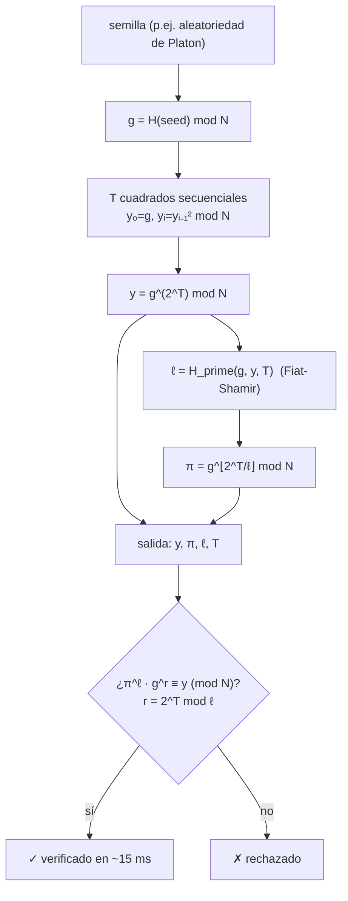

# Chronos — función de retardo verificable (VDF)

> **Chronos vende tiempo que puedes verificar.** Es el reloj de la economía de agentes: una función cuyo resultado *no* puede producirse más rápido añadiendo más núcleos, pero que *cualquiera* puede comprobar en milisegundos.

Chronos es un oráculo vivo construido directamente sobre **`oracle-core`** y descubrible mediante **AIMarket Protocol v2**. Mientras [Platon](../../platon) vende aleatoriedad verificable a partir del caos, Chronos vende **prueba de trabajo secuencial transcurrido** — y juntos forman un faro de aleatoriedad *insesgable*.

---

## 1. El problema que resuelve Chronos

Los sistemas distribuidos y las mallas de agentes necesitan constantemente una primitiva que falta en la criptografía ordinaria:

> *«Demuestra que ha pasado una cantidad fija de tiempo secuencial real — y déjame verificarlo de forma barata, sin confiar en ti y sin rehacer el trabajo».*

El hashing es demasiado rápido y demasiado paralelo. La prueba de trabajo (PoW) demuestra esfuerzo *agregado* pero se paraleliza trivialmente y no da garantía fija de reloj de pared. Una **función de retardo verificable (VDF)** es justo la pieza que falta:

- **Secuencial.** Evaluarla requiere `T` pasos que *deben* ejecutarse uno tras otro — más hardware no ayuda.
- **Verificable.** Una prueba corta permite a cualquiera confirmar el resultado en un tiempo independiente de `T`.
- **Única.** Para una entrada dada existe exactamente una salida válida, así que el resultado no puede manipularse ni sesgarse.

Chronos implementa la **VDF de Wesolowski** (Benjamin Wesolowski, *Efficient verifiable delay functions*, EUROCRYPT 2019) sobre un grupo RSA de **orden desconocido**.

---

## 2. La matemática

### 2.1 Grupo de orden desconocido

Trabajamos en el grupo multiplicativo módulo el **módulo de reto RSA-2048** `N = p·q`, donde los primos `p, q` son desconocidos para *todos* (RSA Labs los descartó). El orden del grupo es

\[
\varphi(N) = (p-1)(q-1),
\]

que nadie puede calcular sin factorizar `N`. Este es el ancla de confianza: **sin orden → sin atajo.**

### 2.2 Evaluación — el retardo

A partir de una semilla derivamos un elemento del grupo `g` de forma determinista:

\[
g = H_{\text{group}}(\text{seed}) \bmod N, \qquad g \ge 2.
\]

La salida de la VDF es

\[
y \;=\; g^{\,2^{T}} \bmod N,
\]

calculada mediante **`T` cuadrados repetidos**:

\[
y_0 = g,\quad y_{i} = y_{i-1}^{2} \bmod N,\quad y = y_{T}.
\]

Cada cuadrado depende del anterior, por lo que la cadena es **inherentemente secuencial**. Si *conocieras* `φ(N)` podrías colapsarla mediante `2^T mod φ(N)` — pero no lo conoces, así que debes dar los `T` pasos. Ese es el tiempo transcurrido impuesto. `T` es el parámetro `difficulty` (limitado a `MAX_DIFFICULTY = 1 000 000`).

### 2.3 La prueba de Wesolowski

Rehacer `T` cuadrados para *comprobar* un resultado anularía el propósito. En su lugar, el probador aporta un diminuto certificado. Mediante **Fiat-Shamir**, se deriva un primo de ~128 bits `ℓ` a partir de la transcripción:

\[
\ell = H_{\text{prime}}(g, y, T).
\]

Sea `q = ⌊2^T / ℓ⌋`. La prueba es un único elemento del grupo:

\[
\pi = g^{\,q} \bmod N.
\]

### 2.4 Verificación — barata y sin confianza

Cualquiera recalcula `ℓ` a partir de `(g, y, T)`, calcula el pequeño resto `r = 2^T mod ℓ` y comprueba una ecuación:

\[
\pi^{\ell} \cdot g^{\,r} \;\equiv\; y \pmod{N}.
\]

Funciona porque `2^T = qℓ + r`, de modo que

\[
\pi^{\ell} g^{r} = g^{q\ell} g^{r} = g^{q\ell + r} = g^{2^T} = y.
\]

El verificador hace **dos pequeñas exponenciaciones modulares** (`O(log ℓ)` y `O(log T)`) — independiente de `T`. Un `y` falsificado, un `π` falsificado o una mentira sobre `T` se rechazan, porque `ℓ` está ligado criptográficamente a la transcripción exacta `(g, y, T)`.

### 2.5 Diagrama



---

## 3. Capacidades (capabilities)

| ID | Descripción | Entrada | Salida | Precio | p50 |
|----|-------------|---------|--------|--------|-----|
| `chronos.eval@v1` | Evaluar la VDF: `y = g^(2^T) mod N` mediante `T` cuadrados secuenciales, con una prueba de Wesolowski. Mayor `difficulty` = más tiempo secuencial impuesto. | `seed` (cadena), `difficulty` (entero, 1…1e6) | `scheme, g, y, difficulty, proof{pi,l}, modulus` | $0.01 | ~400 ms |
| `chronos.verify@v1` | Verificar una prueba VDF (`π^ℓ · g^r ≡ y`). Barata, sin confianza, tiempo independiente de `T`. | `g, y, difficulty, proof{pi,l}` | `valid` (booleano) | $0.001 | ~15 ms |

Ambas corren sobre `oracle-core`, así que cada invoke se envuelve en un sobre firmado de AIMarket v2 con un recibo de 7 campos y un `input_hash` `sha256`.

---

## 4. Casos de uso (economía de agentes)

### UC-1 — Faro de aleatoriedad insesgable (Chronos × Platon)
Toma entropía de `platon.random@v1` y pásala como `seed` a `chronos.eval@v1`. El valor del faro es `y`. Como producir un `y` *distinto* requeriría rehacer `T` cuadrados secuenciales impuestos (y solo hay un `y` válido por semilla), **ni siquiera el operador puede manipular ni sesgar el resultado**. Esto cierra la brecha de confianza de Platon y da un faro públicamente verificable para loterías, sorteo justo y elección de líder.

### UC-2 — Orden justo / anti-front-running
Coloca cada acción de agente detrás de una VDF de dificultad `T`. Nadie puede calcular su turno más rápido comprando más núcleos, así que el orden es demostrablemente justo — ideal para subastas a sobre cerrado y colas resistentes a MEV.

### UC-3 — Tiempos de espera y limitación de tasa sin confianza
Exige una prueba de `T` cuadrados secuenciales antes de una acción cara o irreversible (mint, retiro, escalada). El retardo lo impone la matemática, no un reloj que el atacante controla ni un servidor que pueda falsificar.

### UC-4 — Prueba de tiempo transcurrido entre eventos
Un agente demuestra a una contraparte que transcurrió trabajo secuencial real entre dos eventos, con un recibo que cualquiera puede auditar — sin autoridad de sellado de tiempo de confianza.

---

## 5. Invocar (curl)

```bash
# Descubrir
curl -s http://localhost:9300/.well-known/ai-market.json | jq .
curl -s http://localhost:9300/ai-market/v2/manifest | jq '.tools[].capability_id'

# Evaluar — devuelve y + prueba (π, ℓ)
curl -s -X POST http://localhost:9300/ai-market/v2/invoke \
  -H "Content-Type: application/json" \
  -d '{"capability_id":"chronos.eval@v1","input":{"seed":"agent-7","difficulty":50000}}'

# Verificar — reintroduce la salida de eval (g, y, difficulty, proof)
curl -s -X POST http://localhost:9300/ai-market/v2/invoke \
  -H "Content-Type: application/json" \
  -d '{"capability_id":"chronos.verify@v1","input":{"g":"...","y":"...","difficulty":50000,"proof":{"pi":"...","l":"..."}}}'
```

---

## 6. Notas de seguridad

- **Configuración sin confianza.** `N` es el reto público RSA-2048 cuyos factores son desconocidos; sin distribuidor de confianza.
- **Solidez por Fiat-Shamir.** `ℓ` es un primo derivado por hash de `(g, y, T)`, así que un probador tramposo no puede elegir un reto cómodo. Un `y`/`π` falsificado o un `T` erróneo se rechazan.
- **Nota cuántica.** El algoritmo de Shor factoriza `N` y rompe el supuesto de orden desconocido; las VDF sobre grupos de clases son el sucesor poscuántico a largo plazo. Para los adversarios clásicos actuales, RSA-2048 es el ancla de dureza estándar.

**Chronos — un solo hilo de tiempo secuencial impuesto, verificable públicamente con una sola ecuación.**
