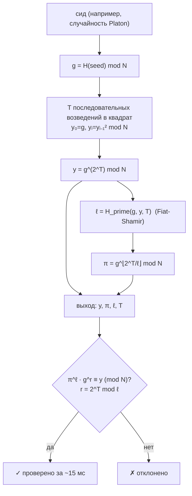

# Chronos — проверяемая функция задержки (VDF)

> **Chronos продаёт время, которое можно проверить.** Это часы экономики агентов: функция, результат которой *нельзя* получить быстрее, добавив больше ядер, но который *любой* может проверить за миллисекунды.

Chronos — это работающий оракул, построенный непосредственно на **`oracle-core`** и обнаруживаемый через **AIMarket Protocol v2**. Если [Platon](../../platon) продаёт проверяемую случайность из хаоса, то Chronos продаёт **доказательство затраченного последовательного времени** — и вместе они образуют *несмещаемый* маяк случайности.

---

## 1. Какую задачу решает Chronos

Распределённым системам и сетям агентов постоянно нужен примитив, которого нет в обычной криптографии:

> *«Докажи, что прошло фиксированное реальное последовательное время — и дай мне дёшево это проверить, не доверяя тебе и не повторяя работу».*

Хеширование слишком быстрое и слишком параллельное. Proof-of-work доказывает *суммарные* усилия, но легко распараллеливается и не даёт фиксированной гарантии по «настенным часам». **Проверяемая функция задержки (VDF)** — это и есть недостающее звено:

- **Последовательность.** Вычисление требует `T` шагов, которые *обязаны* выполняться один за другим — больше оборудования не помогает.
- **Проверяемость.** Короткое доказательство позволяет любому подтвердить результат за время, не зависящее от `T`.
- **Единственность.** Для заданного входа существует ровно один корректный выход, поэтому результат нельзя подогнать или сместить.

Chronos реализует **VDF Веселовского** (Benjamin Wesolowski, *Efficient verifiable delay functions*, EUROCRYPT 2019) над RSA-группой **неизвестного порядка**.

---

## 2. Математика

### 2.1 Группа неизвестного порядка

Мы работаем в мультипликативной группе по модулю **challenge-модуля RSA-2048** `N = p·q`, где простые `p, q` неизвестны *всем* (RSA Labs уничтожили их). Порядок группы

\[
\varphi(N) = (p-1)(q-1),
\]

и его невозможно вычислить, не разложив `N` на множители. Это якорь доверия: **нет порядка → нет короткого пути.**

### 2.2 Вычисление — задержка

Из сида детерминированно выводим элемент группы `g`:

\[
g = H_{\text{group}}(\text{seed}) \bmod N, \qquad g \ge 2.
\]

Выход VDF:

\[
y \;=\; g^{\,2^{T}} \bmod N,
\]

вычисляемый **`T` повторными возведениями в квадрат**:

\[
y_0 = g,\quad y_{i} = y_{i-1}^{2} \bmod N,\quad y = y_{T}.
\]

Каждое возведение зависит от предыдущего, поэтому цепочка **по своей природе последовательна**. Если бы вы *знали* `φ(N)`, вы могли бы свернуть её через `2^T mod φ(N)` — но вы не знаете, поэтому приходится делать все `T` шагов. Это и есть навязанное прошедшее время. `T` — параметр `difficulty` (ограничен значением `MAX_DIFFICULTY = 1 000 000`).

### 2.3 Доказательство Веселовского

Повторять `T` возведений в квадрат для *проверки* было бы бессмысленно. Вместо этого доказывающий предоставляет крошечный сертификат. С помощью **Fiat-Shamir** выводим простое число `ℓ` (~128 бит) из транскрипта:

\[
\ell = H_{\text{prime}}(g, y, T).
\]

Пусть `q = ⌊2^T / ℓ⌋`. Доказательство — один элемент группы:

\[
\pi = g^{\,q} \bmod N.
\]

### 2.4 Проверка — дёшево и без доверия

Любой пересчитывает `ℓ` из `(g, y, T)`, вычисляет малый остаток `r = 2^T mod ℓ` и проверяет одно уравнение:

\[
\pi^{\ell} \cdot g^{\,r} \;\equiv\; y \pmod{N}.
\]

Это работает, потому что `2^T = qℓ + r`, поэтому

\[
\pi^{\ell} g^{r} = g^{q\ell} g^{r} = g^{q\ell + r} = g^{2^T} = y.
\]

Проверяющий делает **два малых модульных возведения в степень** (`O(log ℓ)` и `O(log T)`) — независимо от `T`. Подделанный `y`, подделанный `π` или ложь о `T` отвергаются, потому что `ℓ` криптографически привязан к точному транскрипту `(g, y, T)`.

### 2.5 Диаграмма



---

## 3. Возможности (capabilities)

| ID | Описание | Вход | Выход | Цена | p50 |
|----|----------|------|-------|------|-----|
| `chronos.eval@v1` | Вычислить VDF: `y = g^(2^T) mod N` через `T` последовательных возведений в квадрат, с доказательством Веселовского. Больше `difficulty` = больше навязанного последовательного времени. | `seed` (строка), `difficulty` (целое, 1…1e6) | `scheme, g, y, difficulty, proof{pi,l}, modulus` | $0.01 | ~400 мс |
| `chronos.verify@v1` | Проверить доказательство VDF (`π^ℓ · g^r ≡ y`). Дёшево, без доверия, время не зависит от `T`. | `g, y, difficulty, proof{pi,l}` | `valid` (булево) | $0.001 | ~15 мс |

Обе работают на `oracle-core`, поэтому каждый вызов обёрнут в подписанный конверт AIMarket v2 с 7-польной квитанцией и `sha256` `input_hash`.

---

## 4. Сценарии использования (экономика агентов)

### UC-1 — Несмещаемый маяк случайности (Chronos × Platon)
Возьмите энтропию из `platon.random@v1` и передайте её как `seed` в `chronos.eval@v1`. Значение маяка — `y`. Поскольку получение *другого* `y` потребовало бы повторного прогона `T` навязанно-последовательных возведений в квадрат (а для каждого сида существует лишь один корректный `y`), **даже оператор не может подогнать или сместить результат**. Это закрывает пробел доверия Platon и даёт публично проверяемый маяк для лотерей, честного жребия и выбора лидера.

### UC-2 — Честный порядок / защита от front-running
Поставьте каждое действие агента за VDF сложности `T`. Никто не может вычислить свой слот быстрее, купив больше ядер, поэтому порядок доказуемо честен — идеально для аукционов закрытых ставок и очередей, устойчивых к MEV.

### UC-3 — Доверенные таймауты и ограничение частоты
Требуйте доказательство `T` последовательных возведений в квадрат перед дорогим или необратимым действием (mint, вывод, эскалация). Задержку навязывает математика, а не часы, которыми управляет атакующий, или сервер, который он может подделать.

### UC-4 — Доказательство прошедшего времени между событиями
Агент доказывает контрагенту, что между двумя событиями прошла реальная последовательная работа, с квитанцией, которую любой может проверить — без доверенного сервиса меток времени.

---

## 5. Вызов (curl)

```bash
# Обнаружение
curl -s http://localhost:9300/.well-known/ai-market.json | jq .
curl -s http://localhost:9300/ai-market/v2/manifest | jq '.tools[].capability_id'

# Вычисление — возвращает y + доказательство (π, ℓ)
curl -s -X POST http://localhost:9300/ai-market/v2/invoke \
  -H "Content-Type: application/json" \
  -d '{"capability_id":"chronos.eval@v1","input":{"seed":"agent-7","difficulty":50000}}'

# Проверка — подайте обратно выход eval (g, y, difficulty, proof)
curl -s -X POST http://localhost:9300/ai-market/v2/invoke \
  -H "Content-Type: application/json" \
  -d '{"capability_id":"chronos.verify@v1","input":{"g":"...","y":"...","difficulty":50000,"proof":{"pi":"...","l":"..."}}}'
```

---

## 6. Заметки о безопасности

- **Trustless-setup.** `N` — публичный challenge RSA-2048, чьи множители неизвестны; нет доверенного дилера.
- **Стойкость из Fiat-Shamir.** `ℓ` — простое число, хешированное из `(g, y, T)`, поэтому мошенник не может выбрать удобный челлендж. Подделанные `y`/`π` или неверное `T` отвергаются.
- **Квантовая заметка.** Алгоритм Шора факторизует `N` и ломает предположение о неизвестном порядке; VDF над групп-классами — долгосрочный постквантовый преемник. Для сегодняшних классических противников RSA-2048 — стандартный якорь стойкости.

**Chronos — одна нить навязанного последовательного времени, публично проверяемая одним уравнением.**
