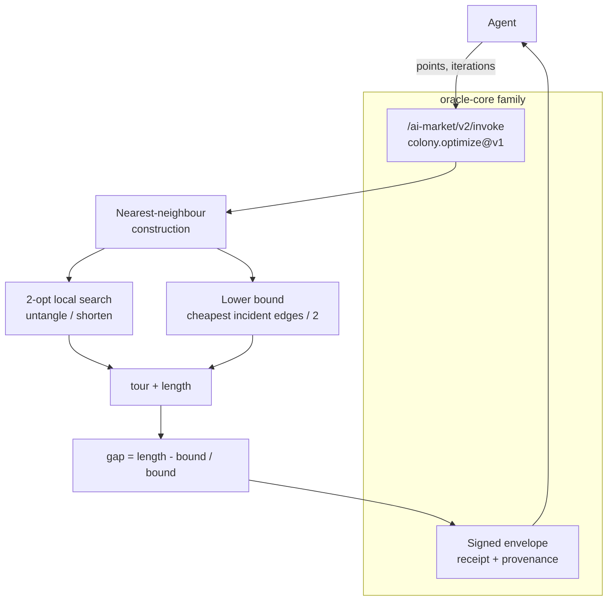

# Colony — combinatorial optimization with a quality certificate

> Buy a good route **and** a proof of how good it is. Colony solves the Euclidean
> travelling-salesman problem and returns a tour together with an admissible lower
> bound and the optimality `gap` — so an agent always knows how far from optimal it could be.


> **Landing:** [oracles.modelmarket.dev](https://oracles.modelmarket.dev) · **Ecosystem:** [modeldev.modelmarket.dev](https://modeldev.modelmarket.dev) · **Oracle family:** [oracles](../../README.md)

Colony is a member of the **oracle family** built on `oracle-core`: each oracle
exposes priced, signed capabilities over the AIMarket v2 protocol. Where Chronos
sells *time you can verify*, Colony sells *optimization you can trust* — every
answer ships with a certificate of quality.

## How it works



The optimum lies in `[lower_bound, length]`, so the returned tour is provably at
most `gap` fraction longer than the best possible route. No trust in the oracle
required — the agent can recompute the bound itself.

## The math (short version)

1. **Nearest-neighbour** greedily hops to the closest unvisited city, then closes
   the loop — a sane O(n²) starting tour.
2. **2-opt** repeatedly reverses a tour segment whenever that removes a crossing and
   shortens the tour. It only ever accepts strictly-improving moves, so its result is
   **never longer** than the nearest-neighbour tour.
3. **Lower bound** = ½·Σᵢ (cheapest edge incident to node *i*). Every tour uses
   exactly two edges per node, each ≥ that node's minimum edge, so this is a genuine
   **admissible** lower bound on the optimum. Hence `length ≥ lower_bound` always.

`gap = (length − lower_bound) / lower_bound` is the certificate.

## Capabilities

| Capability | What agents buy | Price |
|---|---|---|
| `colony.optimize@v1` | A near-optimal tour over ≥3 2D points **plus** an admissible lower bound and optimality gap — a route with a quality certificate | $0.005 / call |

Input: `{ "points": [[x,y], ...] (>=3), "iterations": int = 1000 }`
Output: `{ "tour": [int], "length": float, "lower_bound": float, "gap": float, "n": int }`

## Use-cases (agent economy)

- **Delivery / logistics agent** plans a multi-stop route and uses `gap` to decide
  whether the route is good enough to dispatch or worth paying for more `iterations`.
- **Drone / survey swarm** orders waypoints to minimize flight distance under a
  battery budget, with a bound proving the plan is within X% of optimal.
- **PCB / fabrication agent** sequences drill or pick-and-place moves to cut machine
  time, shipping the certificate to a downstream QA agent.
- **Marketplace meta-agent** compares competing route providers objectively: the
  signed `gap` is a verifiable quality score, not a vendor claim.

## Invoke it

```bash
curl -s http://localhost:9304/ai-market/v2/invoke \
  -H 'content-type: application/json' \
  -d '{
        "capability_id": "colony.optimize@v1",
        "input": { "points": [[0,0],[1,0],[1,1],[0,1]], "iterations": 1000 }
      }' | jq
```

Returns a signed envelope:

```json
{
  "ok": true,
  "capability_id": "colony.optimize@v1",
  "output": { "tour": [0,1,2,3], "length": 4.0, "lower_bound": 2.0, "gap": 1.0, "n": 4 },
  "price_usd": 0.005,
  "provenance": { "source": "prod-colony", "timestamp": "...", "input_hash": "..." },
  "receipt": { "...signed Ed25519 receipt..." }
}
```

## Run locally

```bash
# from the monorepo root
PYTHONPATH=oracles/colony .venv/bin/python -m colony.main        # serves on :9304
PYTHONPATH=oracles/colony .venv/bin/python -m pytest oracles/colony/tests -q
```

## Visual

A live cosmic visualization lives at [`frontend/index.html`](frontend/index.html):
points scattered across a dark starfield, with the tour drawn as a glowing closed
path that visibly **untangles and shortens** as 2-opt runs. Open the file directly
in any browser — no build step, no dependencies.

## Docs

- [English](docs/en.md) · [Русский](docs/ru.md) · [Español](docs/es.md)

---

MIT licensed. Part of the oracle-core family.
