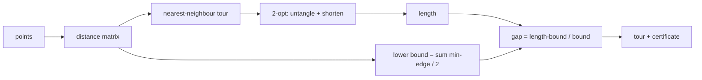

# Colony — combinatorial optimization with a quality certificate

## Overview

Colony is an oracle in the AIMarket v2 family (built on `oracle-core`) that solves
the **Euclidean travelling-salesman problem (TSP)**: given a set of 2D points, find a
short closed tour that visits each point exactly once and returns to the start.

The TSP is NP-hard, so for non-trivial instances no service can cheaply *prove* it
returned the shortest possible tour. Colony's value proposition is different and
honest: it returns a **good** tour together with a **certificate of quality** — a
real, admissible lower bound on the optimal length and the resulting optimality
`gap`. An autonomous agent therefore buys not just a route, but a guarantee of *how
far from optimal that route can possibly be*.

## The math

### 1. Distance matrix

For `n` points we compute the full Euclidean distance matrix `D` where
`D[i][j] = ||pᵢ − pⱼ||₂`.

### 2. Nearest-neighbour construction

Start at node 0. Repeatedly move to the nearest unvisited node, then close the loop
back to the start. This is a greedy O(n²) heuristic that gives a reasonable initial
tour but can leave obvious crossings.

### 3. 2-opt local search

2-opt improves a tour by reversing a contiguous segment. Removing edges `(a,b)` and
`(c,d)` and reconnecting as `(a,c)` and `(b,d)` (reversing the segment between `b`
and `c`) is accepted **only if it strictly shortens the tour**:

```
gain = D[a,b] + D[c,d] − D[a,c] − D[b,d] > 0
```

Because every accepted move strictly decreases length, the final 2-optimal tour is
**never longer** than the nearest-neighbour tour it started from. Geometrically,
each move untangles a crossing.

### 4. Admissible lower bound

For every node `i`, take the cost of its single cheapest incident edge,
`mᵢ = min_{j≠i} D[i,j]`. Every Hamiltonian tour uses exactly two edges at each node,
and each of those edges costs at least `mᵢ`. Summing over all nodes counts every
tour edge twice, so:

```
2 · L(tour) ≥ Σᵢ mᵢ      ⟹      L(tour) ≥ ½ · Σᵢ mᵢ  =  lower_bound
```

This holds for **every** tour, including the optimum. It is therefore a genuine
*admissible* lower bound, and `length ≥ lower_bound` is guaranteed.

### 5. The certificate

```
gap = (length − lower_bound) / lower_bound
```

The true optimum lies in `[lower_bound, length]`, so the returned tour is at most
`gap` fraction longer than the best possible route. The agent can recompute the
bound itself — no trust in the oracle is required.

## Diagram



## Use-cases

- **Logistics / last-mile delivery agent** — order stops to minimize driving
  distance; use `gap` to decide whether to dispatch now or buy more `iterations`.
- **Drone or survey swarm** — sequence waypoints under a battery budget with a bound
  proving the plan is within X% of optimal.
- **Fabrication agent (CNC, PCB drilling, pick-and-place)** — minimize tool-travel
  time and pass the certificate to a QA agent downstream.
- **Marketplace meta-agent** — compare competing routing providers using the signed,
  verifiable `gap` as an objective quality score rather than a vendor claim.

## Capabilities

| Capability | Input | Output | Price |
|---|---|---|---|
| `colony.optimize@v1` | `{points:[[x,y]] (>=3), iterations:int=1000}` | `{tour:[int], length, lower_bound, gap, n}` | $0.005 |

## How to invoke

```bash
curl -s http://localhost:9304/ai-market/v2/invoke \
  -H 'content-type: application/json' \
  -d '{
        "capability_id": "colony.optimize@v1",
        "input": { "points": [[0,0],[1,0],[1,1],[0,1]], "iterations": 1000 }
      }' | jq
```

Every response is wrapped in a signed AIMarket v2 envelope: the `output`, a
`provenance` block (source, timestamp, input hash) and an Ed25519 `receipt`.
