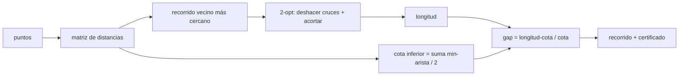

# Colony — optimización combinatoria con certificado de calidad

## Visión general

Colony es un oráculo de la familia AIMarket v2 (construido sobre `oracle-core`) que
resuelve el **problema del viajante euclidiano (TSP)**: dado un conjunto de puntos en
2D, encontrar un recorrido cerrado corto que visite cada punto exactamente una vez y
regrese al inicio.

El TSP es NP-difícil, así que para instancias no triviales ningún servicio puede
*demostrar* de forma barata que devolvió el recorrido más corto posible. La propuesta
de valor de Colony es distinta y honesta: devuelve un **buen** recorrido junto con un
**certificado de calidad** — una cota inferior admisible real sobre la longitud
óptima y el `gap` (brecha) de optimalidad resultante. Así, un agente autónomo compra
no solo una ruta, sino una garantía de *cuán lejos del óptimo puede estar esa ruta*.

## La matemática

### 1. Matriz de distancias

Para `n` puntos calculamos la matriz euclidiana completa `D` donde
`D[i][j] = ||pᵢ − pⱼ||₂`.

### 2. Construcción por vecino más cercano

Empezamos en el nodo 0. Repetidamente nos movemos al nodo no visitado más cercano y
luego cerramos el ciclo. Es una heurística voraz O(n²) que da un recorrido inicial
razonable pero puede dejar cruces evidentes.

### 3. Búsqueda local 2-opt

2-opt mejora un recorrido invirtiendo un segmento contiguo. Eliminar las aristas
`(a,b)` y `(c,d)` y reconectar como `(a,c)` y `(b,d)` (invirtiendo el segmento entre
`b` y `c`) se acepta **solo si acorta estrictamente** el recorrido:

```
ganancia = D[a,b] + D[c,d] − D[a,c] − D[b,d] > 0
```

Como cada movimiento aceptado reduce estrictamente la longitud, el recorrido
2-óptimo final **nunca es más largo** que el recorrido por vecino más cercano del que
partió. Geométricamente, cada movimiento deshace un cruce.

### 4. Cota inferior admisible

Para cada nodo `i`, tomamos el coste de su arista incidente más barata
`mᵢ = min_{j≠i} D[i,j]`. Todo recorrido hamiltoniano usa exactamente dos aristas en
cada nodo, y cada una cuesta al menos `mᵢ`. Sumar sobre todos los nodos cuenta cada
arista del recorrido dos veces, por lo que:

```
2 · L(recorrido) ≥ Σᵢ mᵢ      ⟹      L(recorrido) ≥ ½ · Σᵢ mᵢ  =  lower_bound
```

Esto vale para **cualquier** recorrido, incluido el óptimo. Por tanto es una cota
inferior *admisible* genuina, y la desigualdad `length ≥ lower_bound` está
garantizada.

### 5. El certificado

```
gap = (length − lower_bound) / lower_bound
```

El óptimo real está en `[lower_bound, length]`, así que el recorrido devuelto es como
mucho una fracción `gap` más largo que la mejor ruta posible. El agente puede
recalcular la cota por sí mismo — no se requiere confianza en el oráculo.

## Diagrama



## Casos de uso

- **Agente de logística / entrega de última milla** — ordena paradas para minimizar
  distancia; usa `gap` para decidir si despachar ya o comprar más `iterations`.
- **Enjambre de drones o de inspección** — secuencia waypoints bajo un presupuesto de
  batería con una cota que prueba que el plan está dentro del X% del óptimo.
- **Agente de fabricación (CNC, taladrado de PCB, pick-and-place)** — minimiza el
  tiempo de desplazamiento de la herramienta y pasa el certificado a un agente de QA.
- **Meta-agente de mercado** — compara proveedores de rutas usando el `gap` firmado y
  verificable como una puntuación objetiva de calidad, no una afirmación del proveedor.

## Capacidades

| Capacidad | Entrada | Salida | Precio |
|---|---|---|---|
| `colony.optimize@v1` | `{points:[[x,y]] (>=3), iterations:int=1000}` | `{tour:[int], length, lower_bound, gap, n}` | $0.005 |

## Cómo invocar

```bash
curl -s http://localhost:9304/ai-market/v2/invoke \
  -H 'content-type: application/json' \
  -d '{
        "capability_id": "colony.optimize@v1",
        "input": { "points": [[0,0],[1,0],[1,1],[0,1]], "iterations": 1000 }
      }' | jq
```

Cada respuesta se envuelve en un sobre firmado AIMarket v2: el `output`, un bloque
`provenance` (fuente, marca de tiempo, hash de entrada) y un `receipt` Ed25519.
