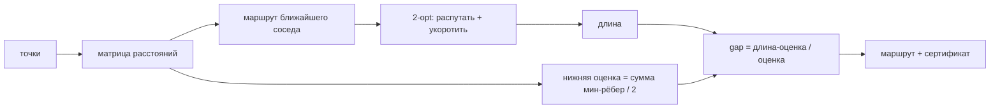

# Colony — комбинаторная оптимизация с сертификатом качества

## Обзор

Colony — это оракул семейства AIMarket v2 (на базе `oracle-core`), решающий
**евклидову задачу коммивояжёра (TSP)**: по набору точек на плоскости найти
короткий замкнутый маршрут, проходящий через каждую точку ровно один раз и
возвращающийся в начало.

TSP NP-трудна, поэтому для нетривиальных задач ни один сервис не может дёшево
*доказать*, что вернул кратчайший маршрут. Ценность Colony в другом и она честная:
оракул возвращает **хороший** маршрут вместе с **сертификатом качества** —
настоящей допустимой нижней оценкой длины оптимума и итоговым зазором `gap`. Таким
образом автономный агент покупает не просто маршрут, а гарантию того, *насколько
далеко от оптимума этот маршрут может находиться*.

## Математика

### 1. Матрица расстояний

Для `n` точек вычисляем полную евклидову матрицу расстояний `D`, где
`D[i][j] = ||pᵢ − pⱼ||₂`.

### 2. Метод ближайшего соседа

Стартуем в узле 0. Раз за разом переходим в ближайший непосещённый узел, затем
замыкаем маршрут. Это жадная эвристика сложности O(n²): она даёт разумный начальный
маршрут, но может оставлять явные самопересечения.

### 3. Локальный поиск 2-opt

2-opt улучшает маршрут, разворачивая непрерывный сегмент. Удаление рёбер `(a,b)` и
`(c,d)` с переподключением в `(a,c)` и `(b,d)` (разворот сегмента между `b` и `c`)
принимается **только если строго укорачивает маршрут**:

```
выигрыш = D[a,b] + D[c,d] − D[a,c] − D[b,d] > 0
```

Поскольку каждый принятый шаг строго уменьшает длину, итоговый 2-оптимальный
маршрут **никогда не длиннее** исходного маршрута ближайшего соседа. Геометрически
каждый шаг устраняет одно самопересечение.

### 4. Допустимая нижняя оценка

Для каждого узла `i` берём стоимость его самого дешёвого инцидентного ребра
`mᵢ = min_{j≠i} D[i,j]`. Любой гамильтонов маршрут использует ровно два ребра в
каждом узле, и каждое из них стоит не меньше `mᵢ`. Суммирование по всем узлам
учитывает каждое ребро маршрута дважды, поэтому:

```
2 · L(маршрут) ≥ Σᵢ mᵢ      ⟹      L(маршрут) ≥ ½ · Σᵢ mᵢ  =  lower_bound
```

Это верно для **любого** маршрута, включая оптимальный. Значит, это настоящая
*допустимая* нижняя оценка, и неравенство `length ≥ lower_bound` гарантировано.

### 5. Сертификат

```
gap = (length − lower_bound) / lower_bound
```

Истинный оптимум лежит в `[lower_bound, length]`, поэтому возвращённый маршрут не
более чем на долю `gap` длиннее наилучшего возможного. Агент может пересчитать
оценку сам — доверие к оракулу не требуется.

## Диаграмма



## Сценарии использования

- **Агент логистики / доставки последней мили** — упорядочивает точки, минимизируя
  пробег; по `gap` решает, отправлять ли маршрут сейчас или докупить `iterations`.
- **Рой дронов или съёмки** — упорядочивает точки маршрута под бюджет батареи с
  оценкой, доказывающей, что план в пределах X% от оптимума.
- **Агент производства (ЧПУ, сверление плат, установка компонентов)** — минимизирует
  время перемещений инструмента и передаёт сертификат агенту контроля качества.
- **Мета-агент маркетплейса** — сравнивает конкурирующих поставщиков маршрутов по
  подписанному проверяемому `gap` как объективной оценке качества, а не по заявлению
  поставщика.

## Возможности

| Возможность | Вход | Выход | Цена |
|---|---|---|---|
| `colony.optimize@v1` | `{points:[[x,y]] (>=3), iterations:int=1000}` | `{tour:[int], length, lower_bound, gap, n}` | $0.005 |

## Как вызвать

```bash
curl -s http://localhost:9304/ai-market/v2/invoke \
  -H 'content-type: application/json' \
  -d '{
        "capability_id": "colony.optimize@v1",
        "input": { "points": [[0,0],[1,0],[1,1],[0,1]], "iterations": 1000 }
      }' | jq
```

Каждый ответ обёрнут в подписанный конверт AIMarket v2: `output`, блок `provenance`
(источник, отметка времени, хеш входа) и подпись `receipt` на Ed25519.
