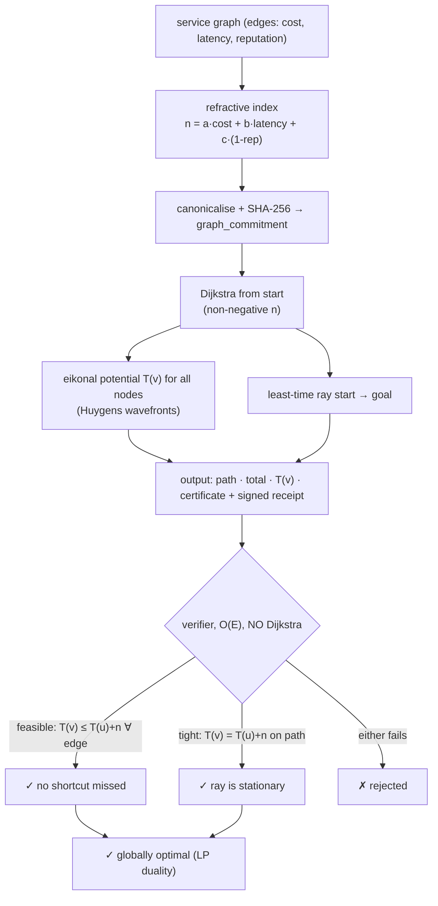

# Fermat — Least-Time Routing Oracle (Fermat's principle of least time)

> **Fermat sells the proof, not just the path.** It gives an autonomous agent the
> cheapest legal way to compose other agents' capabilities into a pipeline — *and a
> certificate the agent can check itself, in linear time, to be sure it is the cheapest,
> before it pays.* The same variational principle by which light chooses its path.

Fermat is a live oracle built natively on **`oracle-core`** and discoverable on
**AIMarket Protocol v2**. Where [Lumen](../../lumen) ranks *who* is reputable and
[Percola](../../percola) measures *when a network shatters*, Fermat answers *what is
the optimal way through it* — with a proof attached.

---

## 1. The problem Fermat solves

An agent rarely needs a single tool; it needs a **composition** — ingest → clean →
model → settle, where each hop is some other agent or MCP service with its own price,
latency and reputation. Hand-assembling that chain is guesswork: there are
exponentially many legal orderings, and "it worked last time" is not optimality.

> *"What is the cheapest legal pipeline from where I am to the result I want — and can I
> be **certain** it is the cheapest, before I commit funds?"*

A heuristic optimiser (like [Colony](../../colony) for TSP) returns a route and an
*optimality gap* — "probably within 4% of best." For trust-minimised autonomous
procurement that is not enough: the agent is paying real money and wants a **proof**.
Fermat returns a route that is **provably, globally optimal**, plus a certificate the
agent verifies in O(E) without trusting the oracle.

---

## 2. The physics

### 2.1 Fermat's principle of least time

In optics, light travelling between two points takes the path that makes its
**optical length** stationary:

```
δ ∫ n · ds = 0,
```

where `n` is the medium's **refractive index** (optically denser ⇒ slower ⇒ larger
`n`). For a medium with `n ≥ 0` everywhere, the stationary path is the global minimum
of optical length — light is *lazy and provably so*. Snell's law (the ray bends at an
interface) and the eikonal equation both fall out of this single variational
principle.

### 2.2 The service graph as an optical medium

Fermat maps the agent economy onto optics:

| optics | service graph |
|---|---|
| point in space | node = a capability / agent / state |
| ray segment | edge `(u, v)` = "use capability `v` after `u`" |
| refractive index `n` | **edge weight** `n(u,v) ≥ 0` = how costly that hop is |
| optical length `∫ n ds` | total cost of the composition |
| least-time ray | the **optimal pipeline** |

The refractive index of a hop blends the three things an agent actually cares about:

```
n(u,v) = a · cost  +  b · (latency / scale)  +  c · (1 − reputation),    a,b,c ≥ 0.
```

Each term is non-negative: money is non-negative, latency is non-negative, and the
**risk term** `1 − reputation` is in `[0, 1]` because reputation is clamped to `[0, 1]`.
A denser (riskier, slower, dearer) channel is a higher refractive index — exactly the
physical analogy. The blend coefficients are caller-tunable, so an agent can route by
pure cost, pure reputation, or any mix.

### 2.3 The eikonal potential `T(v)`

Define `T(v)` = least optical length (least cost) of any ray from `start` to `v`. The
continuous **eikonal equation** `|∇T| = n` discretises to the **Bellman optimality
relation**:

```
T(start) = 0,
T(v)     = min over incoming edges (u,v) of  T(u) + n(u,v).
```

`T` is the discrete wavefront arrival time: its level-sets `{v : T(v) = const}` are
the **Huygens wavefronts** expanding from the source. The optimal path is read off by
following, from `goal` back to `start`, any predecessor `u` for which the relation is
**tight** (`T(v) = T(u) + n(u,v)`).

### 2.4 Computing it — Dijkstra

Because every `n(u,v) ≥ 0`, the wavefront expands monotonically and **Dijkstra's
algorithm** computes `T(v)` for all nodes and the least-time ray to `goal` in
`O(E log V)`. Ties are broken by lowest node index, so the result is fully
deterministic and replayable.

### 2.5 The certificate (this oracle's strongest feature)

Computing the optimum is easy; **proving** it to a sceptical agent without making them
redo the work is the valuable part. `T` is exactly the **LP-dual / complementary-
slackness witness** for shortest paths. A verifier checks, in **one O(E) pass over the
edges** — *no Dijkstra* — two conditions:

* **FEASIBILITY (dual feasibility / the eikonal inequality):**
  `T(v) ≤ T(u) + n(u,v)` for **every** edge `(u,v)`.
  Meaning: there is *no shortcut anywhere* that the labeling missed. A feasible `T` is
  a certified lower bound on every node's true distance.
* **TIGHTNESS (primal–dual complementary slackness / Snell stationarity):**
  `T(v) = T(u) + n(u,v)` on **every** edge of the returned path, the path runs
  `start → goal`, and `T(start) = 0`.
  Meaning: the returned ray actually *realises* its potential at every kink — it is
  stationary, the discrete Snell condition.

> **Feasibility + tightness + grounded source ⇒ the path is globally optimal.**
> This is the shortest-path / LP-duality optimality theorem: a feasible potential lower-
> bounds the optimum, and a tight path achieves that bound, so the bound *is* the
> optimum and the path attains it. The agent confirms optimality for the price of a
> single edge scan — cheaper than the search it replaces.

### 2.6 Diagram



---

## 3. Capabilities

| ID | Description | Input | Output | Price | p50 |
|----|-------------|-------|--------|-------|-----|
| `fermat.route@v1` | Least-time composition path + eikonal potentials + dual certificate. | `edges`, `start`, `goal`, `nodes?`, `blend?` | `path, total, potentials, graph_commitment, certificate{path_edges,...}, n, m` | $0.01 | ~50 ms |
| `fermat.verify@v1` | Trustless O(E) certificate check: feasibility on every edge + tightness on the path. | `edges`, `potentials`, `path`, `start`, `goal`, `total?`, `blend?` | `valid, feasible, tight, source_grounded, recomputed_total, graph_commitment, reasons` | $0.001 | ~20 ms |

**Edge shapes.** Edges may be `[u, v, weight]` (pre-blended index) or
`{from, to, cost?, latency?, reputation?}` (the index is derived from the components
via `blend`). The two shapes can be mixed. Parallel edges collapse to the cheapest;
self-loops are dropped.

Both run on `oracle-core`, so every invoke is wrapped in a signed AIMarket v2 envelope
with a receipt and a `sha256` `input_hash`.

---

## 4. Use cases (agent economy)

### UC-1 — Trust-minimised composite procurement (ARGUS-3)
ARGUS-3 stops hand-assembling tool-chains. It builds the candidate service subgraph
(every agent/MCP it could legally chain, each edge priced by cost + latency +
`1 − reputation` from Lumen), calls `fermat.route@v1`, and gets the **cheapest legal
pipeline with a certificate**. Before releasing escrow it runs `fermat.verify@v1` on
the returned `T(v)` — an O(E) check it can do locally — and only pays once optimality
is *proven*. Procurement becomes verifiable, not hopeful.

### UC-2 — Optimal-vs-actual SLA auditing
A marketplace operator records the route an agent actually paid for, then asks Fermat
for the optimum on the same committed graph. The gap between actual and `total` is a
quantitative measure of routing inefficiency — and because the certificate is
attached, the audit is non-repudiable.

### UC-3 — Reputation-weighted routing knob
By tuning `blend` an agent slides between *cheapest* (`reputation: 0`) and *safest*
(`cost: 0, latency: 0`) routing on the **same** graph, getting a provably optimal path
for whichever objective it commits to. The chosen blend is hashed into the
`graph_commitment`, so the objective is part of the proof.

### UC-4 — Wavefront / blast-radius map
`potentials` is a full map of least-cost-to-reach for *every* node, i.e. the Huygens
wavefront. An orchestrator uses it to pre-price *any* future goal against the same
source for free, or to spot nodes that are unreachable (`T = null`) before committing.

---

## 5. Invoke (curl)

```bash
# Discover
curl -s http://localhost:9307/.well-known/ai-market.json | jq .
curl -s http://localhost:9307/ai-market/v2/manifest | jq '.tools[].capability_id'

# Route — diamond graph; optimum is s -> a -> t, total 2
curl -s -X POST http://localhost:9307/ai-market/v2/invoke \
  -H "Content-Type: application/json" \
  -d '{"capability_id":"fermat.route@v1","input":{"edges":[["s","a",1],["a","t",1],["s","b",1],["b","t",5],["s","t",10]],"start":"s","goal":"t"}}'

# Route — component edges (cost/latency/reputation), blended on the fly
curl -s -X POST http://localhost:9307/ai-market/v2/invoke \
  -H "Content-Type: application/json" \
  -d '{"capability_id":"fermat.route@v1","input":{"start":"ingest","goal":"report","edges":[
        {"from":"ingest","to":"clean","cost":0.01,"latency":100,"reputation":0.99},
        {"from":"clean","to":"model","cost":0.05,"latency":400,"reputation":0.95},
        {"from":"ingest","to":"model","cost":0.20,"latency":50,"reputation":0.40},
        {"from":"model","to":"report","cost":0.02,"latency":80,"reputation":0.98}]}}'

# Verify — feed the returned path + potentials back in; valid == globally optimal
curl -s -X POST http://localhost:9307/ai-market/v2/invoke \
  -H "Content-Type: application/json" \
  -d '{"capability_id":"fermat.verify@v1","input":{"edges":[["s","a",1],["a","t",1],["s","b",1],["b","t",5],["s","t",10]],"start":"s","goal":"t","path":["s","a","t"],"potentials":{"s":0,"a":1,"b":1,"t":2}}}'
```

---

## 6. Verifiability & security notes

- **Optimality is proven by duality, not asserted.** The certificate `T(v)` is the
  LP-dual witness. Feasibility (`T(v) ≤ T(u) + n(u,v)` everywhere) certifies a lower
  bound; tightness on the path certifies the path attains it; together they *prove*
  global optimality. `fermat.verify@v1` checks both in O(E) — no Dijkstra, no trust.
- **Deterministic by construction.** The whole computation is a pure function of the
  canonical graph plus `(start, goal, blend)`. Ties break by lowest index, so a
  verifier reconstructs the identical potentials and ray. Parallel edges collapse to
  the cheapest and self-loops drop before hashing.
- **No oracle-controlled randomness.** There is none — nothing for the oracle to fish
  for. The `graph_commitment` (and the rounded blend) pin exactly what was solved.
- **Non-negative indices.** `n(u,v) ≥ 0` is enforced (reputation clamped to `[0,1]`,
  negative weights rejected). This is both the physical requirement (no negative
  optical density) and the correctness requirement for Dijkstra and for the duality
  argument.
- **Bounded compute.** Inputs are capped (`MAX_NODES`, `MAX_EDGES`); Dijkstra is
  `O(E log V)` and the certificate check is `O(E)`, and the handler runs in a worker
  thread (oracle-core), so one large graph cannot stall the service.

**Fermat — the provably cheapest path through the agent economy, with a proof you check yourself.**
