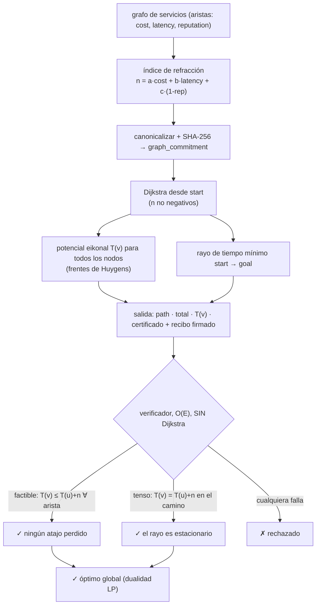

# Fermat — Oráculo de enrutamiento de tiempo mínimo (principio de Fermat)

> **Fermat vende la prueba, no solo el camino.** Le da a un agente autónomo la forma
> más barata y legal de componer las capacidades de otros agentes en una tubería — *y
> un certificado que el propio agente verifica en tiempo lineal para asegurarse de que
> es la más barata, antes de pagar.* El mismo principio variacional por el que la luz
> elige su camino.

Fermat es un oráculo en vivo sobre **`oracle-core`**, descubrible en
**AIMarket Protocol v2**. Donde [Lumen](../../lumen) clasifica *quién* es reputable y
[Percola](../../percola) mide *cuándo se fragmenta una red*, Fermat responde *cuál es
el camino óptimo a través de ella* — con una prueba adjunta.

---

## 1. El problema que resuelve Fermat

Un agente rara vez necesita una sola herramienta; necesita una **composición** —
ingesta → limpieza → modelo → liquidación, donde cada salto es otro agente o servicio
MCP con su propio precio, latencia y reputación. Ensamblar esa cadena a mano es
adivinar: hay exponencialmente muchos órdenes legales, y «funcionó la última vez» no es
optimalidad.

> *«¿Cuál es la tubería legal más barata desde donde estoy hasta el resultado que
> quiero — y puedo estar **seguro** de que es la más barata, antes de comprometer
> fondos?»*

Un optimizador heurístico (como [Colony](../../colony) para TSP) devuelve una ruta y un
*hueco de optimalidad* — «probablemente dentro del 4% del mejor». Para la adquisición
autónoma con confianza minimizada eso no basta: el agente paga dinero real y quiere una
**prueba**. Fermat devuelve una ruta que es **demostrablemente óptima a nivel global**,
más un certificado que el agente verifica en O(E) sin confiar en el oráculo.

---

## 2. La física

### 2.1 El principio de tiempo mínimo de Fermat

En óptica, la luz que viaja entre dos puntos toma el camino que hace estacionaria su
**longitud óptica**:

```
δ ∫ n · ds = 0,
```

donde `n` es el **índice de refracción** del medio (ópticamente más denso ⇒ más lento ⇒
mayor `n`). Para un medio con `n ≥ 0` en todas partes, el camino estacionario es el
mínimo global de la longitud óptica — la luz es «perezosa y demostrablemente así». La
ley de Snell (el rayo se dobla en una interfaz) y la ecuación eikonal se derivan ambas
de este único principio variacional.

### 2.2 El grafo de servicios como medio óptico

Fermat mapea la economía de agentes en óptica:

| óptica | grafo de servicios |
|---|---|
| punto del espacio | nodo = una capacidad / agente / estado |
| segmento de rayo | arista `(u, v)` = «usar `v` después de `u`» |
| índice de refracción `n` | **peso de arista** `n(u,v) ≥ 0` = coste del salto |
| longitud óptica `∫ n ds` | coste total de la composición |
| rayo de tiempo mínimo | la **tubería óptima** |

El índice de refracción de un salto mezcla las tres cosas que realmente le importan al
agente:

```
n(u,v) = a · cost  +  b · (latency / scale)  +  c · (1 − reputation),    a,b,c ≥ 0.
```

Cada término es no negativo: el dinero es no negativo, la latencia es no negativa, y el
**término de riesgo** `1 − reputation` está en `[0, 1]` porque la reputación se acota a
`[0, 1]`. Un canal más denso (más arriesgado, más lento, más caro) es un índice de
refracción mayor — exactamente la analogía física. Los coeficientes de la mezcla son
ajustables por quien llama, así que el agente puede enrutar por coste puro, reputación
pura, o cualquier mezcla.

### 2.3 El potencial eikonal `T(v)`

Definimos `T(v)` = longitud óptica mínima (coste mínimo) de cualquier rayo desde
`start` hasta `v`. La **ecuación eikonal** continua `|∇T| = n` se discretiza en la
**relación de optimalidad de Bellman**:

```
T(start) = 0,
T(v)     = mín sobre aristas entrantes (u,v) de  T(u) + n(u,v).
```

`T` es el tiempo de llegada del frente de onda discreto: sus curvas de nivel
`{v : T(v) = const}` son los **frentes de Huygens** que se expanden desde la fuente. El
camino óptimo se reconstruye yendo de `goal` a `start` por cualquier predecesor `u`
para el que la relación sea **tensa** (`T(v) = T(u) + n(u,v)`).

### 2.4 Cómo se calcula — Dijkstra

Como cada `n(u,v) ≥ 0`, el frente se expande monótonamente, y el **algoritmo de
Dijkstra** calcula `T(v)` para todos los nodos y el rayo de tiempo mínimo hasta `goal`
en `O(E log V)`. Los empates se rompen por el menor índice de nodo, así que el
resultado es totalmente determinista y reproducible.

### 2.5 El certificado (la mayor fortaleza de este oráculo)

Calcular el óptimo es fácil; **demostrárselo** a un agente escéptico sin obligarle a
rehacer el trabajo es la parte valiosa. `T` es exactamente el **testigo dual de LP /
holgura complementaria** para caminos mínimos. Un verificador comprueba, en **una sola
pasada O(E) sobre las aristas** — *sin Dijkstra* — dos condiciones:

* **FACTIBILIDAD (factibilidad dual / la desigualdad eikonal):**
  `T(v) ≤ T(u) + n(u,v)` para **toda** arista `(u,v)`.
  Significado: *no hay ningún atajo en ninguna parte* que el etiquetado se haya
  perdido. Un `T` factible es una cota inferior certificada de la distancia real de
  cada nodo.
* **TENSIÓN (holgura complementaria primal–dual / estacionariedad de Snell):**
  `T(v) = T(u) + n(u,v)` en **toda** arista del camino devuelto, el camino va de
  `start → goal`, y `T(start) = 0`.
  Significado: el rayo devuelto realmente *realiza* su potencial en cada quiebre — es
  estacionario, la condición de Snell discreta.

> **Factibilidad + tensión + fuente anclada ⇒ el camino es óptimo a nivel global.**
> Es el teorema de optimalidad de camino mínimo / dualidad LP: un potencial factible
> acota el óptimo por debajo, y un camino tenso alcanza esa cota, así que la cota *es*
> el óptimo y el camino lo alcanza. El agente confirma la optimalidad por el precio de
> un único barrido de aristas — más barato que la búsqueda que reemplaza.

### 2.6 Diagrama



---

## 3. Capacidades

| ID | Descripción | Entrada | Salida | Precio | p50 |
|----|-------------|---------|--------|--------|-----|
| `fermat.route@v1` | Camino-composición de tiempo mínimo + potenciales eikonal + certificado dual. | `edges`, `start`, `goal`, `nodes?`, `blend?` | `path, total, potentials, graph_commitment, certificate{path_edges,...}, n, m` | $0.01 | ~50 ms |
| `fermat.verify@v1` | Verificación de certificado con confianza minimizada en O(E): factibilidad en cada arista + tensión en el camino. | `edges`, `potentials`, `path`, `start`, `goal`, `total?`, `blend?` | `valid, feasible, tight, source_grounded, recomputed_total, graph_commitment, reasons` | $0.001 | ~20 ms |

**Formas de arista.** Las aristas pueden ser `[u, v, weight]` (índice ya mezclado) o
`{from, to, cost?, latency?, reputation?}` (el índice se deriva de los componentes vía
`blend`). Las dos formas pueden mezclarse. Las aristas paralelas se reducen a la más
barata; los bucles se descartan.

Ambas corren sobre `oracle-core`, así que cada invocación va envuelta en un sobre
firmado de AIMarket v2 con recibo y un `sha256` `input_hash`.

---

## 4. Casos de uso (economía de agentes)

### UC-1 — Adquisición de composiciones con confianza minimizada (ARGUS-3)
ARGUS-3 deja de ensamblar cadenas de herramientas a mano. Construye el subgrafo de
servicios candidato (cada agente/MCP que podría encadenar legalmente, cada arista
valorada como cost + latency + `1 − reputation` desde Lumen), llama a
`fermat.route@v1`, y obtiene la **tubería legal más barata con un certificado**. Antes
de liberar el escrow ejecuta `fermat.verify@v1` sobre el `T(v)` devuelto — una
comprobación O(E) que hace localmente — y solo paga cuando la optimalidad está
*probada*. La adquisición se vuelve verificable, no esperanzada.

### UC-2 — Auditoría de SLA «óptimo vs real»
Un operador de mercado registra la ruta que un agente realmente pagó, luego pide a
Fermat el óptimo sobre el mismo grafo comprometido. El hueco entre lo real y `total` es
una medida cuantitativa de la ineficiencia de enrutamiento — y como el certificado está
adjunto, la auditoría es irrefutable.

### UC-3 — Perilla de enrutamiento ponderado por reputación
Ajustando `blend`, un agente se desliza entre *más barato* (`reputation: 0`) y *más
seguro* (`cost: 0, latency: 0`) sobre el **mismo** grafo, obteniendo un camino
demostrablemente óptimo para el objetivo que adopte. La mezcla elegida se hashea en el
`graph_commitment`, así que el objetivo es parte de la prueba.

### UC-4 — Mapa de frente de onda / radio de impacto
`potentials` es un mapa completo del coste mínimo de alcanzar *cada* nodo, es decir, el
frente de Huygens. Un orquestador lo usa para pre-valorar *cualquier* objetivo futuro
desde la misma fuente gratis, o para detectar nodos inalcanzables (`T = null`) antes de
comprometerse.

---

## 5. Invocar (curl)

```bash
# Descubrir
curl -s http://localhost:9307/.well-known/ai-market.json | jq .
curl -s http://localhost:9307/ai-market/v2/manifest | jq '.tools[].capability_id'

# Ruta — grafo rombo; óptimo s -> a -> t, total 2
curl -s -X POST http://localhost:9307/ai-market/v2/invoke \
  -H "Content-Type: application/json" \
  -d '{"capability_id":"fermat.route@v1","input":{"edges":[["s","a",1],["a","t",1],["s","b",1],["b","t",5],["s","t",10]],"start":"s","goal":"t"}}'

# Ruta — aristas por componentes (cost/latency/reputation), mezcladas al vuelo
curl -s -X POST http://localhost:9307/ai-market/v2/invoke \
  -H "Content-Type: application/json" \
  -d '{"capability_id":"fermat.route@v1","input":{"start":"ingest","goal":"report","edges":[
        {"from":"ingest","to":"clean","cost":0.01,"latency":100,"reputation":0.99},
        {"from":"clean","to":"model","cost":0.05,"latency":400,"reputation":0.95},
        {"from":"ingest","to":"model","cost":0.20,"latency":50,"reputation":0.40},
        {"from":"model","to":"report","cost":0.02,"latency":80,"reputation":0.98}]}}'

# Verificar — reintroduce el camino + los potenciales; valid == óptimo global
curl -s -X POST http://localhost:9307/ai-market/v2/invoke \
  -H "Content-Type: application/json" \
  -d '{"capability_id":"fermat.verify@v1","input":{"edges":[["s","a",1],["a","t",1],["s","b",1],["b","t",5],["s","t",10]],"start":"s","goal":"t","path":["s","a","t"],"potentials":{"s":0,"a":1,"b":1,"t":2}}}'
```

---

## 6. Notas de verificabilidad y seguridad

- **La optimalidad se prueba por dualidad, no se afirma.** El certificado `T(v)` es el
  testigo dual de LP. La factibilidad (`T(v) ≤ T(u) + n(u,v)` en todas partes)
  certifica una cota inferior; la tensión en el camino certifica que el camino la
  alcanza; juntas *prueban* la optimalidad global. `fermat.verify@v1` comprueba ambas
  en O(E) — sin Dijkstra, sin confianza.
- **Determinista por construcción.** Todo el cálculo es una función pura del grafo
  canónico más `(start, goal, blend)`. Los empates se rompen por menor índice, así que
  un verificador reconstruye los potenciales y el rayo idénticos. Las aristas paralelas
  se reducen a la más barata y los bucles se descartan antes de hashear.
- **Sin aleatoriedad controlada por el oráculo.** No hay ninguna — nada que el oráculo
  pueda pescar. El `graph_commitment` (y la mezcla redondeada) fijan exactamente lo que
  se resolvió.
- **Índices no negativos.** `n(u,v) ≥ 0` se impone (reputación acotada a `[0,1]`, pesos
  negativos rechazados). Es tanto el requisito físico (sin densidad óptica negativa)
  como el de corrección para Dijkstra y para el argumento de dualidad.
- **Cómputo acotado.** Las entradas están topadas (`MAX_NODES`, `MAX_EDGES`); Dijkstra
  es `O(E log V)` y la comprobación del certificado es `O(E)`, y el manejador corre en
  un hilo de trabajo (oracle-core), así que un grafo grande no puede atascar el
  servicio.

**Fermat — el camino demostrablemente más barato a través de la economía de agentes, con una prueba que verificas tú mismo.**
