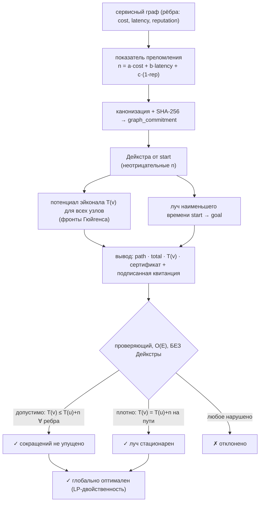

# Fermat — оракул маршрутизации по наименьшему времени (принцип Ферма)

> **Fermat продаёт доказательство, а не только путь.** Он даёт автономному агенту
> самый дешёвый легальный способ скомпоновать возможности других агентов в конвейер —
> *и сертификат, который агент сам проверяет за линейное время, чтобы убедиться, что
> это действительно самый дешёвый путь, прежде чем платить.* Тот же вариационный
> принцип, по которому свет выбирает свой путь.

Fermat — живой оракул на **`oracle-core`**, публикуется в **AIMarket Protocol v2**.
Если [Lumen](../../lumen) ранжирует, *кто* надёжен, а [Percola](../../percola) измеряет,
*когда сеть рассыпается*, то Fermat отвечает, *каков оптимальный путь через неё* — с
приложенным доказательством.

---

## 1. Какую задачу решает Fermat

Агенту редко нужен один инструмент; ему нужна **композиция** — приём → очистка →
модель → расчёт, где каждый переход — это другой агент или MCP-сервис со своей ценой,
задержкой и репутацией. Собирать такую цепочку вручную — гадание: легальных порядков
экспоненциально много, а «в прошлый раз сработало» — не оптимальность.

> *«Каков самый дешёвый легальный конвейер от моего текущего состояния к нужному
> результату — и могу ли я **быть уверенным**, что он самый дешёвый, прежде чем
> вложить деньги?»*

Эвристический оптимизатор (как [Colony](../../colony) для TSP) возвращает маршрут и
*зазор оптимальности* — «вероятно, в пределах 4% от лучшего». Для доверительно-
минимизированной автономной закупки этого мало: агент платит реальные деньги и хочет
**доказательство**. Fermat возвращает маршрут, который **доказуемо глобально
оптимален**, плюс сертификат, который агент проверяет за O(E) без доверия к оракулу.

---

## 2. Физика

### 2.1 Принцип наименьшего времени Ферма

В оптике свет между двумя точками идёт по пути, делающему его **оптическую длину**
стационарной:

```
δ ∫ n · ds = 0,
```

где `n` — **показатель преломления** среды (оптически плотнее ⇒ медленнее ⇒ больше
`n`). Для среды с `n ≥ 0` всюду стационарный путь является глобальным минимумом
оптической длины — свет «ленив и доказуемо так». Закон Снеллиуса (преломление луча на
границе) и уравнение эйконала следуют из этого единственного вариационного принципа.

### 2.2 Сервисный граф как оптическая среда

Fermat отображает экономику агентов в оптику:

| оптика | сервисный граф |
|---|---|
| точка пространства | узел = возможность / агент / состояние |
| отрезок луча | ребро `(u, v)` = «использовать `v` после `u`» |
| показатель преломления `n` | **вес ребра** `n(u,v) ≥ 0` = стоимость перехода |
| оптическая длина `∫ n ds` | суммарная стоимость композиции |
| луч наименьшего времени | **оптимальный конвейер** |

Показатель преломления перехода смешивает три величины, которые реально важны агенту:

```
n(u,v) = a · cost  +  b · (latency / scale)  +  c · (1 − reputation),    a,b,c ≥ 0.
```

Каждое слагаемое неотрицательно: деньги неотрицательны, задержка неотрицательна, а
**член риска** `1 − reputation` лежит в `[0, 1]`, потому что репутация зажимается в
`[0, 1]`. Более плотный (рискованнее, медленнее, дороже) канал — больший показатель
преломления, ровно физическая аналогия. Коэффициенты смеси настраиваются вызывающим,
так что агент может маршрутизировать по чистой цене, чистой репутации или их смеси.

### 2.3 Потенциал эйконала `T(v)`

Определим `T(v)` = наименьшая оптическая длина (наименьшая стоимость) любого луча от
`start` до `v`. Непрерывное **уравнение эйконала** `|∇T| = n` дискретизируется в
**соотношение оптимальности Беллмана**:

```
T(start) = 0,
T(v)     = min по входящим рёбрам (u,v) от  T(u) + n(u,v).
```

`T` — это дискретное время прихода волнового фронта: его линии уровня
`{v : T(v) = const}` — **фронты Гюйгенса**, расходящиеся от источника. Оптимальный
путь восстанавливается, идя от `goal` к `start` по любому предшественнику `u`, для
которого соотношение **плотно** (`T(v) = T(u) + n(u,v)`).

### 2.4 Вычисление — Дейкстра

Поскольку каждое `n(u,v) ≥ 0`, фронт расходится монотонно, и **алгоритм Дейкстры**
вычисляет `T(v)` для всех узлов и луч наименьшего времени до `goal` за `O(E log V)`.
Ничьи разрешаются по наименьшему индексу узла, поэтому результат полностью
детерминирован и воспроизводим.

### 2.5 Сертификат (сильнейшая сторона этого оракула)

Вычислить оптимум легко; **доказать** его скептичному агенту, не заставляя
переделывать работу, — вот ценная часть. `T` — это в точности **двойственный
свидетель LP / дополняющая нежёсткость** для кратчайших путей. Проверяющий за **один
проход O(E) по рёбрам** — *без Дейкстры* — проверяет два условия:

* **ДОПУСТИМОСТЬ (двойственная допустимость / неравенство эйконала):**
  `T(v) ≤ T(u) + n(u,v)` для **каждого** ребра `(u,v)`.
  Смысл: *нигде нет упущенного сокращения*. Допустимый `T` — это удостоверенная нижняя
  граница истинного расстояния каждого узла.
* **ПЛОТНОСТЬ (дополняющая нежёсткость / стационарность Снеллиуса):**
  `T(v) = T(u) + n(u,v)` на **каждом** ребре возвращённого пути, путь идёт
  `start → goal`, и `T(start) = 0`.
  Смысл: возвращённый луч действительно *реализует* свой потенциал в каждом изломе —
  он стационарен, дискретное условие Снеллиуса.

> **Допустимость + плотность + заземлённый источник ⇒ путь глобально оптимален.**
> Это теорема оптимальности кратчайшего пути / LP-двойственности: допустимый потенциал
> ограничивает оптимум снизу, а плотный путь достигает этой границы, значит граница
> *есть* оптимум, и путь его достигает. Агент подтверждает оптимальность ценой одного
> сканирования рёбер — дешевле, чем поиск, который оно заменяет.

### 2.6 Диаграмма



---

## 3. Возможности

| ID | Описание | Вход | Выход | Цена | p50 |
|----|----------|------|-------|------|-----|
| `fermat.route@v1` | Путь-композиция наименьшего времени + потенциалы эйконала + двойственный сертификат. | `edges`, `start`, `goal`, `nodes?`, `blend?` | `path, total, potentials, graph_commitment, certificate{path_edges,...}, n, m` | $0.01 | ~50 мс |
| `fermat.verify@v1` | Доверительно-минимизированная проверка сертификата за O(E): допустимость на каждом ребре + плотность на пути. | `edges`, `potentials`, `path`, `start`, `goal`, `total?`, `blend?` | `valid, feasible, tight, source_grounded, recomputed_total, graph_commitment, reasons` | $0.001 | ~20 мс |

**Формы рёбер.** Рёбра могут быть `[u, v, weight]` (предварительно смешанный
показатель) или `{from, to, cost?, latency?, reputation?}` (показатель выводится из
компонент через `blend`). Формы можно смешивать. Параллельные рёбра сводятся к самому
дешёвому; петли отбрасываются.

Обе работают на `oracle-core`, поэтому каждый вызов завёрнут в подписанный конверт
AIMarket v2 с квитанцией и `sha256` `input_hash`.

---

## 4. Сценарии использования (экономика агентов)

### UC-1 — Доверительно-минимизированная закупка композиций (ARGUS-3)
ARGUS-3 перестаёт собирать цепочки инструментов вручную. Он строит граф-кандидат
сервисов (каждый агент/MCP, который можно легально сцепить, каждое ребро оценено как
cost + latency + `1 − reputation` от Lumen), вызывает `fermat.route@v1` и получает
**самый дешёвый легальный конвейер с сертификатом**. Перед освобождением эскроу он
запускает `fermat.verify@v1` на возвращённом `T(v)` — проверку O(E), которую делает
локально, — и платит только когда оптимальность *доказана*. Закупка становится
проверяемой, а не оптимистичной.

### UC-2 — Аудит SLA «оптимум против факта»
Оператор маркетплейса записывает маршрут, за который агент реально заплатил, затем
спрашивает у Fermat оптимум на том же зафиксированном графе. Разрыв между фактом и
`total` — это количественная мера неэффективности маршрутизации, и поскольку приложен
сертификат, аудит неоспорим.

### UC-3 — Ручка маршрутизации, взвешенной по репутации
Настраивая `blend`, агент скользит между *самым дешёвым* (`reputation: 0`) и *самым
безопасным* (`cost: 0, latency: 0`) маршрутом на **том же** графе, получая доказуемо
оптимальный путь для выбранной цели. Выбранная смесь хешируется в `graph_commitment`,
поэтому цель — часть доказательства.

### UC-4 — Карта волнового фронта / радиуса поражения
`potentials` — полная карта наименьшей стоимости достижения *каждого* узла, т.е. фронт
Гюйгенса. Оркестратор использует её, чтобы заранее оценить *любую* будущую цель от того
же источника бесплатно или заметить недостижимые узлы (`T = null`) до фиксации.

---

## 5. Вызов (curl)

```bash
# Обнаружение
curl -s http://localhost:9307/.well-known/ai-market.json | jq .
curl -s http://localhost:9307/ai-market/v2/manifest | jq '.tools[].capability_id'

# Маршрут — граф-ромб; оптимум s -> a -> t, total 2
curl -s -X POST http://localhost:9307/ai-market/v2/invoke \
  -H "Content-Type: application/json" \
  -d '{"capability_id":"fermat.route@v1","input":{"edges":[["s","a",1],["a","t",1],["s","b",1],["b","t",5],["s","t",10]],"start":"s","goal":"t"}}'

# Маршрут — рёбра-компоненты (cost/latency/reputation), смешиваются на лету
curl -s -X POST http://localhost:9307/ai-market/v2/invoke \
  -H "Content-Type: application/json" \
  -d '{"capability_id":"fermat.route@v1","input":{"start":"ingest","goal":"report","edges":[
        {"from":"ingest","to":"clean","cost":0.01,"latency":100,"reputation":0.99},
        {"from":"clean","to":"model","cost":0.05,"latency":400,"reputation":0.95},
        {"from":"ingest","to":"model","cost":0.20,"latency":50,"reputation":0.40},
        {"from":"model","to":"report","cost":0.02,"latency":80,"reputation":0.98}]}}'

# Проверка — подайте обратно путь + потенциалы; valid == глобально оптимален
curl -s -X POST http://localhost:9307/ai-market/v2/invoke \
  -H "Content-Type: application/json" \
  -d '{"capability_id":"fermat.verify@v1","input":{"edges":[["s","a",1],["a","t",1],["s","b",1],["b","t",5],["s","t",10]],"start":"s","goal":"t","path":["s","a","t"],"potentials":{"s":0,"a":1,"b":1,"t":2}}}'
```

---

## 6. Заметки о проверяемости и безопасности

- **Оптимальность доказана двойственностью, а не заявлена.** Сертификат `T(v)` — это
  двойственный свидетель LP. Допустимость (`T(v) ≤ T(u) + n(u,v)` всюду) удостоверяет
  нижнюю границу; плотность на пути удостоверяет, что путь её достигает; вместе они
  *доказывают* глобальную оптимальность. `fermat.verify@v1` проверяет оба за O(E) — без
  Дейкстры, без доверия.
- **Детерминизм по построению.** Всё вычисление — чистая функция канонического графа
  плюс `(start, goal, blend)`. Ничьи разрешаются по наименьшему индексу, поэтому
  проверяющий восстанавливает идентичные потенциалы и луч. Параллельные рёбра сводятся
  к самому дешёвому, петли отбрасываются до хеширования.
- **Никакой контролируемой оракулом случайности.** Её нет — оракулу нечего
  подбирать. `graph_commitment` (и округлённая смесь) фиксируют ровно то, что решалось.
- **Неотрицательные показатели.** `n(u,v) ≥ 0` обеспечивается (репутация зажата в
  `[0,1]`, отрицательные веса отклоняются). Это и физическое требование (нет
  отрицательной оптической плотности), и требование корректности для Дейкстры и
  аргумента двойственности.
- **Ограниченные вычисления.** Входы ограничены (`MAX_NODES`, `MAX_EDGES`); Дейкстра —
  `O(E log V)`, проверка сертификата — `O(E)`, а обработчик работает в рабочем потоке
  (oracle-core), так что один большой граф не застопорит сервис.

**Fermat — доказуемо самый дешёвый путь через экономику агентов, с доказательством, которое вы проверяете сами.**
