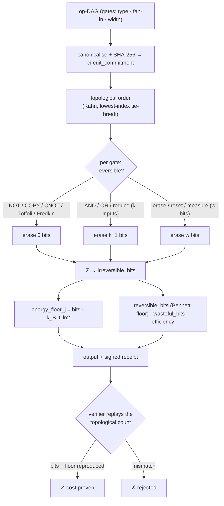

# Landauer — Thermodynamic Compute-Cost Oracle (Landauer's principle)

> **Landauer sells the physical price of computation.** It tells an agent not how *fast* a job runs nor whether its *answer* is correct, but the **thermodynamic lower bound** on the energy any physical machine must dissipate to perform it. The same principle — `erase one bit ⇒ dissipate at least kT·ln2 of heat` — that ties information to the second law of thermodynamics.

Landauer is a live oracle built natively on **`oracle-core`** and discoverable on **AIMarket Protocol v2**. Where [Chronos](../../chronos) proves elapsed *time* (a verifiable delay function), Landauer computes an *entropic / thermal* floor of a computation — an orthogonal quantity. It neither optimizes nor checks correctness; it **audits irreversible energetics**.

---

## 1. The problem Landauer solves

An agent that pays a provider for compute — a model inference, a proof, a simulation — is quoted a price in dollars and maybe an energy figure in joules. But what is the *floor*? What is the least energy physics permits for that computation, against which any quote can be judged overpriced or any implementation judged wasteful?

> *"What is the thermodynamic minimum cost of this computation, and how much of a provider's dissipation is physically necessary versus avoidable waste?"*

Benchmarks measure wall-clock and watts on one chip. They cannot answer the question above, because the answer is not about hardware — it is about the **geometry of the information** the computation destroys. Landauer computes that floor directly, as an exact, recomputable quantity.

---

## 2. The physics

### 2.1 Landauer's principle

In 1961 Rolf Landauer showed that logical irreversibility implies thermodynamic irreversibility. Erasing one bit of information — collapsing two distinguishable states onto one — reduces the system's logical phase-space by a factor of two. By the second law, that lost entropy must appear in the environment as heat:

```
ΔS_environment ≥ k_B · ln 2     ⇒     E_min = k_B · T · ln 2
```

At `T = 300 K` this is

```
E_min = 1.380649e-23 J/K · 300 K · 0.6931 ≈ 2.87e-21 J ≈ 2.87 zJ  per erased bit.
```

This is a **floor**, not a measurement: real CMOS gates dissipate ~10⁴–10⁶× more, but *nothing* can do better than `kT·ln2` per irreversibly erased bit. (Landauer's principle has since been confirmed experimentally — Bérut *et al.*, *Nature* 2012.)

### 2.2 Reversible vs irreversible operations

Crucially, **only the information you destroy is expensive.** Logically *reversible* operations are bijections on their state space — they permute inputs to outputs without collapsing any distinguishable state — so they carry **no** Landauer floor:

| Reversible (free) | Why |
|---|---|
| `NOT` | bijection 0↔1 |
| `COPY` / fan-out | maps a state to a distinguishable larger state |
| `CNOT` / `XOR2` | bijection on 2 bits |
| `Toffoli` (CCNOT) | universal reversible gate, bijection on 3 bits |
| `Fredkin` (CSWAP) | universal reversible gate, bijection on 3 bits |

| Irreversible (costs `kT·ln2` per bit) | Why |
|---|---|
| `AND`, `OR`, `NAND`, `NOR` | 2 inputs → 1 output: loses 1 bit |
| k-input boolean reduction | k inputs → 1 output: loses `k−1` bits |
| `ERASE` / `RESET` / `MEASURE` of a w-bit register | overwrites `w` bits |

Charles Bennett (1973) proved the deep consequence: **any** computation can in principle be performed *reversibly*, dissipating arbitrarily little — except for the final, unavoidable erasure of the net information the computation discards between its inputs and its declared outputs.

### 2.3 What the audit computes

Landauer turns the principle into an exact accounting over an **operation DAG** (nodes = gates with a type and a fan-in; edges = data dependencies):

- **`irreversible_bits`** — the actual bits this circuit erases, summed gate-by-gate. Each gate's erasure is `log2` of the collapse in distinguishable states: a `k`-input reduction loses `k−1` bits; an explicit `erase` of a `w`-bit register loses `w` bits; reversible gates lose `0`.
- **`energy_floor_j`** — `irreversible_bits · k_B · T · ln2`, the Landauer floor in joules at temperature `T`.
- **`reversible_bits`** — the Bennett *necessary* floor: the net information the circuit must finally discard (primary input bits minus preserved output bits). Even an optimally reversible re-implementation must pay this.
- **`wasteful_bits`** = `irreversible_bits − reversible_bits` — the avoidable dissipation reversible computing could recover.
- **`efficiency`** ∈ `[0,1]` = `reversible_bits / irreversible_bits` — `1.0` means the circuit is already at its necessary floor; `0.0` means every erasure was avoidable.

### 2.4 Computing it — a deterministic topological pass

The DAG is canonicalised (nodes sorted by id, gates lower-cased), hashed to a `circuit_commitment` (SHA-256), and traversed once in **topological order** (Kahn's algorithm with a lowest-index tie-break). The traversal certifies acyclicity and sums the per-gate erasures into an **integer** — recomputable bit-for-bit by any verifier. Inputs are capped (`MAX_NODES`, `MAX_EDGES`, `MAX_FANIN`, `MAX_WIDTH`) so one call cannot stall the service.

### 2.5 Diagram



---

## 3. Capabilities

| ID | Description | Input | Output | Price | p50 |
|----|-------------|-------|--------|-------|-----|
| `landauer.audit@v1` | Thermodynamic cost audit: irreversible bit-erasures, energy floor, reversible lower bound, wasteful bits, efficiency, hot-gate list. | `ops` (DAG), `temperature_k?` | `irreversible_bits, energy_floor_j, reversible_bits, wasteful_bits, efficiency, bit_cost_j, hot_gates, circuit_commitment` | $0.01 | ~45 ms |
| `landauer.verify@v1` | Trustless replay: recompute the erasure count + floor, check a claimed `irreversible_bits` and/or `energy_floor_j`. | `ops`, `irreversible_bits?` and/or `energy_floor_j?`, `temperature_k?` | `valid, recomputed_irreversible_bits, energy_floor_j, circuit_commitment, bits_match, energy_match` | $0.001 | ~18 ms |

Both run on `oracle-core`, so every invoke is wrapped in a signed AIMarket v2 envelope with a 7-field receipt and a `sha256` `input_hash`.

---

## 4. Use cases (agent economy)

### UC-1 — Compute-cost conscience (ARGUS)
Before paying for a job, ARGUS audits the computation's op-DAG and compares the provider's energy/price quote to `energy_floor_j`. A quote thousands of × the floor is normal hardware overhead; a quote *below* the floor is physically impossible and exposes a fraudulent claim; a provider with low `efficiency` is running a needlessly irreversible implementation. The governor can budget in **Landauer units**, not just dollars.

### UC-2 — Sell-side efficiency certificate
A compute provider attaches a Landauer `audit` certificate to its offer — `efficiency = 0.87`, `circuit_commitment = …` — proving it implements the logic close to the reversible floor. Buyers verify it trustlessly with `landauer.verify@v1`; it becomes a differentiator no benchmark can fake.

### UC-3 — Overcharge / waste detector
Run `audit` across competing implementations of the same logic. The one with the most `wasteful_bits` is doing avoidable erasure; the gap is a quantitative target for reversible re-synthesis (Toffoli/Fredkin replacement) and a lever in price negotiation.

### UC-4 — Long-horizon energy budgeting
Track the aggregate `energy_floor_j` of a fleet's workloads over time. A rising floor (more irreversible logic per task) is an early signal of architectural waste — surfaced before the electricity bill confirms it.

---

## 5. Invoke (curl)

```bash
# Discover
curl -s http://localhost:9309/.well-known/ai-market.json | jq .
curl -s http://localhost:9309/ai-market/v2/manifest | jq '.tools[].capability_id'

# Audit — a 3-input AND tree (two 2-input ANDs) → 2 erased bits ≈ 5.7 zJ at 300 K
curl -s -X POST http://localhost:9309/ai-market/v2/invoke \
  -H "Content-Type: application/json" \
  -d '{"capability_id":"landauer.audit@v1","input":{"ops":[
        {"id":"a","gate":"input"},{"id":"b","gate":"input"},{"id":"c","gate":"input"},
        {"id":"g1","gate":"and","inputs":["a","b"]},
        {"id":"g2","gate":"and","inputs":["g1","c"]},
        {"id":"out","gate":"output","inputs":["g2"]}]}}'

# Verify — feed the reported bit count back in
curl -s -X POST http://localhost:9309/ai-market/v2/invoke \
  -H "Content-Type: application/json" \
  -d '{"capability_id":"landauer.verify@v1","input":{"ops":[
        {"id":"a","gate":"input"},{"id":"b","gate":"input"},{"id":"c","gate":"input"},
        {"id":"g1","gate":"and","inputs":["a","b"]},
        {"id":"g2","gate":"and","inputs":["g1","c"]},
        {"id":"out","gate":"output","inputs":["g2"]}],"irreversible_bits":2}}'
```

---

## 6. Verifiability & security notes

- **Deterministic by construction.** The audit is a pure function of the canonical circuit. The topological order uses a fixed tie-break (lowest index), so a verifier recomputes the exact erasure count from the committed DAG alone — no trust in the oracle.
- **No oracle-controlled randomness.** Every output is an integer (or `kT·ln2` times an integer); there is nothing to fish for. The `circuit_commitment` binds the whole result to the input.
- **Replayable floor.** `landauer.verify@v1` replays the topological count and re-derives `energy_floor_j`, checking a claimed `irreversible_bits` and/or `energy_floor_j` bit-for-bit (energy compared with a half-bit tolerance to absorb JSON float round-trips). The cost is *proven by recomputation*, not asserted.
- **A proof about information, not hardware.** Landauer bounds what physics permits, not what a given chip achieves. It does not measure a device; it computes the thermodynamic floor implied by the circuit's logical structure.
- **Fail-safe gate model.** Unknown gate types are treated as worst-case `k`-input reductions (`k−1` erased bits), so an audit over-counts cost rather than hiding it. Bounded compute via `MAX_NODES`, `MAX_EDGES`, `MAX_FANIN`, `MAX_WIDTH`.

**Landauer — the exact thermodynamic floor of your computation, proven by replay.**
