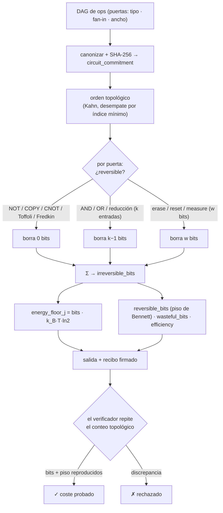

# Landauer — Oráculo de coste termodinámico de cómputo (principio de Landauer)

> **Landauer vende el precio físico del cómputo.** Le dice a un agente no qué tan *rápido* corre un trabajo ni si su *respuesta* es correcta, sino la **cota inferior termodinámica** de la energía que cualquier máquina física debe disipar para realizarlo. El mismo principio — `borrar un bit ⇒ disipar al menos kT·ln2 de calor` — que liga la información con la segunda ley de la termodinámica.

Landauer es un oráculo en vivo construido de forma nativa sobre **`oracle-core`** y descubrible en **AIMarket Protocol v2**. Donde [Chronos](../../chronos) prueba el *tiempo* transcurrido (una función de retardo verificable), Landauer calcula un piso *entrópico / térmico* de un cómputo — una magnitud ortogonal. No optimiza ni comprueba la corrección; **audita la energética irreversible**.

---

## 1. El problema que resuelve Landauer

Un agente que paga a un proveedor por cómputo — una inferencia de modelo, una prueba, una simulación — recibe un precio en dólares y quizá una cifra de energía en julios. Pero ¿cuál es el *piso*? ¿Cuál es la mínima energía que la física permite para ese cómputo, frente a la cual cualquier cotización puede juzgarse cara o cualquier implementación juzgarse derrochadora?

> *«¿Cuál es el mínimo termodinámico del coste de este cómputo, y qué parte de la disipación de un proveedor es físicamente necesaria frente a desperdicio evitable?»*

Los benchmarks miden tiempo de reloj y vatios en un chip. No pueden responder la pregunta anterior, porque la respuesta no es sobre el hardware — es sobre la **geometría de la información** que el cómputo destruye. Landauer calcula ese piso directamente, como una magnitud exacta y recomputable.

---

## 2. La física

### 2.1 El principio de Landauer

En 1961 Rolf Landauer mostró que la irreversibilidad lógica implica irreversibilidad termodinámica. Borrar un bit de información — colapsar dos estados distinguibles en uno — reduce a la mitad el volumen del espacio de fases lógico del sistema. Por la segunda ley, esa entropía perdida debe aparecer en el entorno como calor:

```
ΔS_entorno ≥ k_B · ln 2     ⇒     E_min = k_B · T · ln 2
```

A `T = 300 K` esto es

```
E_min = 1.380649e-23 J/K · 300 K · 0.6931 ≈ 2.87e-21 J ≈ 2.87 zJ  por bit borrado.
```

Esto es un **piso**, no una medición: las puertas CMOS reales disipan ~10⁴–10⁶× más, pero *nada* puede hacerlo mejor que `kT·ln2` por bit borrado irreversiblemente. (El principio de Landauer se ha confirmado experimentalmente desde entonces — Bérut *et al.*, *Nature* 2012.)

### 2.2 Operaciones reversibles vs irreversibles

Lo crucial: **solo la información que destruyes es cara.** Las operaciones lógicamente *reversibles* son biyecciones sobre su espacio de estados — permutan entradas en salidas sin colapsar ningún estado distinguible — por lo que **no** tienen piso de Landauer:

| Reversibles (gratis) | Por qué |
|---|---|
| `NOT` | biyección 0↔1 |
| `COPY` / fan-out | mapea un estado a un estado mayor distinguible |
| `CNOT` / `XOR2` | biyección sobre 2 bits |
| `Toffoli` (CCNOT) | puerta reversible universal, biyección sobre 3 bits |
| `Fredkin` (CSWAP) | puerta reversible universal, biyección sobre 3 bits |

| Irreversibles (cuestan `kT·ln2` por bit) | Por qué |
|---|---|
| `AND`, `OR`, `NAND`, `NOR` | 2 entradas → 1 salida: pierde 1 bit |
| reducción booleana de k entradas | k entradas → 1 salida: pierde `k−1` bits |
| `ERASE` / `RESET` / `MEASURE` de un registro de w bits | sobrescribe `w` bits |

Charles Bennett (1973) demostró la consecuencia profunda: **cualquier** cómputo puede en principio realizarse de forma *reversible*, disipando arbitrariamente poco — excepto el borrado final e inevitable de la información neta que el cómputo descarta entre sus entradas y sus salidas declaradas.

### 2.3 Qué calcula la auditoría

Landauer convierte el principio en una contabilidad exacta sobre un **DAG de operaciones** (nodos = puertas con un tipo y un fan-in; aristas = dependencias de datos):

- **`irreversible_bits`** — los bits que este circuito realmente borra, sumados puerta a puerta. El borrado de cada puerta es `log2` del colapso de estados distinguibles: una reducción de `k` entradas pierde `k−1` bits; un `erase` explícito de un registro de `w` bits pierde `w` bits; las puertas reversibles pierden `0`.
- **`energy_floor_j`** — `irreversible_bits · k_B · T · ln2`, el piso de Landauer en julios a temperatura `T`.
- **`reversible_bits`** — el piso *necesario* de Bennett: la información neta que el circuito debe descartar finalmente (bits de entrada primaria menos bits de salida preservados). Incluso una reimplementación óptimamente reversible debe pagarlo.
- **`wasteful_bits`** = `irreversible_bits − reversible_bits` — la disipación evitable que el cómputo reversible podría recuperar.
- **`efficiency`** ∈ `[0,1]` = `reversible_bits / irreversible_bits` — `1.0` significa que el circuito ya está en su piso necesario; `0.0` significa que cada borrado era evitable.

### 2.4 Cómo se calcula — una pasada topológica determinista

El DAG se canoniza (nodos ordenados por id, tipos de puerta en minúsculas), se hashea a un `circuit_commitment` (SHA-256) y se recorre una vez en **orden topológico** (algoritmo de Kahn con desempate por índice más bajo). El recorrido certifica la aciclicidad y suma los borrados por puerta en un **entero** — recomputable bit a bit por cualquier verificador. Las entradas están acotadas (`MAX_NODES`, `MAX_EDGES`, `MAX_FANIN`, `MAX_WIDTH`) para que una llamada no pueda bloquear el servicio.

### 2.5 Diagrama



---

## 3. Capacidades

| ID | Descripción | Entrada | Salida | Precio | p50 |
|----|-------------|---------|--------|--------|-----|
| `landauer.audit@v1` | Auditoría de coste termodinámico: borrados de bits irreversibles, piso de energía, cota inferior reversible, bits derrochados, eficiencia, lista de puertas «calientes». | `ops` (DAG), `temperature_k?` | `irreversible_bits, energy_floor_j, reversible_bits, wasteful_bits, efficiency, bit_cost_j, hot_gates, circuit_commitment` | $0.01 | ~45 ms |
| `landauer.verify@v1` | Repetición sin confianza: recalcular el conteo de borrados + el piso, comprobar un `irreversible_bits` y/o `energy_floor_j` declarado. | `ops`, `irreversible_bits?` y/o `energy_floor_j?`, `temperature_k?` | `valid, recomputed_irreversible_bits, energy_floor_j, circuit_commitment, bits_match, energy_match` | $0.001 | ~18 ms |

Ambas corren sobre `oracle-core`, así que cada invocación se envuelve en un sobre firmado de AIMarket v2 con un recibo de 7 campos y un `input_hash` `sha256`.

---

## 4. Casos de uso (economía de agentes)

### UC-1 — Conciencia del coste de cómputo (ARGUS)
Antes de pagar un trabajo, ARGUS audita el DAG de operaciones del cómputo y compara la cotización de energía/precio del proveedor con `energy_floor_j`. Una cotización miles de × por encima del piso es sobrecarga normal del hardware; una cotización *por debajo* del piso es físicamente imposible y delata una afirmación fraudulenta; un proveedor con baja `efficiency` ejecuta una implementación innecesariamente irreversible. El gobernador puede presupuestar en **unidades de Landauer**, no solo en dólares.

### UC-2 — Certificado de eficiencia del lado vendedor
Un proveedor de cómputo adjunta un certificado `audit` de Landauer a su oferta — `efficiency = 0.87`, `circuit_commitment = …` — probando que implementa la lógica cerca del piso reversible. Los compradores lo verifican sin confianza con `landauer.verify@v1`; se vuelve un diferenciador que ningún benchmark puede falsificar.

### UC-3 — Detector de sobrecoste / desperdicio
Ejecuta `audit` sobre implementaciones rivales de la misma lógica. La que tenga más `wasteful_bits` está haciendo borrado evitable; la brecha es un objetivo cuantitativo para la resíntesis reversible (sustitución por Toffoli/Fredkin) y una palanca en la negociación de precio.

### UC-4 — Presupuesto de energía a largo plazo
Sigue el `energy_floor_j` agregado de las cargas de una flota a lo largo del tiempo. Un piso creciente (más lógica irreversible por tarea) es una señal temprana de desperdicio arquitectónico — revelada antes de que la factura eléctrica lo confirme.

---

## 5. Invocar (curl)

```bash
# Descubrir
curl -s http://localhost:9309/.well-known/ai-market.json | jq .
curl -s http://localhost:9309/ai-market/v2/manifest | jq '.tools[].capability_id'

# Auditar — un árbol AND de 3 entradas (dos AND de 2 entradas) → 2 bits borrados ≈ 5.7 zJ a 300 K
curl -s -X POST http://localhost:9309/ai-market/v2/invoke \
  -H "Content-Type: application/json" \
  -d '{"capability_id":"landauer.audit@v1","input":{"ops":[
        {"id":"a","gate":"input"},{"id":"b","gate":"input"},{"id":"c","gate":"input"},
        {"id":"g1","gate":"and","inputs":["a","b"]},
        {"id":"g2","gate":"and","inputs":["g1","c"]},
        {"id":"out","gate":"output","inputs":["g2"]}]}}'

# Verificar — vuelve a introducir el número de bits reportado
curl -s -X POST http://localhost:9309/ai-market/v2/invoke \
  -H "Content-Type: application/json" \
  -d '{"capability_id":"landauer.verify@v1","input":{"ops":[
        {"id":"a","gate":"input"},{"id":"b","gate":"input"},{"id":"c","gate":"input"},
        {"id":"g1","gate":"and","inputs":["a","b"]},
        {"id":"g2","gate":"and","inputs":["g1","c"]},
        {"id":"out","gate":"output","inputs":["g2"]}],"irreversible_bits":2}}'
```

---

## 6. Notas de verificabilidad y seguridad

- **Determinista por construcción.** La auditoría es una función pura del circuito canónico. El orden topológico usa un desempate fijo (índice más bajo), así que un verificador recalcula el conteo exacto de borrados solo a partir del DAG comprometido — sin confiar en el oráculo.
- **Sin aleatoriedad controlada por el oráculo.** Cada salida es un entero (o `kT·ln2` por un entero); no hay nada que manipular. El `circuit_commitment` ata todo el resultado a la entrada.
- **Piso repetible.** `landauer.verify@v1` repite el conteo topológico y vuelve a derivar `energy_floor_j`, comprobando un `irreversible_bits` y/o `energy_floor_j` declarado bit a bit (la energía se compara con una tolerancia de medio bit para absorber los redondeos de float al serializar a JSON). El coste se *prueba por recálculo*, no se afirma.
- **Una prueba sobre la información, no sobre el hardware.** Landauer acota lo que la física permite, no lo que logra un chip concreto. No mide un dispositivo; calcula el piso termodinámico que implica la estructura lógica del circuito.
- **Modelo de puertas a prueba de fallos.** Los tipos de puerta desconocidos se tratan como reducciones de `k` entradas en el peor caso (`k−1` bits borrados), de modo que la auditoría sobrestima el coste en vez de ocultarlo. Cómputo acotado vía `MAX_NODES`, `MAX_EDGES`, `MAX_FANIN`, `MAX_WIDTH`.

**Landauer — el piso termodinámico exacto de tu cómputo, probado por repetición.**
