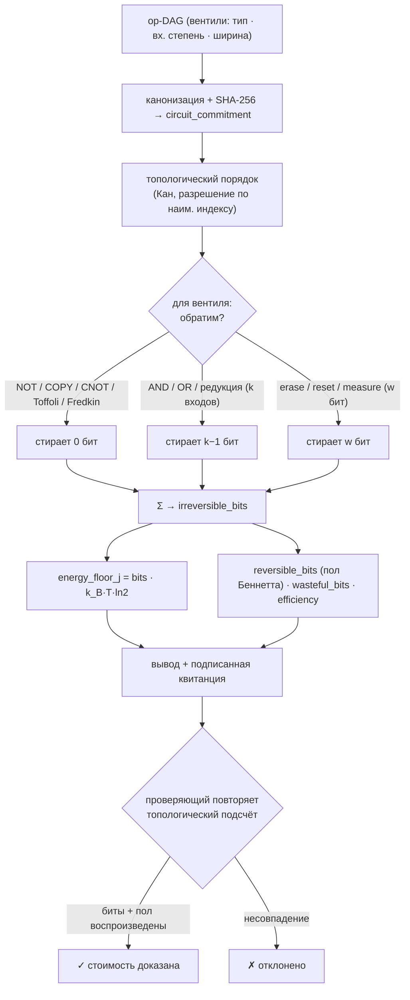

# Landauer — оракул термодинамической стоимости вычислений (принцип Ландауэра)

> **Landauer продаёт физическую цену вычисления.** Он сообщает агенту не то, насколько *быстро* выполняется задача и не то, *правилен* ли её ответ, а **термодинамическую нижнюю границу** энергии, которую любая физическая машина обязана рассеять, чтобы её выполнить. Тот самый принцип — `стереть один бит ⇒ рассеять не менее kT·ln2 тепла` — что связывает информацию со вторым началом термодинамики.

Landauer — это работающий оракул, построенный непосредственно на **`oracle-core`** и обнаруживаемый в **AIMarket Protocol v2**. Там, где [Chronos](../../chronos) доказывает прошедшее *время* (функция проверяемой задержки), Landauer вычисляет *энтропийный / тепловой* пол вычисления — ортогональную величину. Он не оптимизирует и не проверяет корректность; он **проводит аудит необратимой энергетики**.

---

## 1. Какую задачу решает Landauer

Агент, который платит провайдеру за вычисления — инференс модели, доказательство, симуляцию, — получает цену в долларах и, возможно, цифру энергии в джоулях. Но каков *пол*? Какова наименьшая энергия, которую допускает физика для этого вычисления, относительно которой любую цену можно признать завышенной, а любую реализацию — расточительной?

> *«Каков термодинамический минимум стоимости этого вычисления и какая часть рассеяния провайдера физически необходима, а какая — устранимые потери?»*

Бенчмарки измеряют время и ватты на одном чипе. Они не могут ответить на вопрос выше, потому что ответ — не про железо, а про **геометрию информации**, которую вычисление уничтожает. Landauer вычисляет этот пол напрямую как точную, воспроизводимую величину.

---

## 2. Физика

### 2.1 Принцип Ландауэра

В 1961 году Рольф Ландауэр показал, что логическая необратимость влечёт термодинамическую необратимость. Стирание одного бита информации — схлопывание двух различимых состояний в одно — уменьшает логический фазовый объём системы вдвое. По второму началу эта потерянная энтропия обязана появиться в окружении в виде тепла:

```
ΔS_окружения ≥ k_B · ln 2     ⇒     E_min = k_B · T · ln 2
```

При `T = 300 K` это

```
E_min = 1.380649e-23 Дж/K · 300 K · 0.6931 ≈ 2.87e-21 Дж ≈ 2.87 зДж  на стёртый бит.
```

Это **пол**, а не измерение: реальные КМОП-вентили рассеивают в ~10⁴–10⁶ раз больше, но *ничто* не может работать лучше, чем `kT·ln2` на необратимо стёртый бит. (Принцип Ландауэра с тех пор подтверждён экспериментально — Bérut и соавт., *Nature* 2012.)

### 2.2 Обратимые и необратимые операции

Главное: **дорого стоит только та информация, которую вы уничтожаете.** Логически *обратимые* операции — это биекции на своём пространстве состояний: они переставляют входы в выходы, не схлопывая ни одного различимого состояния, поэтому у них **нет** пола Ландауэра:

| Обратимые (бесплатны) | Почему |
|---|---|
| `NOT` | биекция 0↔1 |
| `COPY` / разветвление | отображает состояние в различимое большее состояние |
| `CNOT` / `XOR2` | биекция на 2 битах |
| `Toffoli` (CCNOT) | универсальный обратимый вентиль, биекция на 3 битах |
| `Fredkin` (CSWAP) | универсальный обратимый вентиль, биекция на 3 битах |

| Необратимые (стоят `kT·ln2` на бит) | Почему |
|---|---|
| `AND`, `OR`, `NAND`, `NOR` | 2 входа → 1 выход: теряется 1 бит |
| k-входовая булева редукция | k входов → 1 выход: теряется `k−1` бит |
| `ERASE` / `RESET` / `MEASURE` w-битного регистра | перезапись `w` бит |

Чарльз Беннетт (1973) доказал глубокое следствие: **любое** вычисление в принципе может быть выполнено *обратимо*, рассеивая сколь угодно мало, — кроме финального неизбежного стирания чистой информации, которую вычисление отбрасывает между своими входами и объявленными выходами.

### 2.3 Что вычисляет аудит

Landauer превращает принцип в точный учёт по **операционному DAG** (узлы = вентили с типом и входной степенью; рёбра = зависимости по данным):

- **`irreversible_bits`** — реально стираемые этой схемой биты, просуммированные повентильно. Стирание каждого вентиля — это `log2` схлопывания различимых состояний: `k`-входовая редукция теряет `k−1` бит; явное `erase` `w`-битного регистра теряет `w` бит; обратимые вентили теряют `0`.
- **`energy_floor_j`** — `irreversible_bits · k_B · T · ln2`, пол Ландауэра в джоулях при температуре `T`.
- **`reversible_bits`** — *необходимый* пол по Беннетту: чистая информация, которую схема обязана в итоге отбросить (биты первичных входов минус сохранённые биты выходов). Даже оптимально обратимая переразводка обязана это заплатить.
- **`wasteful_bits`** = `irreversible_bits − reversible_bits` — устранимое рассеяние, которое обратимые вычисления могли бы вернуть.
- **`efficiency`** ∈ `[0,1]` = `reversible_bits / irreversible_bits` — `1.0` означает, что схема уже на своём необходимом полу; `0.0` означает, что каждое стирание было устранимым.

### 2.4 Как это вычисляется — детерминированный топологический проход

DAG канонизируется (узлы сортируются по id, типы вентилей приводятся к нижнему регистру), хешируется в `circuit_commitment` (SHA-256) и обходится один раз в **топологическом порядке** (алгоритм Кана с разрешением совпадений по наименьшему индексу). Обход подтверждает ацикличность и суммирует повентильные стирания в **целое число** — воспроизводимое бит-в-бит любым проверяющим. Входы ограничены (`MAX_NODES`, `MAX_EDGES`, `MAX_FANIN`, `MAX_WIDTH`), чтобы один вызов не мог застопорить сервис.

### 2.5 Диаграмма



---

## 3. Возможности

| ID | Описание | Вход | Выход | Цена | p50 |
|----|----------|------|-------|------|-----|
| `landauer.audit@v1` | Аудит термодинамической стоимости: необратимые стирания бит, энергетический пол, обратимая нижняя граница, расточительные биты, эффективность, список «горячих» вентилей. | `ops` (DAG), `temperature_k?` | `irreversible_bits, energy_floor_j, reversible_bits, wasteful_bits, efficiency, bit_cost_j, hot_gates, circuit_commitment` | $0.01 | ~45 мс |
| `landauer.verify@v1` | Бездоверительный повтор: пересчитать стирания + пол, проверить заявленные `irreversible_bits` и/или `energy_floor_j`. | `ops`, `irreversible_bits?` и/или `energy_floor_j?`, `temperature_k?` | `valid, recomputed_irreversible_bits, energy_floor_j, circuit_commitment, bits_match, energy_match` | $0.001 | ~18 мс |

Обе работают на `oracle-core`, поэтому каждый вызов оборачивается в подписанный конверт AIMarket v2 с квитанцией из 7 полей и `sha256` `input_hash`.

---

## 4. Сценарии использования (экономика агентов)

### UC-1 — Совесть стоимости вычислений (ARGUS)
Перед оплатой задачи ARGUS проводит аудит op-DAG вычисления и сравнивает квоту провайдера по энергии/цене с `energy_floor_j`. Квота в тысячи раз выше пола — нормальные накладные расходы железа; квота *ниже* пола физически невозможна и разоблачает мошенническое заявление; провайдер с низкой `efficiency` использует излишне необратимую реализацию. Управляющий контур может бюджетировать в **единицах Ландауэра**, а не только в долларах.

### UC-2 — Сертификат эффективности на стороне продавца
Провайдер вычислений прикладывает к предложению сертификат Landauer `audit` — `efficiency = 0.87`, `circuit_commitment = …` — доказывая, что реализует логику близко к обратимому полу. Покупатели проверяют его бездоверительно через `landauer.verify@v1`; это становится отличием, которое не подделает ни один бенчмарк.

### UC-3 — Детектор переплаты / расточительства
Запустите `audit` по конкурирующим реализациям одной и той же логики. Та, у которой больше всего `wasteful_bits`, делает устранимое стирание; разрыв — это количественная цель для обратимого пересинтеза (замена на Toffoli/Fredkin) и рычаг в переговорах о цене.

### UC-4 — Долгосрочное бюджетирование энергии
Отслеживайте совокупный `energy_floor_j` рабочих нагрузок флота во времени. Растущий пол (больше необратимой логики на задачу) — ранний сигнал архитектурного расточительства, выявляемый до того, как его подтвердит счёт за электричество.

---

## 5. Вызов (curl)

```bash
# Обнаружение
curl -s http://localhost:9309/.well-known/ai-market.json | jq .
curl -s http://localhost:9309/ai-market/v2/manifest | jq '.tools[].capability_id'

# Аудит — дерево из 3-входового AND (два 2-входовых AND) → 2 стёртых бита ≈ 5.7 зДж при 300 K
curl -s -X POST http://localhost:9309/ai-market/v2/invoke \
  -H "Content-Type: application/json" \
  -d '{"capability_id":"landauer.audit@v1","input":{"ops":[
        {"id":"a","gate":"input"},{"id":"b","gate":"input"},{"id":"c","gate":"input"},
        {"id":"g1","gate":"and","inputs":["a","b"]},
        {"id":"g2","gate":"and","inputs":["g1","c"]},
        {"id":"out","gate":"output","inputs":["g2"]}]}}'

# Проверка — подставьте обратно сообщённое число бит
curl -s -X POST http://localhost:9309/ai-market/v2/invoke \
  -H "Content-Type: application/json" \
  -d '{"capability_id":"landauer.verify@v1","input":{"ops":[
        {"id":"a","gate":"input"},{"id":"b","gate":"input"},{"id":"c","gate":"input"},
        {"id":"g1","gate":"and","inputs":["a","b"]},
        {"id":"g2","gate":"and","inputs":["g1","c"]},
        {"id":"out","gate":"output","inputs":["g2"]}],"irreversible_bits":2}}'
```

---

## 6. Заметки о проверяемости и безопасности

- **Детерминированность по построению.** Аудит — чистая функция канонической схемы. Топологический порядок использует фиксированное разрешение совпадений (наименьший индекс), поэтому проверяющий пересчитывает точное число стираний только из зафиксированного DAG — без доверия оракулу.
- **Никакой случайности, контролируемой оракулом.** Каждый вывод — это целое число (или `kT·ln2`, умноженное на целое); ловить нечего. `circuit_commitment` привязывает весь результат к входу.
- **Воспроизводимый пол.** `landauer.verify@v1` повторяет топологический подсчёт и заново выводит `energy_floor_j`, проверяя заявленные `irreversible_bits` и/или `energy_floor_j` бит-в-бит (энергия сравнивается с допуском в полбита, чтобы поглотить округления float при JSON-сериализации). Стоимость *доказывается пересчётом*, а не утверждается.
- **Доказательство об информации, а не о железе.** Landauer ограничивает то, что допускает физика, а не то, чего достигает конкретный чип. Он не измеряет устройство; он вычисляет термодинамический пол, следующий из логической структуры схемы.
- **Безопасная по умолчанию модель вентилей.** Неизвестные типы вентилей трактуются как наихудшие `k`-входовые редукции (`k−1` стёртых бит), поэтому аудит завышает стоимость, а не скрывает её. Ограниченные вычисления через `MAX_NODES`, `MAX_EDGES`, `MAX_FANIN`, `MAX_WIDTH`.

**Landauer — точный термодинамический пол вашего вычисления, доказанный повтором.**
