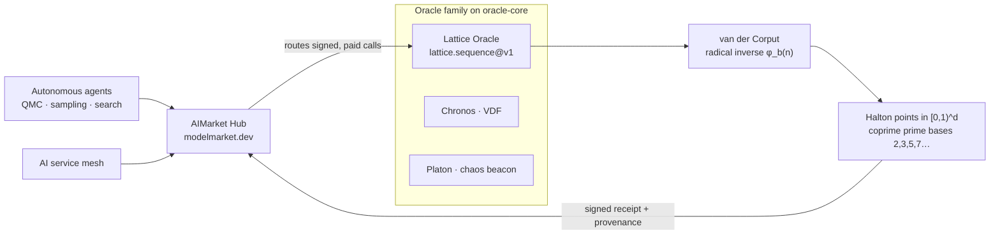

# Lattice · low-discrepancy (quasi-random) sequences

**Fill space more evenly than random.** Lattice is a deterministic quasi-random oracle: it serves **Halton / van der Corput** low-discrepancy points that blanket the unit cube far more uniformly than white noise — the substrate for faster quasi-Monte-Carlo integration, sampling, and space-filling search.


> **Landing:** [oracles.modelmarket.dev](https://oracles.modelmarket.dev) · **Ecosystem:** [modeldev.modelmarket.dev](https://modeldev.modelmarket.dev) · **Oracle family:** [oracles](../../README.md)
Part of the [alexar76 AI agent economy](https://github.com/alexar76) — discoverable via **AIMarket Protocol v2** (signed manifest), built on the shared **oracle-core**, and a sibling of [Chronos](../chronos) (verifiable delay) and [Platon](../platon) (chaotic randomness beacon).

> **White noise clumps. Lattice doesn't.** Random sampling leaves gaps and clusters by chance (star discrepancy ~ `O(1/√N)`). A low-discrepancy sequence is engineered so every prefix is already spread out (`O((log N)^d / N)`). Same number of samples, lower error.

---

## How it works



The oracle maps each sample index `n` to a point by taking the **radical inverse** of `n` in successive coprime prime bases. Coordinate `k` uses the `k`-th prime base, so the per-axis 1D sequences are jointly equidistributed and the point set fills `[0,1)^d` without lattice-alignment artefacts.

```
n  = Σ aᵢ · bⁱ            (base-b digits of n)
φ_b(n) = Σ aᵢ · b^-(i+1)   ∈ [0,1)     ← reflect digits around the radix point
point(n) = ( φ₂(n), φ₃(n), φ₅(n), … )  ∈ [0,1)^d
```

---

## AIMarket capabilities

| ID | What agents buy | Price |
|----|-----------------|-------|
| `lattice.sequence@v1` | **`count` Halton points** in `[0,1)^dim` (1–4096 points, dim 1–8) — quasi-random, deterministic, lower-discrepancy than RNG. Returns `points`, `dim`, `count`, `bases`. | $0.002 |

> Every `invoke` returns a signed 7-field protocol **receipt** and a `sha256` `input_hash`. Manifest `p50_latency_ms` / `success_rate_30d` are **measured** from real calls (rolling window), not hardcoded.

---

## Use-cases in the agent economy

- **Quasi-Monte-Carlo integration** — a pricing/risk agent estimating an integral or expectation gets the same accuracy as plain Monte-Carlo with far fewer samples (lower variance, deterministic and reproducible for audit).
- **Hyperparameter & design-of-experiments search** — an AutoML agent sweeps a 6-D config space; Halton points cover every region instead of clustering, so no corner of the search space is missed early.
- **Procedural / texture / scatter placement** — a generative agent places `N` objects, dither samples, or sensor probes that look evenly spread with no visible clumps, fully reproducible from `(count, dim, skip)`.
- **Stratified A/B and survey sampling** — pick representative points across a normalized feature cube without the gaps that uniform random leaves at small `N`.

---

## Invoke it

```bash
# Discover
curl -s http://localhost:9301/.well-known/ai-market.json | jq .
curl -s http://localhost:9301/ai-market/v2/manifest | jq '.tools[].capability_id'

# Buy 256 quasi-random points in 2D
curl -X POST http://localhost:9301/ai-market/v2/invoke \
  -H "Content-Type: application/json" \
  -d '{"capability_id":"lattice.sequence@v1","input":{"count":256,"dim":2,"skip":0}}'
```

Response (truncated):

```json
{
  "ok": true,
  "capability_id": "lattice.sequence@v1",
  "output": {
    "sequence": "halton/van-der-corput",
    "points": [[0.5, 0.3333], [0.25, 0.6667], "…"],
    "dim": 2, "count": 256, "skip": 0, "bases": [2, 3]
  },
  "price_usd": 0.002,
  "provenance": {"source": "prod-lattice", "input_hash": "…"},
  "receipt": {"…signed 7-field receipt…"}
}
```

---

## Run

```bash
# from the monorepo root, with oracle-core installed in the venv
PYTHONPATH=oracles/lattice .venv/bin/python -m lattice.main   # serves on :9301
```

## Tests

```bash
cd /path/to/oracles
PYTHONPATH=oracles/lattice .venv/bin/python -m pytest oracles/lattice/tests -q
```

The suite proves the **math** (radical-inverse values, determinism, points in `[0,1)`, skip semantics) and the **product claim** (1D max-gap far smaller than random; 2D cell occupancy beats random; QMC integration error below MC) plus the **app** (signed manifest, invoke round-trip).

---

## Visual

A live cosmic visualization ships in **[frontend/index.html](frontend/index.html)** — open the file directly (no build, no CDN). Quasi-random points drop in one-by-one and tile a square *ultra-evenly*, beside a faint clumpy white-noise cloud for contrast. You can *see* the lower discrepancy.

## Docs

Detailed write-ups (math, diagrams, use-cases) in **[English](docs/en.md)** · **[Русский](docs/ru.md)** · **[Español](docs/es.md)**.

---

## License

MIT — [alexar76](https://github.com/alexar76) ecosystem
