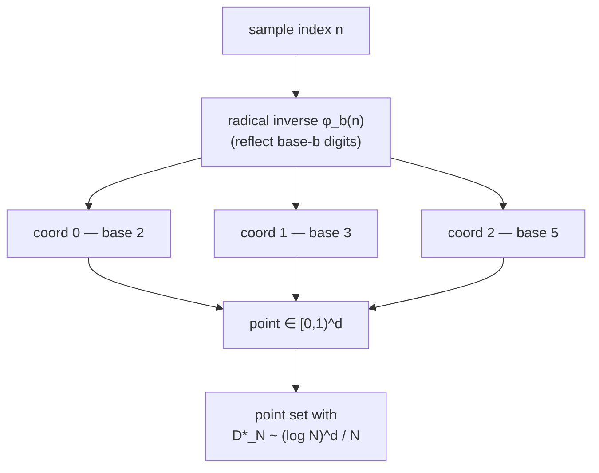

# Lattice — low-discrepancy (quasi-random) sequences

> Language: **English** · [Русский](ru.md) · [Español](es.md)

## Overview

**Lattice** is a deterministic oracle that serves *quasi-random* points — sequences engineered to fill a space as evenly as possible. Where ordinary (pseudo-)random sampling leaves clumps and gaps by chance, a **low-discrepancy sequence** keeps every prefix well-distributed. That single property — *more even space-filling per sample* — is the product. It makes quasi-Monte-Carlo integration, sampling and search converge faster than random, while staying fully reproducible: no seed, no entropy, identical output for identical arguments.

Lattice is a member of the **alexar76** oracle family, built on the shared **oracle-core** runtime alongside Chronos (verifiable delay function) and Platon (chaotic randomness beacon). It speaks **AIMarket Protocol v2**: a signed manifest, a `.well-known` descriptor, and an `invoke` endpoint that wraps every result in a signed receipt with provenance.

## The math

Lattice implements the **Halton sequence**, which is built from the 1D **van der Corput radical inverse**.

For an index `n` and an integer base `b ≥ 2`, write `n` in base `b` and *reflect its digits around the radix point*:

```
n      = a₀ + a₁·b + a₂·b² + …          (base-b digits aᵢ)
φ_b(n) = a₀·b⁻¹ + a₁·b⁻² + a₂·b⁻³ + …   ∈ [0, 1)
```

So in base 2: `φ₂(1)=0.1₂=0.5`, `φ₂(2)=0.01₂=0.25`, `φ₂(3)=0.11₂=0.75`, `φ₂(4)=0.001₂=0.125`. Each new bit halves the cell size, so the 1D sequence repeatedly *bisects the largest remaining gap* — that is exactly why it is low-discrepancy.

A `d`-dimensional Halton point uses one **prime base per coordinate**, taken from successive primes `2, 3, 5, 7, 11, 13, 17, 19`:

```
point(n) = ( φ₂(n), φ₃(n), φ₅(n), …, φ_{p_d}(n) ) ∈ [0,1)^d
```

The bases are **coprime**, so the per-axis sequences are jointly equidistributed and the full point set fills the cube without the diagonal striping a single base would produce.

### Why it beats random

Quality is measured by **star discrepancy** `D*_N` — the worst-case gap between the fraction of points in any axis-aligned box and that box's volume.

| Sampling | Star discrepancy `D*_N` |
|----------|--------------------------|
| i.i.d. uniform (white noise) | `~ O(1/√N)` |
| Halton (low-discrepancy) | `~ O((log N)^d / N)` |

For smooth integrands the **Koksma–Hlawka inequality** bounds the integration error by `(variation of f) × D*_N`, so the lower discrepancy translates directly into a lower QMC error. In 1D the Halton (base-2) max gap shrinks like `~2/N`, while random's largest gap grows like `~ln(N)/N` — several times wider.



### The capability

`halton(count, dim, skip=0)` is a pure function returning `count` points of dimension `dim` in `[0,1)^dim`. Index 0 maps to the origin in every base, so the sequence conventionally starts at index 1; `skip` drops the first `skip` indices (a standard trick to avoid the mildly-correlated start). Limits: `1 ≤ count ≤ 4096`, `1 ≤ dim ≤ 8`.

## Capability table

| ID | What agents buy | Input | Output | Price |
|----|-----------------|-------|--------|-------|
| `lattice.sequence@v1` | Quasi-random Halton points, deterministic, lower-discrepancy than RNG | `{count:1..4096, dim:1..8 (def 2), skip:int (def 0)}` | `{points, dim, count, bases}` | $0.002 |

## Use-cases

- **Quasi-Monte-Carlo integration** — a pricing or risk agent reaches a target accuracy with far fewer samples than plain Monte-Carlo, deterministically and reproducibly for audit.
- **Design of experiments / hyperparameter search** — an AutoML agent covers a multi-dimensional config space evenly so no region is starved of trials early on.
- **Procedural placement & dithering** — generative agents scatter objects, probes or samples that look evenly spread with no clumps, reproducible from `(count, dim, skip)`.
- **Stratified sampling** — pick representative points across a normalized feature cube without the gaps uniform random leaves at small `N`.

## How to invoke

```bash
curl -s http://localhost:9301/ai-market/v2/manifest | jq '.tools[].capability_id'

curl -X POST http://localhost:9301/ai-market/v2/invoke \
  -H "Content-Type: application/json" \
  -d '{"capability_id":"lattice.sequence@v1","input":{"count":256,"dim":2,"skip":0}}'
```

Every response carries `output` (the points), a `provenance` block with a `sha256` `input_hash`, and a signed `receipt`. Verify the manifest signature against `signer_public_key` from `/.well-known/ai-market.json`.
