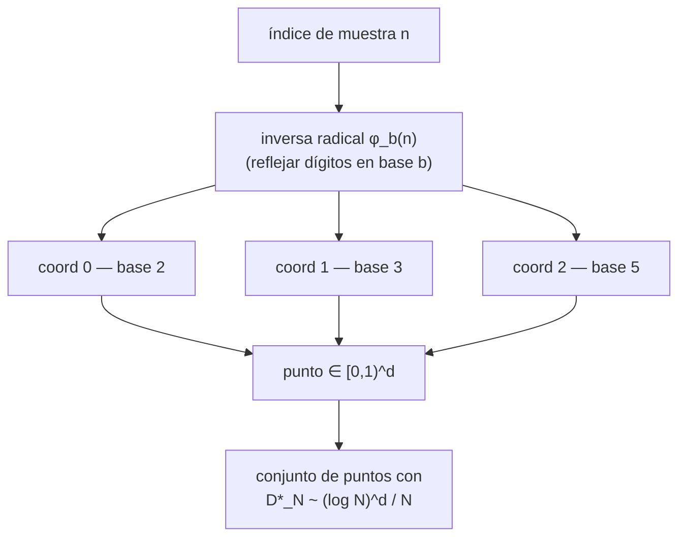

# Lattice — secuencias de baja discrepancia (cuasi-aleatorias)

> Idioma: [English](en.md) · [Русский](ru.md) · **Español**

## Resumen

**Lattice** es un oráculo determinista que entrega puntos *cuasi-aleatorios*: secuencias diseñadas para llenar un espacio de la forma más uniforme posible. Donde el muestreo (pseudo)aleatorio ordinario deja grumos y huecos por azar, una **secuencia de baja discrepancia** mantiene cada prefijo bien distribuido. Esa única propiedad — *un llenado del espacio más uniforme por cada muestra* — es el producto. Hace que la integración cuasi-Montecarlo, el muestreo y la búsqueda converjan más rápido que con métodos aleatorios, manteniéndose totalmente reproducible: sin semilla, sin entropía, idéntica salida para idénticos argumentos.

Lattice forma parte de la familia de oráculos **alexar76**, construido sobre el runtime compartido **oracle-core** junto a Chronos (función de retardo verificable, VDF) y Platon (baliza de aleatoriedad caótica). Habla **AIMarket Protocol v2**: un manifiesto firmado, un descriptor `.well-known` y un endpoint `invoke` que envuelve cada resultado en un recibo firmado con procedencia.

## Las matemáticas

Lattice implementa la **secuencia de Halton**, construida a partir de la **inversa radical de van der Corput** en 1D.

Para un índice `n` y una base entera `b ≥ 2`, escribimos `n` en base `b` y *reflejamos sus dígitos alrededor del punto radical*:

```
n      = a₀ + a₁·b + a₂·b² + …          (dígitos aᵢ en base b)
φ_b(n) = a₀·b⁻¹ + a₁·b⁻² + a₂·b⁻³ + …   ∈ [0, 1)
```

En base 2: `φ₂(1)=0.1₂=0.5`, `φ₂(2)=0.01₂=0.25`, `φ₂(3)=0.11₂=0.75`, `φ₂(4)=0.001₂=0.125`. Cada nuevo bit reduce a la mitad el tamaño de la celda, así que la secuencia 1D *biseca repetidamente el mayor hueco restante* — exactamente por eso tiene baja discrepancia.

Un punto de Halton en `d` dimensiones usa **una base prima por coordenada**, tomada de los primos sucesivos `2, 3, 5, 7, 11, 13, 17, 19`:

```
point(n) = ( φ₂(n), φ₃(n), φ₅(n), …, φ_{p_d}(n) ) ∈ [0,1)^d
```

Las bases son **coprimas**, por lo que las secuencias por eje quedan conjuntamente equidistribuidas y el conjunto completo de puntos llena el cubo sin el rayado diagonal que produciría una sola base.

### Por qué supera al azar

La calidad se mide con la **discrepancia estrella** `D*_N` — la mayor diferencia, en el peor caso, entre la fracción de puntos dentro de cualquier caja alineada con los ejes y el volumen de esa caja.

| Muestreo | Discrepancia estrella `D*_N` |
|----------|-------------------------------|
| uniforme i.i.d. (ruido blanco) | `~ O(1/√N)` |
| Halton (baja discrepancia) | `~ O((log N)^d / N)` |

Para integrandos suaves, la **desigualdad de Koksma–Hlawka** acota el error de integración por `(variación de f) × D*_N`, de modo que una menor discrepancia se traduce directamente en menor error de QMC. En 1D el hueco máximo de Halton (base 2) decrece como `~2/N`, mientras que el mayor hueco del azar crece como `~ln(N)/N` — varias veces más ancho.



### La capacidad

`halton(count, dim, skip=0)` es una función pura que devuelve `count` puntos de dimensión `dim` en `[0,1)^dim`. El índice 0 se mapea al origen en todas las bases, así que la secuencia comienza por convención en el índice 1; `skip` descarta los primeros `skip` índices (un truco estándar para evitar el inicio levemente correlacionado). Límites: `1 ≤ count ≤ 4096`, `1 ≤ dim ≤ 8`.

## Tabla de capacidades

| ID | Qué compran los agentes | Entrada | Salida | Precio |
|----|--------------------------|---------|--------|--------|
| `lattice.sequence@v1` | Puntos de Halton cuasi-aleatorios, deterministas, con menor discrepancia que un RNG | `{count:1..4096, dim:1..8 (def 2), skip:int (def 0)}` | `{points, dim, count, bases}` | $0.002 |

## Casos de uso

- **Integración cuasi-Montecarlo** — un agente de precios o de riesgo alcanza una precisión objetivo con muchas menos muestras que el Montecarlo simple, de forma determinista y reproducible para auditoría.
- **Diseño de experimentos / búsqueda de hiperparámetros** — un agente de AutoML cubre un espacio de configuración multidimensional de forma pareja, sin dejar ninguna región sin pruebas al inicio.
- **Colocación procedimental y tramado (dithering)** — agentes generativos esparcen objetos, sondas o muestras que se ven uniformes, sin grumos, reproducibles a partir de `(count, dim, skip)`.
- **Muestreo estratificado** — elegir puntos representativos en un cubo de características normalizado sin los huecos que el azar uniforme deja con `N` pequeño.

## Cómo invocar

```bash
curl -s http://localhost:9301/ai-market/v2/manifest | jq '.tools[].capability_id'

curl -X POST http://localhost:9301/ai-market/v2/invoke \
  -H "Content-Type: application/json" \
  -d '{"capability_id":"lattice.sequence@v1","input":{"count":256,"dim":2,"skip":0}}'
```

Cada respuesta incluye `output` (los puntos), un bloque `provenance` con un `input_hash` `sha256` y un `receipt` firmado. Verifica la firma del manifiesto contra `signer_public_key` de `/.well-known/ai-market.json`.
