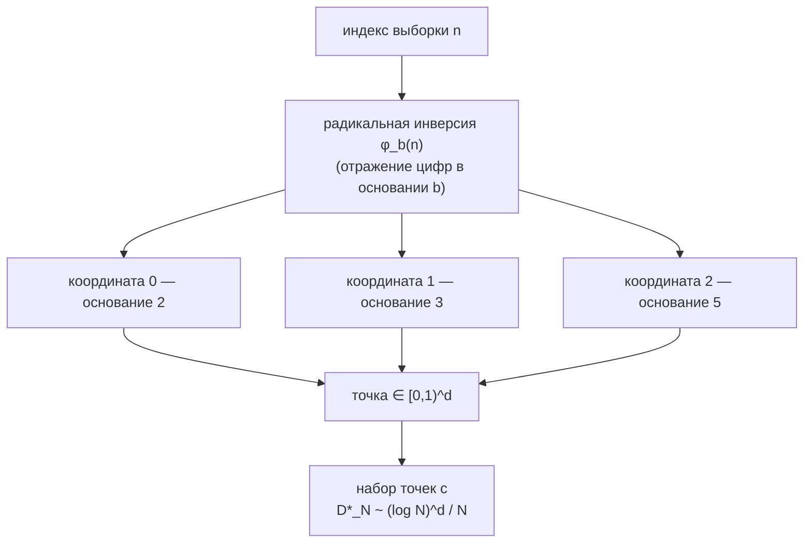

# Lattice — последовательности с низким расхождением (квазислучайные)

> Язык: [English](en.md) · **Русский** · [Español](es.md)

## Обзор

**Lattice** — детерминированный оракул, отдающий *квазислучайные* точки: последовательности, спроектированные так, чтобы заполнять пространство максимально равномерно. Там, где обычная (псевдо)случайная выборка по воле случая оставляет сгустки и пустоты, **последовательность с низким расхождением** удерживает равномерность на любом своём префиксе. Именно это свойство — *более равномерное заполнение пространства на каждую выборку* — и есть продукт. Оно ускоряет квазимонте-карловское интегрирование, выборку и поиск по сравнению со случайными методами, оставаясь полностью воспроизводимым: без сида, без энтропии, одинаковый результат при одинаковых аргументах.

Lattice входит в семейство оракулов **alexar76** и построен на общем рантайме **oracle-core** рядом с Chronos (верифицируемая функция задержки, VDF) и Platon (хаотический маяк случайности). Он говорит на **AIMarket Protocol v2**: подписанный манифест, дескриптор `.well-known` и эндпоинт `invoke`, оборачивающий каждый результат в подписанную квитанцию с провенансом.

## Математика

Lattice реализует **последовательность Халтона**, построенную на одномерной **радикально-инверсной функции ван дер Корпута**.

Для индекса `n` и целочисленного основания `b ≥ 2` запишем `n` в системе с основанием `b` и *отразим его цифры относительно разделительной точки*:

```
n      = a₀ + a₁·b + a₂·b² + …          (цифры aᵢ в основании b)
φ_b(n) = a₀·b⁻¹ + a₁·b⁻² + a₂·b⁻³ + …   ∈ [0, 1)
```

В основании 2: `φ₂(1)=0.1₂=0.5`, `φ₂(2)=0.01₂=0.25`, `φ₂(3)=0.11₂=0.75`, `φ₂(4)=0.001₂=0.125`. Каждый новый бит вдвое уменьшает ячейку, поэтому одномерная последовательность раз за разом *делит пополам самый большой оставшийся промежуток* — именно поэтому расхождение низкое.

`d`-мерная точка Халтона использует **своё простое основание на каждую координату**, взятое из последовательных простых чисел `2, 3, 5, 7, 11, 13, 17, 19`:

```
point(n) = ( φ₂(n), φ₃(n), φ₅(n), …, φ_{p_d}(n) ) ∈ [0,1)^d
```

Основания **взаимно просты**, поэтому покоординатные последовательности совместно равнораспределены, и весь набор точек заполняет куб без диагональной полосатости, которую дало бы единственное основание.

### Почему это лучше случайности

Качество измеряется **звёздным расхождением** `D*_N` — наихудшим расхождением между долей точек в произвольном осеориентированном прямоугольнике и его объёмом.

| Выборка | Звёздное расхождение `D*_N` |
|---------|------------------------------|
| н.о.р. равномерная (белый шум) | `~ O(1/√N)` |
| Халтон (низкое расхождение) | `~ O((log N)^d / N)` |

Для гладких подынтегральных функций **неравенство Коксмы–Хлавки** ограничивает ошибку интегрирования произведением `(вариация f) × D*_N`, поэтому меньшее расхождение напрямую даёт меньшую ошибку QMC. В одномерии максимальный промежуток Халтона (основание 2) убывает как `~2/N`, тогда как у случайной выборки наибольший промежуток растёт как `~ln(N)/N` — в разы шире.



### Возможность

`halton(count, dim, skip=0)` — чистая функция, возвращающая `count` точек размерности `dim` в `[0,1)^dim`. Индекс 0 отображается в начало координат во всех основаниях, поэтому последовательность по соглашению стартует с индекса 1; `skip` отбрасывает первые `skip` индексов (стандартный приём, чтобы избежать слабо коррелированного начала). Ограничения: `1 ≤ count ≤ 4096`, `1 ≤ dim ≤ 8`.

## Таблица возможностей

| ID | Что покупают агенты | Вход | Выход | Цена |
|----|---------------------|------|-------|------|
| `lattice.sequence@v1` | Квазислучайные точки Халтона, детерминированные, с меньшим расхождением, чем у ГСЧ | `{count:1..4096, dim:1..8 (по умолч. 2), skip:int (по умолч. 0)}` | `{points, dim, count, bases}` | $0.002 |

## Сценарии использования

- **Квазимонте-карловское интегрирование** — ценовой или риск-агент достигает целевой точности при гораздо меньшем числе выборок, чем обычный Монте-Карло, детерминированно и воспроизводимо для аудита.
- **Планирование экспериментов / поиск гиперпараметров** — AutoML-агент равномерно покрывает многомерное пространство конфигураций, не обделяя ни один регион на ранних итерациях.
- **Процедурное размещение и дизеринг** — генеративные агенты разбрасывают объекты, зонды или сэмплы равномерно, без сгустков, воспроизводимо из `(count, dim, skip)`.
- **Стратифицированная выборка** — выбор репрезентативных точек по нормированному кубу признаков без пустот, которые оставляет равномерный random при малых `N`.

## Как вызвать

```bash
curl -s http://localhost:9301/ai-market/v2/manifest | jq '.tools[].capability_id'

curl -X POST http://localhost:9301/ai-market/v2/invoke \
  -H "Content-Type: application/json" \
  -d '{"capability_id":"lattice.sequence@v1","input":{"count":256,"dim":2,"skip":0}}'
```

Каждый ответ содержит `output` (точки), блок `provenance` с `sha256`-хешем входа `input_hash` и подписанную `receipt`. Подпись манифеста проверяется по `signer_public_key` из `/.well-known/ai-market.json`.
