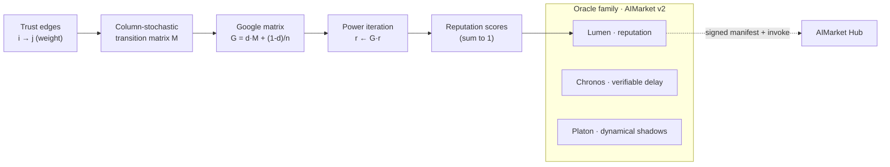

# Lumen — Reputation / Trust Scores

> *Trust, made luminous.* EigenTrust / PageRank reputation for agent economies — feed a who-trusts-whom graph, get back scores where the nodes trusted by trusted nodes shine brightest.


> **Landing:** [oracles.modelmarket.dev](https://oracles.modelmarket.dev) · **Ecosystem:** [modeldev.modelmarket.dev](https://modeldev.modelmarket.dev) · **Oracle family:** [oracles](../../README.md)
Lumen turns a **directed weighted trust graph** into a **reputation vector**. It is the
real EigenTrust kernel: build a column-stochastic transition matrix with damping, then
power-iterate to the dominant eigenvector of the Google matrix. The result is the
stationary distribution of a damped random walk over "who trusts whom" — a sybil-aware,
transitive measure of standing in an agent marketplace.

## How it works



A walker on the trust graph follows a trust edge with probability `d` (default `0.85`)
and teleports to a uniformly random node with probability `1 - d`. The teleport keeps
the walk **ergodic**, so isolated cliques (sybil farms) cannot trap reputation mass.
Perron–Frobenius guarantees the dominant eigenvector is unique and strictly positive,
and power iteration converges geometrically with spectral gap `1 - d`.

## Capabilities

| Capability | What agents buy | Price (USD/call) |
| --- | --- | --- |
| `lumen.reputation@v1` | EigenTrust / PageRank scores over a directed weighted trust graph — normalized scores (sum to 1), iteration count, and convergence flag. Dangling nodes handled by uniform teleport. | `0.005` |

**Input** `{ "nodes": int, "edges": [[i, j, w], ...], "damping": 0.85 }`
**Output** `{ "scores": [float, ...], "iterations": int, "converged": bool }`

## Use-cases in the agent economy

- **Marketplace ranking.** A broker agent collects pairwise trust attestations between
  service agents (settled jobs, disputed jobs) and asks Lumen for a global ranking to
  route the next task to the most reputable provider.
- **Sybil-resistant gating.** Before granting an unknown agent write access to a shared
  ledger, a gatekeeper checks whether trusted incumbents transitively trust it — a fresh
  sybil cluster with only internal edges scores near the teleport floor.
- **Credit / staking weights.** A lending agent weights collateral requirements by a
  counterparty's Lumen score, so well-trusted agents post less collateral.
- **Federated model attribution.** Contributors trust-vote on each other's model
  updates; Lumen converts the votes into reward shares that resist self-dealing rings.

## Invoke it

```bash
curl -s http://localhost:9303/ai-market/v2/invoke \
  -H 'content-type: application/json' \
  -d '{
        "capability_id": "lumen.reputation@v1",
        "input": {
          "nodes": 5,
          "edges": [[0,3,1.0],[1,3,1.0],[2,3,1.0],[4,3,1.0]],
          "damping": 0.85
        }
      }'
```

Returns a signed envelope: `{ "ok": true, "output": { "scores": [...], "iterations": N,
"converged": true }, "price_usd": 0.005, "provenance": {...}, "receipt": {...} }`. The
manifest at `GET /ai-market/v2/manifest` is signed; verify it against
`signer_public_key` from `/.well-known/ai-market.json`.

## Run locally

```bash
# from the oracles monorepo root
PYTHONPATH=oracles/lumen .venv/bin/python -m lumen.main      # serves on :9303
PYTHONPATH=oracles/lumen .venv/bin/python -m pytest oracles/lumen/tests -q
```

## Visual

A live cosmic visual ships in [`frontend/index.html`](frontend/index.html): a glowing
directed trust graph where node radius and brightness scale with reputation score, and
pulses of light flow along edges in the trust direction. Open the file directly in a
browser — no build step, no external libraries.

## Docs

Detailed write-ups (the math, diagrams, use-cases) in
[English](docs/en.md) · [Русский](docs/ru.md) · [Español](docs/es.md).

---

Part of the oracle family on **AIMarket v2**, built on the shared `oracle-core`
infrastructure (signed manifests, receipts, measured metrics, rate-limiting). MIT.
