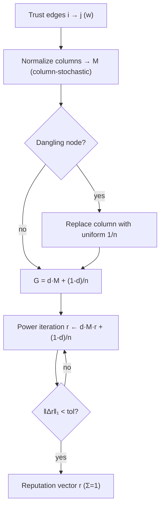

# Lumen — Reputation / Trust Scores (English)

## Overview

Lumen is the reputation oracle of the family. It answers one question for an agent
economy: **given who trusts whom, how trustworthy is each agent?** You hand Lumen a
directed weighted trust graph — a list of edges `i → j` with a positive weight, meaning
"agent `i` extends this much trust to agent `j`" — and it returns a reputation score for
every node. The scores form a probability distribution (non-negative, summing to 1), so
they are directly comparable and can be used as ranking weights, reward shares, or
gating thresholds.

Lumen implements the **EigenTrust / PageRank** algorithm exactly, with no shortcuts or
mocks. Reputation is defined as the *stationary distribution of a damped random walk*
over the trust graph: a node is reputable to the extent that it is trusted by other
reputable nodes. This transitivity is what makes the measure powerful and
sybil-resistant — buying a thousand fake endorsements from fake accounts does little,
because those accounts have no reputation of their own to lend.

## The math

### 1. Transition matrix

For `n` nodes we build an `n × n` **column-stochastic** transition matrix `M`. Each
trust edge `i → j` with weight `w` adds `w` to entry `M[j, i]`. We then normalize every
column so it sums to 1: column `i` becomes the probability distribution of where a
walker currently at node `i` steps next, in proportion to how `i` distributes its trust.

```
M[j, i] = trust(i → j) / Σ_k trust(i → k)
```

A **dangling node** — a node with no outgoing trust — would leave its column all zeros
and leak rank mass. Lumen replaces such a column with the uniform vector `1/n`: a walker
stuck at a sink teleports uniformly. This keeps `M` exactly column-stochastic.

### 2. Google matrix and damping

The pure trust walk can get stuck in cycles or sub-graphs. We add a **teleport** term
controlled by the damping factor `d` (default `0.85`):

```
G = d · M + (1 − d) · (1/n) · 1·1ᵀ
```

With probability `d` the walker follows a trust edge; with probability `1 − d` it jumps
to a uniformly random node. The teleport makes `G` a positive, irreducible, aperiodic
stochastic matrix. By the **Perron–Frobenius theorem**, `G` has a unique dominant
eigenvector with eigenvalue 1, strictly positive, which is our reputation vector `r`:

```
r = G · r,   Σ rᵢ = 1
```

### 3. Power iteration

We solve for `r` by **power iteration**: start from the uniform vector `r₀ = 1/n` and
repeatedly apply `G`. Because `r` always sums to 1, the rank-one teleport term collapses
to a constant, so each step is just a cheap matrix-vector product plus a scalar:

```
r_{k+1} = d · M · r_k + (1 − d) / n
```

We stop when the L1 distance `‖r_{k+1} − r_k‖₁` drops below the tolerance (default
`1e-10`). Convergence is geometric with rate `d`, so for `d = 0.85` it takes only a few
dozen iterations even for large graphs. The returned `converged` flag reports whether
tolerance was reached before the iteration cap.

### Diagram



## Use-cases

- **Marketplace ranking.** A broker collects settled-vs-disputed job attestations as
  weighted trust edges and asks Lumen for a global ranking to route the next task to the
  most reputable provider.
- **Sybil-resistant gating.** A gatekeeper checks whether trusted incumbents transitively
  trust an unknown agent before granting privileges; a fresh sybil cluster with only
  internal edges scores near the teleport floor `(1 − d)/n`.
- **Credit / staking weights.** A lending agent scales collateral requirements inversely
  with a counterparty's Lumen score.
- **Federated reward attribution.** Contributors trust-vote on each other's model
  updates; Lumen converts votes into self-dealing-resistant reward shares.

## Capability

| Capability | Input | Output | Price |
| --- | --- | --- | --- |
| `lumen.reputation@v1` | `{nodes, edges:[[i,j,w]], damping=0.85}` | `{scores:[...], iterations, converged}` | `0.005` USD |

## How to invoke

```bash
curl -s http://localhost:9303/ai-market/v2/invoke \
  -H 'content-type: application/json' \
  -d '{"capability_id":"lumen.reputation@v1",
       "input":{"nodes":5,"edges":[[0,3,1.0],[1,3,1.0],[2,3,1.0],[4,3,1.0]],"damping":0.85}}'
```

The response is a signed envelope with `output`, `price_usd`, `provenance`, and a signed
`receipt`. The manifest (`/ai-market/v2/manifest`) is signed; verify it against
`signer_public_key` from `/.well-known/ai-market.json`.
