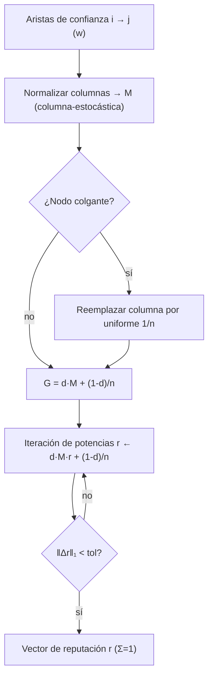

# Lumen — Reputación / puntuaciones de confianza (Español)

## Resumen

Lumen es el oráculo de reputación de la familia. Responde a una pregunta para una
economía de agentes: **dado quién confía en quién, ¿cuán confiable es cada agente?**
Le entregas a Lumen un grafo de confianza dirigido y ponderado — una lista de aristas
`i → j` con un peso positivo, que significa «el agente `i` extiende esta cantidad de
confianza al agente `j`» — y devuelve una puntuación de reputación para cada nodo. Las
puntuaciones forman una distribución de probabilidad (no negativas, que suman 1), así
que son directamente comparables y sirven como pesos de ranking, cuotas de recompensa o
umbrales de admisión.

Lumen implementa el algoritmo **EigenTrust / PageRank** con exactitud, sin atajos ni
simulaciones. La reputación se define como la *distribución estacionaria de una caminata
aleatoria amortiguada* sobre el grafo de confianza: un nodo es reputado en la medida en
que confían en él otros nodos reputados. Esta transitividad es lo que hace que la medida
sea potente y resistente a ataques sybil — comprar mil avales falsos desde cuentas
falsas sirve de poco, porque esas cuentas no tienen reputación propia que prestar.

## La matemática

### 1. Matriz de transición

Para `n` nodos construimos una matriz de transición `M` de `n × n`
**columna-estocástica**. Cada arista de confianza `i → j` con peso `w` suma `w` a la
entrada `M[j, i]`. Luego normalizamos cada columna para que sume 1: la columna `i` se
convierte en la distribución de probabilidad de hacia dónde da el siguiente paso un
caminante situado en el nodo `i`, en proporción a cómo `i` reparte su confianza.

```
M[j, i] = confianza(i → j) / Σ_k confianza(i → k)
```

Un **nodo colgante** — un nodo sin confianza saliente — dejaría su columna en ceros y
perdería masa de rango. Lumen reemplaza esa columna por el vector uniforme `1/n`: un
caminante atrapado en un sumidero se teletransporta de forma uniforme. Esto mantiene `M`
exactamente columna-estocástica.

### 2. Matriz de Google y amortiguación

La caminata pura de confianza puede quedar atrapada en ciclos o subgrafos. Añadimos un
término de **teletransporte** controlado por el factor de amortiguación `d` (por defecto
`0.85`):

```
G = d · M + (1 − d) · (1/n) · 1·1ᵀ
```

Con probabilidad `d` el caminante sigue una arista de confianza; con probabilidad
`1 − d` salta a un nodo uniformemente aleatorio. El teletransporte hace de `G` una
matriz estocástica positiva, irreducible y aperiódica. Por el **teorema de
Perron–Frobenius**, `G` tiene un único vector propio dominante con valor propio 1,
estrictamente positivo, que es nuestro vector de reputación `r`:

```
r = G · r,   Σ rᵢ = 1
```

### 3. Iteración de potencias

Resolvemos `r` mediante **iteración de potencias**: partimos del vector uniforme
`r₀ = 1/n` y aplicamos `G` repetidamente. Como `r` siempre suma 1, el término de
teletransporte de rango uno se reduce a una constante, así que cada paso es solo un
producto matriz-vector barato más un escalar:

```
r_{k+1} = d · M · r_k + (1 − d) / n
```

Nos detenemos cuando la distancia L1 `‖r_{k+1} − r_k‖₁` cae por debajo de la tolerancia
(por defecto `1e-10`). La convergencia es geométrica con tasa `d`, así que con
`d = 0.85` bastan unas pocas decenas de iteraciones incluso para grafos grandes. El
indicador `converged` devuelto informa si se alcanzó la tolerancia antes del límite de
iteraciones.

### Diagrama



## Casos de uso

- **Ranking de mercado.** Un bróker recopila atestaciones de trabajos liquidados frente a
  disputados como aristas de confianza ponderadas y le pide a Lumen un ranking global
  para enrutar la próxima tarea al proveedor más reputado.
- **Admisión resistente a sybil.** Un guardián comprueba si los miembros establecidos y
  confiables confían transitivamente en un agente desconocido antes de conceder
  privilegios; un clúster sybil nuevo con solo aristas internas puntúa cerca del suelo de
  teletransporte `(1 − d)/n`.
- **Pesos de crédito / staking.** Un agente prestamista escala los requisitos de garantía
  de forma inversa a la puntuación Lumen de la contraparte.
- **Atribución federada de recompensas.** Los contribuyentes votan con confianza las
  actualizaciones de modelos de los demás; Lumen convierte los votos en cuotas de
  recompensa resistentes al autotrato.

## Capacidad

| Capacidad | Entrada | Salida | Precio |
| --- | --- | --- | --- |
| `lumen.reputation@v1` | `{nodes, edges:[[i,j,w]], damping=0.85}` | `{scores:[...], iterations, converged}` | `0.005` USD |

## Cómo invocar

```bash
curl -s http://localhost:9303/ai-market/v2/invoke \
  -H 'content-type: application/json' \
  -d '{"capability_id":"lumen.reputation@v1",
       "input":{"nodes":5,"edges":[[0,3,1.0],[1,3,1.0],[2,3,1.0],[4,3,1.0]],"damping":0.85}}'
```

La respuesta es un sobre firmado con `output`, `price_usd`, `provenance` y un `receipt`
firmado. El manifiesto (`/ai-market/v2/manifest`) está firmado; verifícalo contra
`signer_public_key` de `/.well-known/ai-market.json`.
