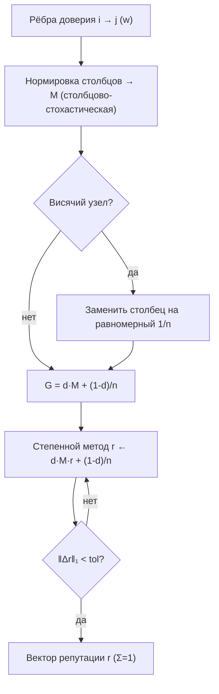

# Lumen — Репутация / оценки доверия (Русский)

## Обзор

Lumen — это репутационный оракул семейства. Он отвечает на один вопрос экономики
агентов: **зная, кто кому доверяет, насколько надёжен каждый агент?** Вы передаёте Lumen
ориентированный взвешенный граф доверия — список рёбер `i → j` с положительным весом, что
означает «агент `i` оказывает агенту `j` столько-то доверия», — и он возвращает оценку
репутации для каждого узла. Оценки образуют распределение вероятностей
(неотрицательные, в сумме равные 1), поэтому их можно напрямую сравнивать и использовать
как веса ранжирования, доли вознаграждения или пороги допуска.

Lumen реализует алгоритм **EigenTrust / PageRank** в точности, без упрощений и заглушек.
Репутация определяется как *стационарное распределение случайного блуждания с
затуханием* по графу доверия: узел репутационен ровно настолько, насколько ему доверяют
другие репутационные узлы. Именно эта транзитивность делает меру мощной и устойчивой к
сибил-атакам — покупка тысячи фальшивых одобрений с фейковых аккаунтов почти ничего не
даёт, потому что у этих аккаунтов нет собственной репутации, которую можно было бы
одолжить.

## Математика

### 1. Матрица переходов

Для `n` узлов строится `n × n` **столбцово-стохастическая** матрица переходов `M`. Каждое
ребро доверия `i → j` с весом `w` добавляет `w` к элементу `M[j, i]`. Затем каждый
столбец нормируется к сумме 1: столбец `i` становится распределением вероятностей того,
куда шагнёт блуждающий из узла `i`, пропорционально тому, как `i` распределяет доверие.

```
M[j, i] = доверие(i → j) / Σ_k доверие(i → k)
```

**Висячий узел** — узел без исходящего доверия — оставил бы свой столбец нулевым и «терял»
бы массу ранга. Lumen заменяет такой столбец равномерным вектором `1/n`: застрявший в
стоке блуждающий телепортируется равномерно. Это сохраняет `M` строго
столбцово-стохастической.

### 2. Матрица Google и затухание

Чистое блуждание по доверию может застрять в циклах или подграфах. Мы добавляем член
**телепортации**, управляемый коэффициентом затухания `d` (по умолчанию `0.85`):

```
G = d · M + (1 − d) · (1/n) · 1·1ᵀ
```

С вероятностью `d` блуждающий следует ребру доверия; с вероятностью `1 − d` прыгает в
равномерно случайный узел. Телепортация делает `G` положительной, неразложимой,
апериодической стохастической матрицей. По **теореме Перрона–Фробениуса** у `G` есть
единственный доминирующий собственный вектор с собственным значением 1, строго
положительный — это и есть наш вектор репутации `r`:

```
r = G · r,   Σ rᵢ = 1
```

### 3. Степенной метод

Мы находим `r` **степенным методом**: начинаем с равномерного вектора `r₀ = 1/n` и
многократно применяем `G`. Поскольку `r` всегда суммируется к 1, член телепортации
ранга 1 сводится к константе, и каждый шаг — это дешёвое произведение матрицы на вектор
плюс скаляр:

```
r_{k+1} = d · M · r_k + (1 − d) / n
```

Останавливаемся, когда L1-расстояние `‖r_{k+1} − r_k‖₁` падает ниже допуска (по умолчанию
`1e-10`). Сходимость геометрическая со скоростью `d`, поэтому при `d = 0.85` хватает
лишь нескольких десятков итераций даже для больших графов. Возвращаемый флаг `converged`
сообщает, был ли достигнут допуск до предела числа итераций.

### Диаграмма



## Сценарии использования

- **Ранжирование на маркетплейсе.** Брокер собирает свидетельства об исполненных и
  оспоренных заданиях как взвешенные рёбра доверия и запрашивает у Lumen глобальный
  рейтинг, чтобы направить следующую задачу самому надёжному исполнителю.
- **Защита допуска от сибил-атак.** Привратник проверяет, доверяют ли транзитивно
  доверенные старожилы неизвестному агенту, прежде чем выдать привилегии; свежий
  сибил-кластер с одними внутренними рёбрами получает оценку у пола телепортации
  `(1 − d)/n`.
- **Веса кредита / стейкинга.** Кредитующий агент масштабирует требования к залогу
  обратно пропорционально оценке Lumen контрагента.
- **Федеративное распределение вознаграждений.** Участники голосуют доверием за обновления
  моделей друг друга; Lumen превращает голоса в доли вознаграждения, устойчивые к
  самосделкам.

## Возможность

| Возможность | Вход | Выход | Цена |
| --- | --- | --- | --- |
| `lumen.reputation@v1` | `{nodes, edges:[[i,j,w]], damping=0.85}` | `{scores:[...], iterations, converged}` | `0.005` USD |

## Как вызвать

```bash
curl -s http://localhost:9303/ai-market/v2/invoke \
  -H 'content-type: application/json' \
  -d '{"capability_id":"lumen.reputation@v1",
       "input":{"nodes":5,"edges":[[0,3,1.0],[1,3,1.0],[2,3,1.0],[4,3,1.0]],"damping":0.85}}'
```

Ответ — подписанный конверт с `output`, `price_usd`, `provenance` и подписанным
`receipt`. Манифест (`/ai-market/v2/manifest`) подписан; проверьте его по
`signer_public_key` из `/.well-known/ai-market.json`.
