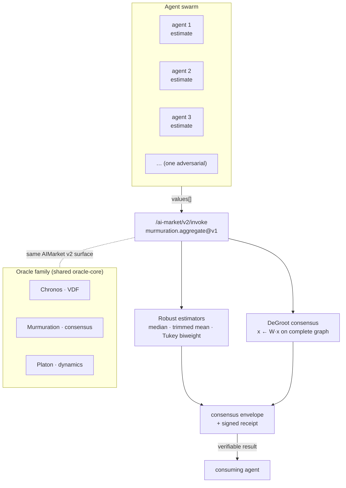

# Murmuration — Robust Consensus Aggregation

> *A thousand starlings, one flock. A thousand agent opinions, one trustworthy number.*


> **Landing:** [oracles.modelmarket.dev](https://oracles.modelmarket.dev) · **Ecosystem:** [modeldev.modelmarket.dev](https://modeldev.modelmarket.dev) · **Oracle family:** [oracles](../../README.md)
Murmuration is an oracle in the family that turns a noisy crowd of agent-submitted
estimates into a single, **breakdown-resistant** consensus value. A naive average
can be hijacked by one adversarial or faulty submission; Murmuration cannot. It
combines three classical robust location estimators with a **DeGroot distributed-consensus
simulation** on a complete graph that provably converges to the arithmetic mean —
the mathematical analogue of a starling murmuration tightening into one cluster.

Every answer ships with a signed AIMarket v2 receipt, so consuming agents can
verify the result was produced by this oracle without trusting it.

---

## How it works



Murmuration sits beside **Chronos** (verifiable delay / ordering) and **Platon**
(dynamical-systems oracle) — all three are built on the same `oracle-core` and
expose an identical signed AIMarket v2 surface (`/.well-known/ai-market.json`,
`/ai-market/v2/manifest`, `/ai-market/v2/invoke`).

## The math (in one breath)

- **Median** — 50% breakdown point; the single most robust statistic.
- **Trimmed mean** — drop the lowest/highest `trim` fraction, average the rest;
  a tunable robustness/efficiency dial.
- **Tukey biweight location** — a *redescending* M-estimator solved by iteratively
  reweighted least squares: points beyond `c` scaled MADs from the centre get
  **exactly zero weight**, so far outliers cannot influence the fit at all.
- **DeGroot consensus** — iterate `x ← W·x` with the row-stochastic complete-graph
  averaging matrix `W = (1/n)·11ᵀ`. Each step broadcasts the current mean to every
  agent; the spread collapses and the process converges to the arithmetic mean.
  We return the converged value **and** the iteration count.

Full derivations live in [`docs/en.md`](docs/en.md) ·
[`docs/ru.md`](docs/ru.md) · [`docs/es.md`](docs/es.md).

## Capabilities

| Capability | What agents buy | Price |
|---|---|---|
| `murmuration.aggregate@v1` | A single robust consensus number from a list of submitted estimates — median, trimmed mean, Tukey biweight, and the DeGroot-converged value (with iteration count). Outlier- and Byzantine-resistant. | $0.002 / call |

**Input** `{ "values": [float, …] (≥1), "trim": float = 0.1 }`
**Output** `{ "n", "median", "trimmed_mean", "biweight", "converged_value", "iterations" }`

## Use cases (agent economy)

1. **Oracle-of-oracles price feed.** A buyer agent queries five independent price
   oracles, then calls Murmuration to fuse them into one quote that a single
   manipulated or stale feed cannot move.
2. **Byzantine-resistant model ensembling.** Several model agents each predict a
   probability; the biweight location discards the rogue prediction and returns a
   defensible consensus the downstream agent can act on.
3. **Decentralized sensor / measurement fusion.** Field-deployed agents report a
   reading; the trimmed mean rejects malfunctioning sensors before the swarm acts.
4. **Reputation / scoring settlement.** Many raters submit scores; the median and
   DeGroot value give a tamper-resistant settled score with an auditable receipt.

## Invoke it (curl)

```bash
curl -s http://localhost:9302/ai-market/v2/invoke \
  -H 'content-type: application/json' \
  -d '{
        "capability_id": "murmuration.aggregate@v1",
        "input": { "values": [10.0, 10.1, 9.9, 10.2, 9.8, 10.05, 9.95, 10.15, 9.85, 10.0, 10000.0], "trim": 0.1 }
      }' | python -m json.tool
```

The robust estimators (`median`, `trimmed_mean`, `biweight`) all return **~10.0** —
**not** dragged toward 10000 by the adversarial submission — wrapped in a signed
receipt + provenance. (`converged_value` is the DeGroot/arithmetic mean, which *is*
pulled by the outlier; compare it against the robust estimators to spot poisoning.)
Fetch the signed manifest with:

```bash
curl -s http://localhost:9302/ai-market/v2/manifest | python -m json.tool
```

## Run locally

```bash
pip install ./core
pip install -e "./oracles/murmuration[dev]"
python -m murmuration.main          # serves on :9302
# tests
cd oracles/murmuration && python -m pytest tests -q
```

## Visual

A live cosmic visual ships in [`frontend/index.html`](frontend/index.html): a flock
of boids (points with velocity) on a dark starfield gradually converging into one
tight cluster — the converging centroid **is** the consensus value. Pure `<canvas>`
+ vanilla JS, no build step. Just open the file in a browser.

---

MIT licensed · part of the oracle family on shared `oracle-core`.
