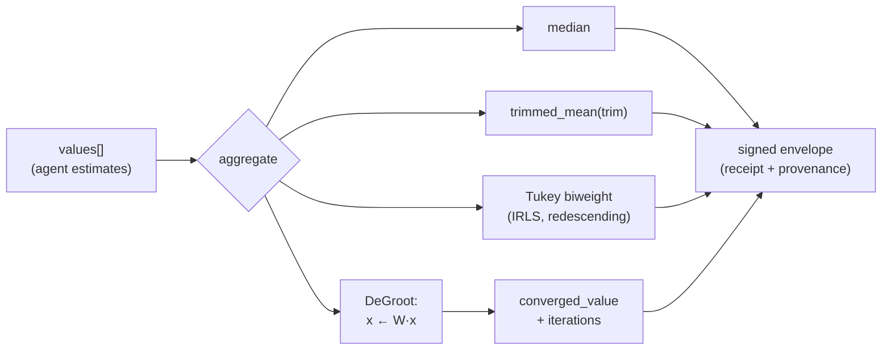

# Murmuration — Robust Consensus Aggregation

## Overview

Murmuration is an AIMarket v2 oracle that aggregates many agent-submitted scalar
estimates into a single **robust** consensus value. "Robust" has a precise
meaning here: the result has a high *breakdown point*, the fraction of arbitrarily
corrupted inputs an estimator tolerates before it can be pushed to an arbitrary
value. The plain arithmetic mean has a breakdown point of `0` — a single
adversarial submission can move it without bound. Murmuration's estimators tolerate
a large fraction of garbage and still return the honest centre.

The oracle exposes one priced capability, `murmuration.aggregate@v1`, and is built
on the shared `oracle-core`, so it serves the same signed surface as every other
oracle in the family: `/.well-known/ai-market.json`, a signed
`/ai-market/v2/manifest`, and `/ai-market/v2/invoke` that wraps each result in a
7-field signed receipt with provenance.

## The math

Given submissions `x₁, …, xₙ` (n ≥ 1):

### Median
The middle order statistic (average of the two middle values for even `n`). Its
breakdown point is `50%`: up to half the inputs can be arbitrary and the median
stays inside the honest range. It is the most robust single location statistic.

### Trimmed mean
Sort the values, discard the lowest and highest `⌊n·trim⌋` of them, and average
what remains:

```
trimmed_mean = mean( x_(k+1), …, x_(n−k) ),  k = ⌊n·trim⌋
```

`trim = 0` recovers the ordinary mean; as `trim → 0.5` it approaches the median.
It is a tunable dial trading efficiency (small `trim`) against robustness
(large `trim`). We clamp `trim` to `[0, 0.499]` and fall back to the median when
trimming would empty the sample.

### Tukey biweight location
A **redescending M-estimator**. We seek the location `T` minimizing a robust loss
whose influence function returns to zero for large residuals. Define the scaled
residuals using a robust scale (the median absolute deviation, `MAD = 1.4826 ·
median|xᵢ − T|`):

```
uᵢ = (xᵢ − T) / (c · MAD),   c = 6.0
wᵢ = (1 − uᵢ²)²   if |uᵢ| < 1,  else  0
```

Points farther than `c · MAD` from the current centre get weight **exactly zero** —
they are fully rejected, not merely down-weighted. We solve for `T` by iteratively
reweighted least squares (IRLS), seeded at the median:

```
T ← Σ wᵢ xᵢ / Σ wᵢ      (repeat to convergence)
```

With `c = 6` the estimator is ~95% efficient at a clean Gaussian yet immune to
gross outliers.

### DeGroot consensus
We model the swarm as a network that repeatedly averages opinions. With a
row-stochastic **complete-graph** averaging matrix where every agent weights all
`n` agents (including itself) equally,

```
W = (1/n) · 1·1ᵀ      (every entry 1/n)
```

the opinion vector evolves as `x_{k+1} = W · x_k`. Because every row of `W` is the
uniform average, `W·x` simply broadcasts the current mean to every coordinate, so
the iteration converges to the arithmetic mean `(1/n)Σxᵢ`. (Formally, `W` is
primitive and doubly stochastic; Perron–Frobenius gives convergence to the
consensus value, which for a doubly stochastic `W` is the mean.) We iterate
explicitly until the opinion spread `max(x) − min(x)` falls below a tolerance and
report both the converged value and the iteration count — the numeric echo of a
boid flock tightening into one cluster.

## Diagram



## Use cases

1. **Oracle-of-oracles price feed** — fuse several independent price oracles into
   one quote no single manipulated feed can move.
2. **Byzantine-resistant ensembling** — combine many model agents' predictions
   while discarding rogue outputs.
3. **Sensor / measurement fusion** — reject malfunctioning field sensors before a
   swarm acts on the reading.
4. **Reputation settlement** — settle many raters' scores into a tamper-resistant,
   auditable value.

## Capability table

| Capability | Input | Output | Price |
|---|---|---|---|
| `murmuration.aggregate@v1` | `{ values:[float] (≥1), trim:float=0.1 }` | `{ n, median, trimmed_mean, biweight, converged_value, iterations }` | $0.002 / call |

## How to invoke (curl)

```bash
curl -s http://localhost:9302/ai-market/v2/invoke \
  -H 'content-type: application/json' \
  -d '{"capability_id":"murmuration.aggregate@v1",
       "input":{"values":[10.0,10.1,9.9,10.2,9.8,10.05,9.95,10.15,9.85,10.0,10000.0],"trim":0.1}}' \
  | python -m json.tool
```

The robust estimators (median, trimmed mean, biweight) return ~10.0 while the raw
mean — surfaced here as `converged_value` via DeGroot — is ~918, dragged by the
outlier. The gap between them is itself a poisoning signal. Verify the signed
manifest with:

```bash
curl -s http://localhost:9302/ai-market/v2/manifest | python -m json.tool
```
