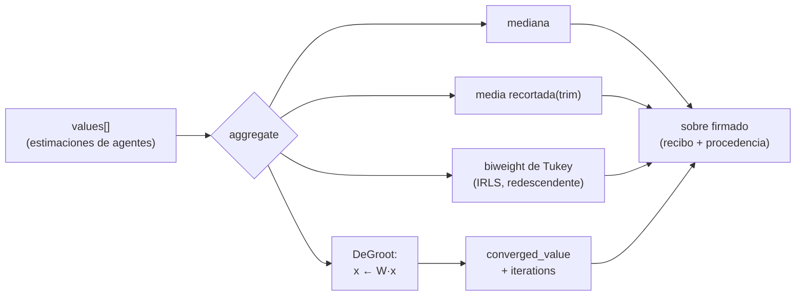

# Murmuration — agregación de consenso robusta

## Resumen

Murmuration es un oráculo AIMarket v2 que agrega muchas estimaciones escalares enviadas
por agentes en un único valor de consenso **robusto**. "Robusto" tiene aquí un significado
preciso: el resultado posee un *punto de ruptura* (breakdown point) alto, la fracción de
entradas corrompidas de forma arbitraria que un estimador tolera antes de poder ser
empujado a un valor cualquiera. La media aritmética simple tiene un punto de ruptura de `0`:
una sola entrada adversaria puede moverla sin límite. Los estimadores de Murmuration toleran
una gran fracción de basura y aun así devuelven el centro honesto.

El oráculo expone una única capacidad de pago, `murmuration.aggregate@v1`, y está construido
sobre el `oracle-core` compartido, por lo que sirve la misma superficie firmada que el resto
de oráculos de la familia: `/.well-known/ai-market.json`, un `/ai-market/v2/manifest` firmado
y `/ai-market/v2/invoke`, que envuelve cada resultado en un recibo firmado de 7 campos con
procedencia.

## La matemática

Dadas las entradas `x₁, …, xₙ` (n ≥ 1):

### Mediana
El estadístico de orden central (promedio de los dos valores centrales cuando `n` es par).
Su punto de ruptura es `50%`: hasta la mitad de las entradas pueden ser arbitrarias y la
mediana permanece dentro del rango honesto. Es el estadístico de localización individual más
robusto.

### Media recortada (trimmed mean)
Ordena los valores, descarta los `⌊n·trim⌋` más bajos y más altos, y promedia el resto:

```
trimmed_mean = mean( x_(k+1), …, x_(n−k) ),  k = ⌊n·trim⌋
```

`trim = 0` recupera la media ordinaria; cuando `trim → 0.5` se aproxima a la mediana. Es un
dial ajustable entre eficiencia (`trim` pequeño) y robustez (`trim` grande). Limitamos `trim`
a `[0, 0.499]` y volvemos a la mediana si el recorte vaciara la muestra.

### Localización biweight de Tukey
Un **M-estimador redescendente**. Buscamos la localización `T` que minimiza una pérdida robusta
cuya función de influencia regresa a cero para residuos grandes. Definimos los residuos escalados
usando una escala robusta (la desviación absoluta mediana, `MAD = 1.4826 · median|xᵢ − T|`):

```
uᵢ = (xᵢ − T) / (c · MAD),   c = 6.0
wᵢ = (1 − uᵢ²)²   si |uᵢ| < 1,  si no  0
```

Los puntos a más de `c · MAD` del centro actual reciben peso **exactamente cero** — quedan
totalmente rechazados, no solo penalizados. Resolvemos `T` por mínimos cuadrados reponderados
iterativamente (IRLS), partiendo de la mediana:

```
T ← Σ wᵢ xᵢ / Σ wᵢ      (repetir hasta converger)
```

Con `c = 6` el estimador alcanza ~95% de eficiencia en una gaussiana limpia y a la vez es
inmune a valores atípicos extremos.

### Consenso de DeGroot
Modelamos el enjambre como una red que promedia opiniones repetidamente. Con una matriz de
promediado **del grafo completo**, estocástica por filas, donde cada agente pondera por igual
a los `n` agentes (incluido él mismo),

```
W = (1/n) · 1·1ᵀ      (cada entrada 1/n)
```

el vector de opiniones evoluciona como `x_{k+1} = W · x_k`. Como cada fila de `W` es el promedio
uniforme, `W·x` simplemente difunde la media actual a todas las coordenadas, de modo que la
iteración converge a la media aritmética `(1/n)Σxᵢ`. (Formalmente, `W` es primitiva y doblemente
estocástica; Perron–Frobenius garantiza la convergencia al valor de consenso, que para una `W`
doblemente estocástica es la media.) Iteramos explícitamente hasta que la dispersión de opiniones
`max(x) − min(x)` cae por debajo de una tolerancia y reportamos tanto el valor convergido como el
número de iteraciones — el eco numérico de una bandada que se aprieta en un solo grupo.

## Diagrama



## Casos de uso

1. **Oráculo de oráculos para precios** — fusiona varios oráculos de precio independientes en
   una cotización que ningún feed manipulado puede mover.
2. **Ensamblado resistente a fallos bizantinos** — combina predicciones de muchos agentes-modelo
   descartando las salidas anómalas.
3. **Fusión de sensores / mediciones** — rechaza sensores de campo defectuosos antes de que el
   enjambre actúe.
4. **Liquidación de reputación** — consolida las puntuaciones de muchos evaluadores en un valor
   auditable y resistente a manipulación.

## Tabla de capacidades

| Capacidad | Entrada | Salida | Precio |
|---|---|---|---|
| `murmuration.aggregate@v1` | `{ values:[float] (≥1), trim:float=0.1 }` | `{ n, median, trimmed_mean, biweight, converged_value, iterations }` | $0.002 / llamada |

## Cómo invocar (curl)

```bash
curl -s http://localhost:9302/ai-market/v2/invoke \
  -H 'content-type: application/json' \
  -d '{"capability_id":"murmuration.aggregate@v1",
       "input":{"values":[10.0,10.1,9.9,10.2,9.8,10.05,9.95,10.15,9.85,10.0,10000.0],"trim":0.1}}' \
  | python -m json.tool
```

Los estimadores robustos (mediana, media recortada, biweight) devuelven ~10.0 mientras que la
media cruda — mostrada aquí como `converged_value` vía DeGroot — es ~918, arrastrada por el
valor atípico. La brecha entre ambos es en sí misma una señal de envenenamiento. Verifica el
manifiesto firmado con:

```bash
curl -s http://localhost:9302/ai-market/v2/manifest | python -m json.tool
```
