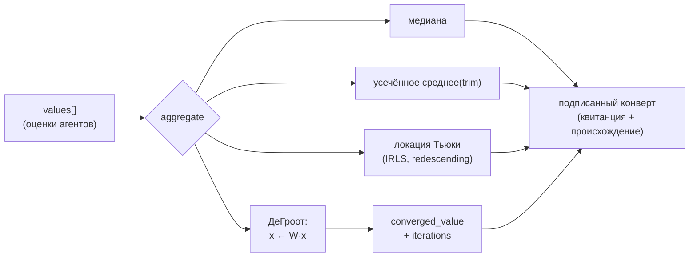

# Murmuration — устойчивая агрегация консенсуса

## Обзор

Murmuration — это оракул AIMarket v2, который агрегирует множество скалярных оценок,
присланных агентами, в одно **устойчивое** консенсусное значение. «Устойчивость» здесь
имеет точный смысл: результат обладает высокой *точкой срыва* (breakdown point) — долей
произвольно искажённых входов, которую оценщик выдерживает, прежде чем его можно сдвинуть
к произвольному значению. У обычного среднего арифметического точка срыва равна `0`: одна
вредоносная заявка может сдвинуть его неограниченно. Оценщики Murmuration выдерживают
большую долю мусора и всё равно возвращают честный центр.

Оракул предоставляет одну платную способность `murmuration.aggregate@v1` и построен на
общем `oracle-core`, поэтому выдаёт ту же подписанную поверхность, что и остальные оракулы
семейства: `/.well-known/ai-market.json`, подписанный `/ai-market/v2/manifest` и
`/ai-market/v2/invoke`, который оборачивает каждый результат в подписанную квитанцию из
7 полей с указанием происхождения.

## Математика

Даны заявки `x₁, …, xₙ` (n ≥ 1):

### Медиана
Центральная порядковая статистика (среднее двух средних значений при чётном `n`). Её точка
срыва равна `50%`: до половины входов могут быть произвольными, а медиана остаётся внутри
честного диапазона. Это самая устойчивая одиночная статистика положения.

### Усечённое среднее (trimmed mean)
Отсортируйте значения, отбросьте по `⌊n·trim⌋` наименьших и наибольших, усредните остаток:

```
trimmed_mean = mean( x_(k+1), …, x_(n−k) ),  k = ⌊n·trim⌋
```

`trim = 0` даёт обычное среднее; при `trim → 0.5` оно стремится к медиане. Это настраиваемый
регулятор между эффективностью (малый `trim`) и устойчивостью (большой `trim`). Мы ограничиваем
`trim` диапазоном `[0, 0.499]` и возвращаемся к медиане, если усечение опустошило бы выборку.

### Локация Тьюки (biweight)
**Переописывающий (redescending) M-оценщик**. Ищем положение `T`, минимизирующее устойчивую
функцию потерь, чья функция влияния возвращается к нулю для больших остатков. Масштабированные
остатки берём через устойчивый масштаб — медианное абсолютное отклонение
`MAD = 1.4826 · median|xᵢ − T|`:

```
uᵢ = (xᵢ − T) / (c · MAD),   c = 6.0
wᵢ = (1 − uᵢ²)²   если |uᵢ| < 1,  иначе  0
```

Точки дальше `c · MAD` от текущего центра получают вес **ровно ноль** — они полностью
отвергаются, а не просто понижаются в весе. `T` находим итеративно перевзвешенным методом
наименьших квадратов (IRLS), стартуя с медианы:

```
T ← Σ wᵢ xᵢ / Σ wᵢ      (повторять до сходимости)
```

При `c = 6` оценщик даёт ~95% эффективности на чистом гауссиане и при этом невосприимчив к
грубым выбросам.

### Консенсус по ДеГрооту
Моделируем рой как сеть, многократно усредняющую мнения. С построчно-стохастической матрицей
усреднения **полного графа**, где каждый агент одинаково взвешивает всех `n` агентов (включая
себя),

```
W = (1/n) · 1·1ᵀ      (каждый элемент 1/n)
```

вектор мнений эволюционирует как `x_{k+1} = W · x_k`. Поскольку каждая строка `W` — равномерное
среднее, `W·x` просто транслирует текущее среднее во все координаты, поэтому итерация сходится
к среднему арифметическому `(1/n)Σxᵢ`. (Формально `W` примитивна и дважды стохастична;
теорема Перрона–Фробениуса даёт сходимость к консенсусному значению, которое для дважды
стохастической `W` равно среднему.) Мы итерируем явно, пока разброс мнений `max(x) − min(x)`
не упадёт ниже допуска, и возвращаем как сошедшееся значение, так и число итераций — численное
эхо стаи, стягивающейся в один кластер.

## Диаграмма



## Сценарии использования

1. **Оракул оракулов для цены** — слияние нескольких независимых ценовых оракулов в одну
   котировку, которую не сдвинет ни один манипулированный источник.
2. **Ансамблирование, устойчивое к византийским сбоям** — объединение прогнозов многих
   модельных агентов с отбрасыванием аномальных выходов.
3. **Слияние датчиков / измерений** — отбраковка неисправных полевых датчиков до того, как
   рой начнёт действовать.
4. **Урегулирование репутации** — сведение оценок многих оценщиков в защищённое от подделки
   проверяемое значение.

## Таблица способностей

| Способность | Вход | Выход | Цена |
|---|---|---|---|
| `murmuration.aggregate@v1` | `{ values:[float] (≥1), trim:float=0.1 }` | `{ n, median, trimmed_mean, biweight, converged_value, iterations }` | $0.002 / вызов |

## Как вызвать (curl)

```bash
curl -s http://localhost:9302/ai-market/v2/invoke \
  -H 'content-type: application/json' \
  -d '{"capability_id":"murmuration.aggregate@v1",
       "input":{"values":[10.0,10.1,9.9,10.2,9.8,10.05,9.95,10.15,9.85,10.0,10000.0],"trim":0.1}}' \
  | python -m json.tool
```

Устойчивые оценщики (медиана, усечённое среднее, biweight) вернут ~10.0, тогда как «сырое»
среднее — здесь оно отражено в `converged_value` через ДеГроота — будет ~918, сдвинутое
выбросом. Разрыв между ними сам по себе сигнализирует об отравлении. Проверьте подписанный
манифест:

```bash
curl -s http://localhost:9302/ai-market/v2/manifest | python -m json.tool
```
