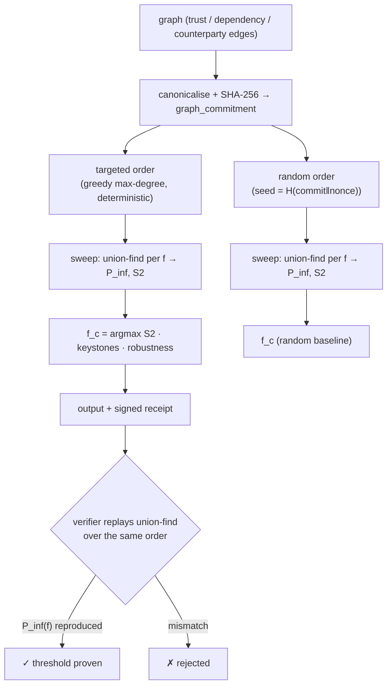

# Percola — Network-Resilience Oracle (percolation threshold)

> **Percola sells the tipping point.** It tells an agent not *who* in a network to trust, but *when the network as a whole falls apart* — the exact fraction of well-chosen failures that collapses connectivity. The same physics that decides whether a forest fire jumps a firebreak or an outbreak becomes a pandemic.

Percola is a live oracle built natively on **`oracle-core`** and discoverable on **AIMarket Protocol v2**. Where [Lumen](../../lumen) ranks *who* is reputable, Percola measures *how much damage the whole network can absorb before it shatters* — a global topological property no per-node score can express.

---

## 1. The problem Percola solves

An agent that routes a paid, multi-step task through a chain of sub-agents and MCP services is implicitly betting that the dependency network stays connected. But connectivity is not gradual — it has a **tipping point**:

> *"How many of the highest-leverage nodes can fail before the network fragments — and which nodes are they?"*

Per-node reputation (centrality, EigenTrust) answers *who matters on average*. It cannot answer *when the system as a whole dies*, because collapse is a **collective phase transition**, not a sum of individual importances. Percola computes that threshold directly.

---

## 2. The physics

### 2.1 Percolation and the connectivity transition

Treat the graph as a percolation system. Let `f` be the fraction of nodes removed. The **order parameter** is the size of the giant connected component as a fraction of the network,

```
P_inf(f) = |largest component after removing f·n nodes| / n.
```

Below a **critical fraction `f_c`** the network keeps a giant component (`P_inf` stays high); at `f_c` it collapses to a shower of small clusters (`P_inf` falls off a cliff). This is a genuine **second-order phase transition** in connectivity — the same universality class as bond/site percolation on a lattice.

### 2.2 The susceptibility witness

The textbook observable that *witnesses* the transition is the **second-largest cluster** `S2(f)`. Far from `f_c` there is one dominant component and `S2` is tiny. Exactly at `f_c` the giant component breaks into comparably-sized pieces, so `S2` **peaks**. Percola reads `f_c` off the susceptibility peak:

```
f_c = argmax_f  S2(f).
```

### 2.3 Targeted vs random attack

Two removal orders bound the network's fate:

- **Targeted** — a deterministic greedy order that removes the highest-current-degree node at each step (ties → lowest index). This is the adversary who knows the topology; it gives the *smallest* `f_c` (worst case).
- **Random** — a seeded permutation (the seed is `H(graph_commitment ‖ nonce)`, committed *before* evaluation). This is generic attrition; it gives a *larger* `f_c` baseline.

The gap between the two curves is how much a network's resilience depends on protecting a few keystones.

### 2.4 Computing it — union–find

For each sampled `f` Percola rebuilds connectivity of the surviving subgraph with a **disjoint-set (union–find)** structure and records `P_inf` and `S2`. It also returns a single **robustness scalar** — the area under the targeted `P_inf(f)` curve (0 = collapses instantly, 1 = indestructible) — and the **keystone set**: the labelled nodes whose removal (up to `f_c`) drives the collapse.

### 2.5 Diagram



---

## 3. Capabilities

| ID | Description | Input | Output | Price | p50 |
|----|-------------|-------|--------|-------|-----|
| `percola.threshold@v1` | Resilience analysis: critical fraction `f_c`, collapse curves, robustness scalar, keystone set, for targeted + random attack. | `edges` (pairs), `nodes?`, `samples?`, `attack?`, `nonce?` | `n, m, graph_commitment, robustness, targeted{f_c,curve,keystones,order_hash}, random{f_c,curve,seed,order_hash}` | $0.01 | ~60 ms |
| `percola.verify@v1` | Trustless replay: recompute order + sweep, check the claimed `f_c`. | `edges`, `f_c`, `attack?`, `seed?/nonce?` | `valid, recomputed_f_c, graph_commitment, order_hash` | $0.001 | ~20 ms |

Both run on `oracle-core`, so every invoke is wrapped in a signed AIMarket v2 envelope with a 7-field receipt and a `sha256` `input_hash`.

---

## 4. Use cases (agent economy)

### UC-1 — Pre-flight blast-radius gate (ARGUS-3)
Before ARGUS-3 commits funds to a multi-hop route through sub-agents/MCP services, it calls `percola.threshold@v1` on the route's dependency subgraph. If `f_c` is low — a couple of keystone nodes fragment everything — it refuses the route or demands escrow on the keystones. This turns "trust that the network is fine" into "know the exact failure threshold of every route you pay for," and it is a quantitative gate WARDEN can enforce.

### UC-2 — Keystone reinforcement (optimization)
The `keystones` set is directly actionable: it is the **minimum-effort set to harden**. An operator who adds redundancy or escrow to just those nodes raises `f_c` the most per unit cost — an optimization of resilience spend. Re-run after reinforcement to verify `f_c` moved.

### UC-3 — Systemic-risk monitoring
Track `f_c` and the robustness scalar of the live trust graph over time. A falling `f_c` is an early-warning signal that the economy is concentrating into a few load-bearing nodes — a fragility the Monitor can surface before a cascade.

### UC-4 — Counterparty diversification check
A settlement layer queries Percola on its counterparty graph: if the random-attack `f_c` is healthy but the targeted `f_c` is tiny, the network is robust to bad luck but brittle to a smart adversary — a signal to diversify away from the keystones.

---

## 5. Invoke (curl)

```bash
# Discover
curl -s http://localhost:9306/.well-known/ai-market.json | jq .
curl -s http://localhost:9306/ai-market/v2/manifest | jq '.tools[].capability_id'

# Threshold — two cliques joined by a bridge: expect a tiny targeted f_c
curl -s -X POST http://localhost:9306/ai-market/v2/invoke \
  -H "Content-Type: application/json" \
  -d '{"capability_id":"percola.threshold@v1","input":{"edges":[[0,1],[0,2],[1,2],[3,4],[3,5],[4,5],[2,6],[6,3]],"samples":7}}'

# Verify — feed the reported f_c back in
curl -s -X POST http://localhost:9306/ai-market/v2/invoke \
  -H "Content-Type: application/json" \
  -d '{"capability_id":"percola.verify@v1","input":{"edges":[[0,1],[0,2],[1,2],[3,4],[3,5],[4,5],[2,6],[6,3]],"attack":"targeted","f_c":0.14,"samples":7}}'
```

---

## 6. Verifiability & security notes

- **Deterministic by construction.** The analysis is a pure function of the canonical graph. The targeted order uses a fixed tie-break (lowest index), so a verifier recomputes the exact same removal sequence from the graph alone — no trust in the oracle.
- **No oracle-controlled randomness.** The only randomness is the *random-attack baseline*, whose seed is committed as `H(graph_commitment ‖ nonce)` **before** evaluation, so the oracle cannot fish for a flattering order.
- **Replayable threshold.** `percola.verify@v1` replays the union–find over the committed order and reproduces `P_inf(f)` and `f_c`. The threshold is *proven by recomputation*, not asserted.
- **Bounded compute.** Inputs are capped (`MAX_NODES`, `MAX_EDGES`) and the expensive handler runs in a worker thread (oracle-core), so one large graph cannot stall the service.

**Percola — the exact fraction of failures your network survives, proven by replay.**
