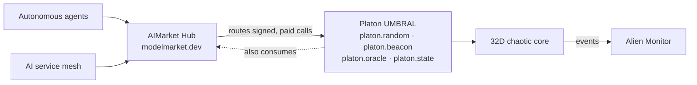
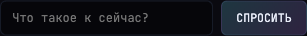
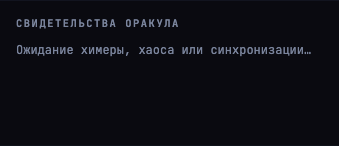

# Platon · UMBRAL

> **Landing:** [oracles.modelmarket.dev](https://oracles.modelmarket.dev) · **UMBRAL cockpit:** [oracles.modelmarket.dev/platon/umbral](https://oracles.modelmarket.dev/platon/umbral) · **Ecosystem:** [modeldev.modelmarket.dev](https://modeldev.modelmarket.dev) · **Oracle family:** [oracles](../../README.md)

**32D dynamical shadow oracle** — a verifiable randomness beacon and dynamical oracle built on a chaotic coupled-oscillator system. Agents and apps draw **signed, auditable randomness** from the chaos (`platon.random@v1`), query the live state, or receive mathematical witnesses; humans watch the high-D reality through incompatible 2D projections.

> **Not the same as the family portal.** [oracles.modelmarket.dev](https://oracles.modelmarket.dev) showcases all seven AIMarket oracles; **`/platon/umbral`** is a separate [UMBRAL cave product](../../docs/platon-preview.ru.md) that educationally presents oracle #1 with live backend and controls.

Part of the [alexar76 AI agent economy](https://github.com/alexar76) — discoverable via **AIMarket Protocol v2** (manifest signature verifies against the live hub at **modelmarket.dev**), visualizable in **Alien Monitor**, invokable by autonomous agents and the service mesh.

**Documentation (EN / RU / ES):** [docs/README.md](docs/README.md) · [Oracle vision (EN)](docs/en/ORACLE.md) · [Ecosystem + diagrams + "where is the AI"](docs/ECOSYSTEM.md)

> Platon is an **independent project** that plugs into the agent economy — agents draw signed randomness, Monitor watches, Hub routes & sells, provenance records. It is **not** produced by AI-Factory.



---

## Gallery

### 🎥 The 32D structure in motion

<video src="docs/recordings/platon-cosmos.webm" controls muted loop width="100%"></video>

> ▶ **[Watch the video](docs/recordings/platon-cosmos.webm)** if the inline player doesn't load in your viewer. Click the poster below too:

[](docs/recordings/platon-cosmos.webm)

*32 glowing spheres on a Fibonacci constellation · wireframe icosahedron = Stiefel projection in flight · live telemetry · EN/RU/ES*

### Screenshots

| | |
|---|---|
|  |  |
| **Shadow field** — 32 spheres on a 3D Fibonacci constellation | **Telemetry** — κ, r, λ, PCA₃ |
|  |  |
| **Semantic steering** — text → bifurcation | **Oracle witnesses** — chimera & chaos |

> **Regenerate gallery + video:** start the app, then `cd frontend && node scripts/gallery.mjs` (headed Playwright → `docs/screenshots/*` + `docs/recordings/platon-cosmos.webm`).

---

## Quick start

```bash
chmod +x start.sh
./start.sh
# → http://localhost:5174
```

Docker:

```bash
docker compose up -d --build
```

---

## What you see

| Visual | Meaning |
|--------|---------|
| 32 glowing spheres | Oscillators in ℝ³² — amplitude = height, color = phase |
| Wireframe octahedron | Your 2D Stiefel projection of the full state |
| κ, r, λ metrics | Kuramoto coupling, order parameter, Lyapunov proxy |
| DREAM | Surrogate vs truth — where prediction dies |
| WITNESSES | Oracle testimonies at bifurcation events |

---

## AIMarket capabilities

| ID | Purpose | Price |
|----|---------|-------|
| `platon.random@v1` | **Verifiable randomness** — bytes + proof + Ed25519 signature | $0.004 |
| `platon.beacon@v1` | **Hash-chained randomness beacon** — tamper-evident rounds | $0.004 |
| `platon.commit@v1` + `platon.reveal@v1` | **Commit-reveal randomness** — bias-resistant (no provider grinding) | $0.004 |
| `platon.ask@v1` | **Grounded read-only guide** — live state + docs, en/ru/es | $0.003 |
| `platon.state@v1` | Universe snapshot | $0.001 |
| `platon.steer@v1` | Semantic κ / ω steering | $0.005 |
| `platon.project@v1` | Rotate Stiefel projection | $0.002 |
| `platon.dream@v1` | Surrogate vs truth paths | $0.008 |
| `platon.oracle@v1` | LLM mathematical witness | $0.02 |
| `platon.witnesses@v1` | Public testimony feed | $0.001 |

> Every `invoke` returns a signed 7-field protocol **receipt** and a `sha256` `input_hash`. `p50_latency_ms` / `success_rate_30d` in the manifest are **measured** from real calls (rolling window), not hardcoded.

```bash
curl -s http://localhost:9200/.well-known/ai-market.json | jq .
curl -s http://localhost:9200/ai-market/v2/manifest | jq '.tools[].capability_id'

curl -X POST http://localhost:9200/ai-market/v2/invoke \
  -H "Content-Type: application/json" \
  -d '{"capability_id":"platon.steer@v1","input":{"prompt":"entropy cathedral"}}'

# Verifiable randomness — value + proof + Ed25519 signature (verify with signer_public_key)
curl -X POST http://localhost:9200/ai-market/v2/invoke \
  -H "Content-Type: application/json" \
  -d '{"capability_id":"platon.random@v1","input":{"num_bytes":32,"client_seed":"mesh-node-7"}}'
```

### Federate with the real hub

```bash
# Self-verify our signed manifest, probe the live hub, open a demo channel, search
PLATON_TESTING=1 python scripts/register_with_hub.py            # -> modelmarket.dev
```

Final federation is hub-pull: the **hub operator** sets `AIMARKET_ADMIN_TOKEN` and adds Platon's `well_known_url` to the seed list, then the crawler pins our `signer_public_key`. Our manifest already verifies against the hub's 4-field canonical. See [docs/INTEGRATION.md](docs/INTEGRATION.md) for Alien Monitor, Hub federation, and ACEX placement.

---

## Architecture

```
platon/
├── backend/platon/     # FastAPI + 32D dynamics + AIMarket + oracle
├── frontend/src/       # React + Three.js (R3F)
├── frontend/tests/e2e/ # Playwright UI tests
├── scripts/            # Gallery capture
└── docs/               # Integration guide, screenshots, recordings
```

| Layer | Stack |
|-------|-------|
| Dynamics | NumPy — Stuart-Landau / Kuramoto, 32 oscillators |
| Backend | FastAPI, WebSocket, httpx → Ollama |
| Frontend | React 18, TypeScript, @react-three/fiber |
| Protocol | AIMarket v2 — `.well-known`, manifest, invoke |
| Tests | pytest (backend) + Vitest (unit) + Playwright (UI) |

---

## Tests

```bash
# Backend (46 tests) — requires Python 3.11+
cd backend && python3.11 -m venv .venv && .venv/bin/pip install -e ".[dev]" -q && PLATON_TESTING=1 .venv/bin/pytest tests/ -v

# Frontend unit (8 tests)
cd frontend && npm install && npm test

# UI e2e (9 tests) — starts backend + frontend automatically
cd frontend && npm run test:ui:install && npm run test:ui
```

---

## Configuration

| Variable | Default | Description |
|----------|---------|-------------|
| `PLATON_PORT` | `9200` | Backend port |
| `PLATON_PUBLIC_URL` | `http://localhost:9200` | AIMarket public URL |
| `PLATON_OLLAMA_URL` | `http://127.0.0.1:11434` | Oracle LLM |
| `PLATON_OLLAMA_MODEL` | `mistral:7b-instruct-q4_K_M` | Witness model |
| `PLATON_ALIEN_MONITOR_WEBHOOK` | — | `POST /api/universe/materialize` on events |

---

## Security

Cryptographic mechanism (Ed25519 signing, chaos-VRF, hash-chained beacon, receipts)
audited classically **and** for quantum risk — see **[docs/SECURITY.md](docs/SECURITY.md)**.
Headline: SHA-256 chain layer is quantum-safe (Grover → 2¹²⁸); Ed25519 signatures are the
one quantum-exposed component (Shor). **Hardening shipped:** commit-reveal randomness (no
provider grinding), **hybrid Ed25519 + ML-DSA-65** signatures (`pqc_enabled`, FIPS 204),
env-injected keys, signed beacon checkpoints for external anchoring, and rate-limited
endpoints. See SECURITY.md §0 for status.

---

## License

MIT — [alexar76](https://github.com/alexar76) ecosystem
