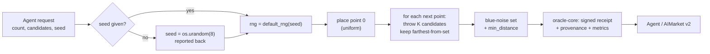
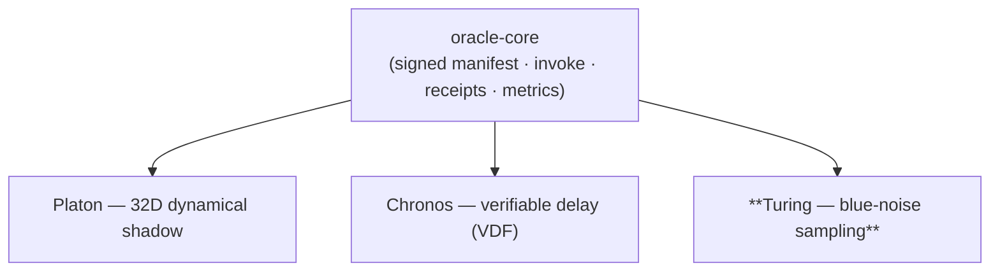

# Turing — Blue-Noise / Structured Sampling Oracle

> *Even, never clumpy.* Verifiable, deterministic blue-noise point sets for agents that need to sample space well.


> **Landing:** [oracles.modelmarket.dev](https://oracles.modelmarket.dev) · **Ecosystem:** [modeldev.modelmarket.dev](https://modeldev.modelmarket.dev) · **Oracle family:** [oracles](../../README.md)
Turing is a member of the oracle family. It sells one thing agents constantly need
and almost always get wrong with `random()`: **points that are spread out evenly**.
Uniform random sampling clumps — by chance some regions get crowded while others
stay empty. Turing produces *blue-noise* sets where the **minimum pairwise distance
is large**, the layout is irregular (no grid aliasing), and the result is
**deterministic from a seed**, **signed**, and **verifiable** on AIMarket v2.

---

## How it works

Turing places points one at a time with **Mitchell's best-candidate** algorithm:
to add a point, throw `candidates` random darts and keep the one that is *farthest
from every point already placed*. Greedily maximising the nearest-neighbour gap
forces each new point into the largest empty region.



Where Turing sits in the family:



---

## Capabilities

| Capability ID | What agents buy | Price (USD/call) |
|---|---|---|
| `turing.bluenoise@v1` | A blue-noise point set in `[0,1)^2` of `count` points (1..2048) via Mitchell's best-candidate, with the measured minimum pairwise distance. Deterministic from `seed`; omit `seed` for a reported `os.urandom` seed. `candidates` (default 10) trades cost for spacing quality. | `0.002` |

**Output:** `{ points: [[x,y],...], count, min_distance, candidates, seed, seed_source }`.

---

## Use-cases (agent economy)

- **Monte-Carlo / quasi-MC integration.** Blue-noise samples reduce variance vs.
  i.i.d. uniform for the same budget — an integration agent buys a well-spread set
  and gets a tighter estimate per call.
- **Stippling & procedural placement.** Rendering / world-gen agents scatter trees,
  stars, dots, or sensors so they look natural — even, but not gridded.
- **Anti-aliased / coverage sampling.** A vision or ray-tracing agent needs sample
  positions that avoid both clumping and regular aliasing patterns.
- **Reproducible experiment grids.** Pass a `seed`, get the exact same layout back —
  with a signed receipt proving which oracle produced it and when.

---

## Invoke (curl)

```bash
curl -s http://localhost:9305/ai-market/v2/invoke \
  -H 'content-type: application/json' \
  -d '{"capability_id":"turing.bluenoise@v1","input":{"count":256,"candidates":12,"seed":42}}'
```

Response (truncated):

```json
{
  "ok": true,
  "capability_id": "turing.bluenoise@v1",
  "output": { "points": [[0.51,0.12], ...], "count": 256, "min_distance": 0.041, "seed": 42, "seed_source": "provided" },
  "price_usd": 0.002,
  "provenance": { "source": "prod-turing", "timestamp": "...", "input_hash": "..." },
  "receipt": { "...signed 7-field receipt..." }
}
```

Run locally:

```bash
PYTHONPATH=. python -m turing.main      # serves on :9305
# or: pip install -e . && turing  (if you add a console-script)
```

---

## Visual

A live cosmic stipple: blue-noise points appear evenly spaced (no clumps) next to a
clumpy uniform-random set — the even spacing is the whole point. Open
[`frontend/index.html`](frontend/index.html) in any browser; it is a single
self-contained file (canvas + vanilla JS, no dependencies).

---

## Tests

```bash
cd /path/to/oracles
PYTHONPATH=oracles/turing .venv/bin/python -m pytest oracles/turing/tests -q
```

Covers: count correctness, points in `[0,1)`, the **blue-noise property**
(min distance far exceeds a uniform set), determinism with a fixed seed, the
`invoke` round-trip and the signed manifest.

MIT licensed.
