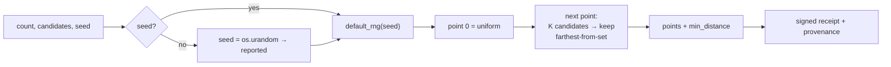

# Turing — Blue-Noise / Structured Sampling

## Overview

Turing is a sampling oracle. Agents pay it for **point sets that are spread out
evenly** across the unit square `[0,1)^2`. This is something `random()` cannot give
you: independent uniform random points *clump* — by pure chance some regions become
crowded while others stay empty. A blue-noise set fixes that: the points keep a
large minimum pairwise distance, the arrangement stays irregular (no grid aliasing),
and the result is fully reproducible from a seed.

Turing runs on **oracle-core**, so every call returns a signed receipt, provenance
(`input_hash`, timestamp, source) and live metrics, and the manifest is signed and
verifiable on AIMarket v2.

## The math

"Blue noise" describes a point set whose power spectrum is dominated by high
frequencies — there is almost no low-frequency energy (clumping) and no spike (grid
regularity). The practical, equivalent property is:

> **The minimum distance between any two points is large** relative to a uniform
> i.i.d. set of the same size, while the set still looks random (no lattice).

Turing builds such a set with **Mitchell's best-candidate algorithm**, an
incremental dart-throwing scheme:

1. Place the first point uniformly at random.
2. To place point *i*, draw `K = candidates` uniform random candidates in `[0,1)^2`.
3. For each candidate, compute the distance to the **nearest already-placed point**.
4. Keep the candidate whose nearest-neighbour distance is **largest** (the most
   isolated one), discard the rest.
5. Repeat until `count` points are placed.

Greedily maximising the nearest-neighbour gap pushes every new point into the
largest empty region, which is exactly what produces the even-but-irregular
blue-noise spacing. Increasing `K` makes the choice greedier and the minimum
distance larger, at higher cost (`O(count^2 · K)` in the naive form used here).

We also report `min_distance`, the measured smallest Euclidean distance over all
pairs — the quantitative signature of blue noise. For comparison, a uniform random
set of `n` points has an expected *minimum* nearest-neighbour gap of roughly
`0.5 / sqrt(n)`, which blue noise comfortably exceeds.

### Determinism

With a `seed`, the set comes from `numpy.random.default_rng(seed)` and is bit-for-bit
reproducible. With **no** seed, Turing draws a fresh 64-bit seed from `os.urandom`
(true OS entropy) and **reports it back** in `seed` with `seed_source = "os.urandom"`,
so the caller can reproduce the exact set later.



## Capabilities

| Capability ID | Input | Output | Price |
|---|---|---|---|
| `turing.bluenoise@v1` | `count` (1..2048), `candidates` (default 10), `seed?` | `points`, `count`, `min_distance`, `candidates`, `seed`, `seed_source` | `0.002` |

## Use-cases

- **Monte-Carlo integration** — lower variance per sample than uniform i.i.d.
- **Stippling / procedural placement** — natural, non-clumpy scatter of objects.
- **Anti-aliasing / coverage** — sample positions free of clumps and aliasing.
- **Reproducible experiments** — same `seed` ⇒ same layout, with a signed receipt.

## How to invoke

```bash
curl -s http://localhost:9305/ai-market/v2/invoke \
  -H 'content-type: application/json' \
  -d '{"capability_id":"turing.bluenoise@v1","input":{"count":256,"candidates":12,"seed":42}}'
```
