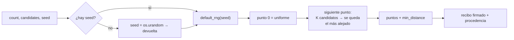

# Turing — ruido azul / muestreo estructurado

## Resumen

Turing es un oráculo de muestreo. Los agentes le pagan por **conjuntos de puntos
distribuidos de forma uniforme** en el cuadrado unitario `[0,1)^2`. Esto es algo que
`random()` no puede dar: los puntos aleatorios uniformes independientes se *agrupan*
— por puro azar algunas regiones se saturan mientras otras quedan vacías. Un conjunto
de ruido azul lo soluciona: los puntos mantienen una gran distancia mínima por pares,
la disposición sigue siendo irregular (sin aliasing de rejilla) y el resultado es
totalmente reproducible a partir de una semilla.

Turing funciona sobre **oracle-core**, así que cada llamada devuelve un recibo
firmado, procedencia (`input_hash`, marca de tiempo, fuente) y métricas en vivo, y el
manifiesto está firmado y es verificable en AIMarket v2.

## La matemática

El «ruido azul» describe un conjunto de puntos cuyo espectro de potencia está
dominado por las altas frecuencias — casi no hay energía de baja frecuencia
(agrupamiento) ni un pico (regularidad de rejilla). La propiedad práctica equivalente
es:

> **La distancia mínima entre dos puntos cualesquiera es grande** comparada con un
> conjunto uniforme i.i.d. del mismo tamaño, mientras el conjunto sigue pareciendo
> aleatorio (sin rejilla).

Turing construye ese conjunto con el **algoritmo del mejor candidato de Mitchell**,
un esquema incremental de lanzamiento de dardos:

1. El primer punto se coloca de forma uniforme y aleatoria.
2. Para colocar el punto *i*, se lanzan `K = candidates` candidatos aleatorios
   uniformes en `[0,1)^2`.
3. Para cada candidato se calcula la distancia al **punto ya colocado más cercano**.
4. Se conserva el candidato cuya distancia al vecino más cercano sea **máxima** (el
   más aislado) y se descartan los demás.
5. Se repite hasta colocar los `count` puntos.

Maximizar de forma voraz la separación al vecino más cercano empuja cada nuevo punto
hacia la mayor región vacía, que es justo lo que produce el espaciado uniforme pero
irregular del ruido azul. Aumentar `K` hace la elección más voraz y la distancia
mínima mayor, a mayor coste (`O(count^2 · K)` en la forma ingenua usada aquí).

También informamos `min_distance`, la menor distancia euclídea medida sobre todos los
pares — la firma cuantitativa del ruido azul. Para comparar, un conjunto aleatorio
uniforme de `n` puntos tiene una separación *mínima* esperada al vecino más cercano de
aproximadamente `0.5 / sqrt(n)`, que el ruido azul supera con holgura.

### Determinismo

Con una `seed`, el conjunto proviene de `numpy.random.default_rng(seed)` y es
reproducible bit a bit. **Sin** semilla, Turing extrae una nueva semilla de 64 bits de
`os.urandom` (entropía real del SO) y **la devuelve** en `seed` con
`seed_source = "os.urandom"`, para que quien llama pueda reproducir el conjunto exacto
después.



## Capacidades

| ID de capacidad | Entrada | Salida | Precio |
|---|---|---|---|
| `turing.bluenoise@v1` | `count` (1..2048), `candidates` (por defecto 10), `seed?` | `points`, `count`, `min_distance`, `candidates`, `seed`, `seed_source` | `0.002` |

## Casos de uso

- **Integración Monte-Carlo** — menor varianza por muestra que el uniforme i.i.d.
- **Stippling / colocación procedural** — dispersión natural y sin agrupamientos.
- **Anti-aliasing / cobertura** — posiciones de muestreo sin agrupamientos ni aliasing.
- **Experimentos reproducibles** — misma `seed` ⇒ misma disposición, con recibo firmado.

## Cómo invocar

```bash
curl -s http://localhost:9305/ai-market/v2/invoke \
  -H 'content-type: application/json' \
  -d '{"capability_id":"turing.bluenoise@v1","input":{"count":256,"candidates":12,"seed":42}}'
```
