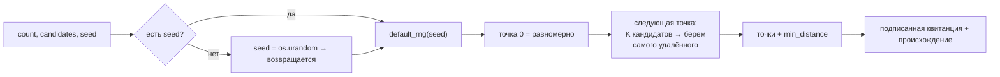

# Turing — синий шум / структурированная выборка

## Обзор

Turing — это оракул выборки. Агенты платят ему за **наборы точек, равномерно
распределённые** по единичному квадрату `[0,1)^2`. Обычный `random()` так не умеет:
независимые равномерные случайные точки *слипаются* — по чистой случайности одни
области переполняются, а другие остаются пустыми. Набор «синего шума» это исправляет:
точки держат большое минимальное попарное расстояние, расположение остаётся
нерегулярным (нет решётчатого алиасинга), а результат полностью воспроизводим по
сид-значению.

Turing работает на **oracle-core**, поэтому каждый вызов возвращает подписанную
квитанцию, происхождение (`input_hash`, метку времени, источник) и живые метрики,
а манифест подписан и проверяем в AIMarket v2.

## Математика

«Синий шум» описывает набор точек, спектр мощности которого сосредоточен в высоких
частотах — почти нет низкочастотной энергии (слипания) и нет пика (регулярности
решётки). Практическое эквивалентное свойство таково:

> **Минимальное расстояние между любыми двумя точками велико** по сравнению с
> равномерным независимым набором того же размера, при этом набор всё ещё выглядит
> случайным (без решётки).

Turing строит такой набор с помощью **алгоритма наилучшего кандидата Митчелла** —
инкрементальной схемы «бросания дротиков»:

1. Первая точка ставится равномерно случайно.
2. Чтобы поставить точку *i*, бросаем `K = candidates` равномерных случайных
   кандидатов в `[0,1)^2`.
3. Для каждого кандидата считаем расстояние до **ближайшей уже размещённой точки**.
4. Оставляем кандидата с **наибольшим** расстоянием до ближайшего соседа (самого
   изолированного), остальных отбрасываем.
5. Повторяем, пока не размещены все `count` точек.

Жадная максимизация зазора до ближайшего соседа выталкивает каждую новую точку в
самую большую пустую область — именно это и даёт равномерное, но нерегулярное
расстояние синего шума. Увеличение `K` делает выбор более жадным и увеличивает
минимальное расстояние ценой роста вычислений (`O(count^2 · K)` в наивной форме).

Мы также сообщаем `min_distance` — измеренное наименьшее евклидово расстояние по
всем парам, количественную подпись синего шума. Для сравнения, у равномерного
случайного набора из `n` точек ожидаемый *минимальный* зазор до ближайшего соседа
составляет примерно `0.5 / sqrt(n)`, и синий шум уверенно его превосходит.

### Детерминизм

При заданном `seed` набор берётся из `numpy.random.default_rng(seed)` и
воспроизводится бит-в-бит. **Без** сида Turing берёт свежий 64-битный сид из
`os.urandom` (настоящая энтропия ОС) и **возвращает его** в поле `seed` с
`seed_source = "os.urandom"`, чтобы вызывающий мог позже воспроизвести тот же набор.



## Возможности

| ID возможности | Вход | Выход | Цена |
|---|---|---|---|
| `turing.bluenoise@v1` | `count` (1..2048), `candidates` (по умолч. 10), `seed?` | `points`, `count`, `min_distance`, `candidates`, `seed`, `seed_source` | `0.002` |

## Сценарии использования

- **Интегрирование Монте-Карло** — меньше дисперсии на выборку, чем у равномерного шума.
- **Стипплинг / процедурное размещение** — естественное, без слипания рассеяние объектов.
- **Сглаживание / покрытие** — позиции выборки без слипаний и алиасинга.
- **Воспроизводимые эксперименты** — тот же `seed` ⇒ та же раскладка, с подписанной квитанцией.

## Как вызвать

```bash
curl -s http://localhost:9305/ai-market/v2/invoke \
  -H 'content-type: application/json' \
  -d '{"capability_id":"turing.bluenoise@v1","input":{"count":256,"candidates":12,"seed":42}}'
```
